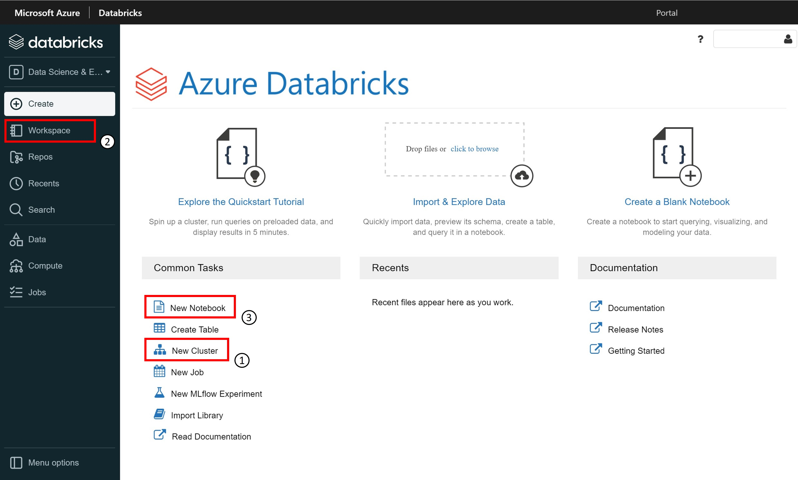

Azure Databricks runs on top of a proprietary data processing engine called Databricks Runtime, an optimized version of Apache Spark.
It allows up to 50x performance for Apache Spark workloads.

Apache Spark is the core technology. Spark is an open-source analytics engine for large-scale data processing.
It provides an interface for programming entire clusters with implicit data parallelism and fault tolerance.

In a nutshell: Azure Databricks offers a fast, easy, and collaborative Spark based analytics service. It is used to accelerate big data analytics, artificial intelligence, performant data lakes, interactive data science, machine learning, and collaboration.

## The main concepts in Azure Databricks

The landing page shows the fundamental concepts to be used in Databricks:
1. The **cluster**: a set of computational resources on which we run the code.
2. The **workspace**: groups all the Databricks elements, clusters, notebooks, data.
3. The **notebook**: a document that contains runnable code, descriptive text, and visualizations.

> [!NOTE]
> **More information:** for more information about Azure Databricks, see the [documentation](/azure/databricks/scenarios/what-is-azure-databricks).

