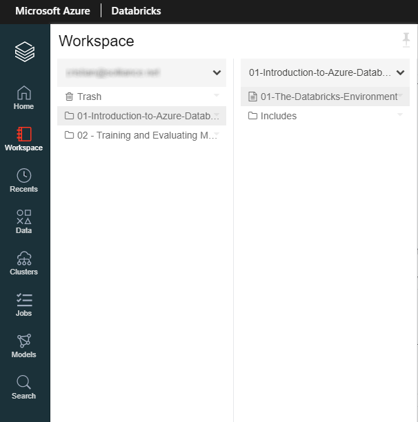
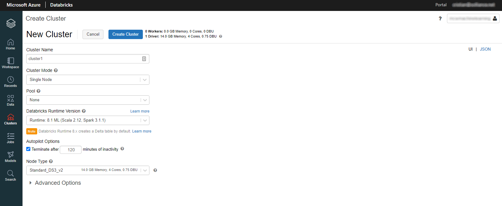
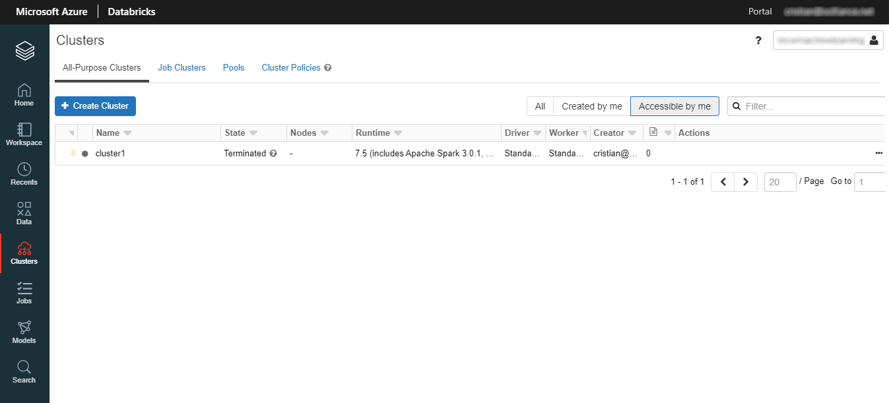
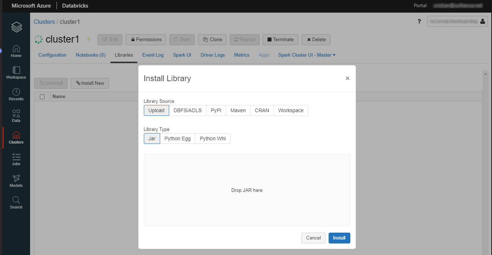
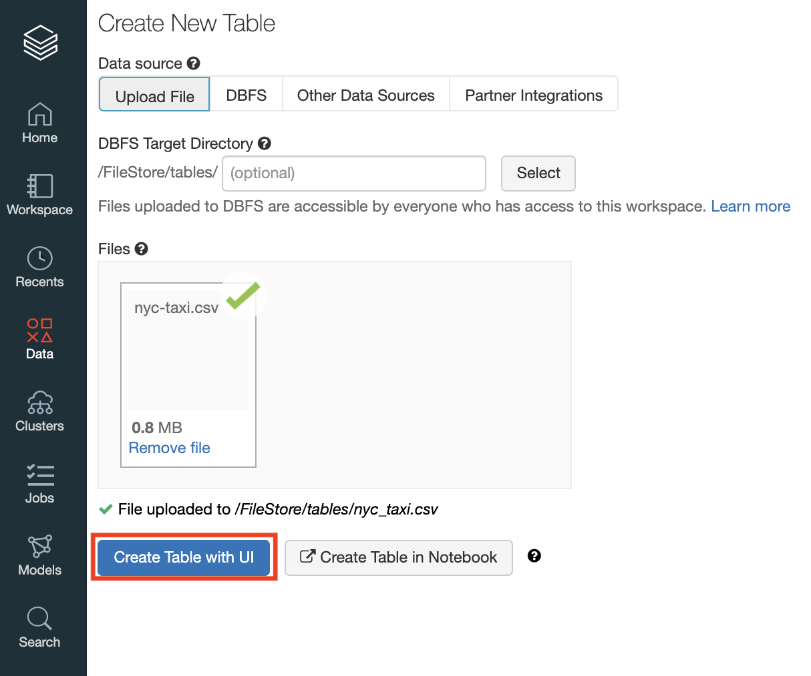
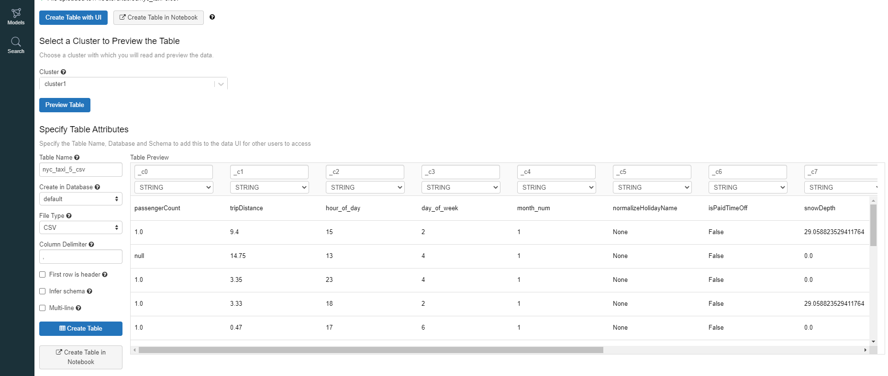
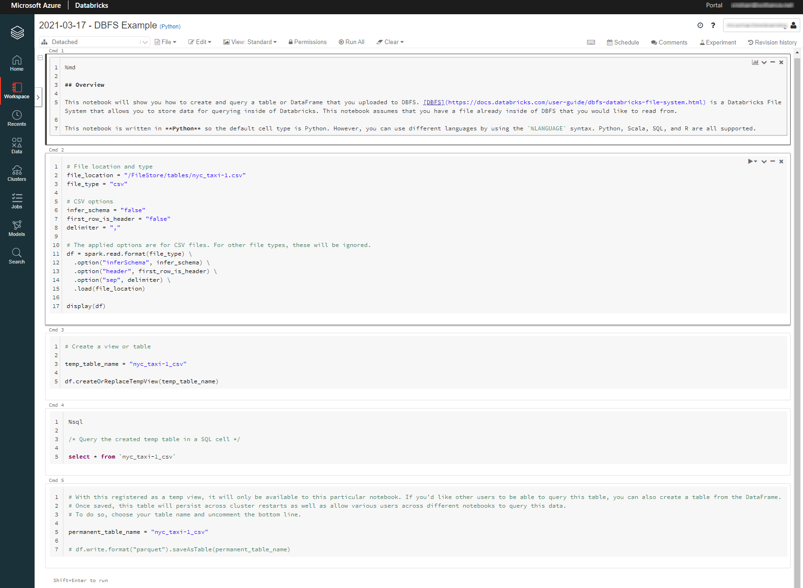

Two of the key concepts you need to be familiar with when working with Azure Databricks are **workspaces** and **clusters**.

## Workspaces

A workspace is an environment for accessing all of your Databricks elements:
- It groups objects (like notebooks, libraries, experiments) into folders,
- Provides access to your data,
- Provides access to the computations resources used (clusters, jobs).



Each user has a home folder for their notebooks and libraries.
The objects stored in the Workspace root folder are: folders, notebooks, libraries, and experiments.

To perform an action on a Workspace object, we can right-click the object and choose one of the available actions.

## Clusters

A cluster is a set of computational resources on which you run your code (as notebooks or jobs). We can run ETL pipelines, or machine learning, data science, analytics workloads on the cluster.

We can create:

- An **all-purpose cluster**. Multiple users can share such clusters to do collaborative interactive analysis.
- A **job cluster** to run a specific job. The cluster will be terminated when the job completes
(A job is a way of running a notebook or JAR either immediately or on a scheduled basis).

Before we can use a cluster, we have to choose one of the available **runtimes**.

Databricks runtimes are the set of core components that run on Azure Databricks clusters. Azure Databricks offers several types of runtimes:
- **Databricks Runtime**: includes Apache Spark, components and updates that optimize the usability, performance, and security for big data analytics.
- **Databricks Runtime for Machine Learning**: a variant that adds multiple machine learning libraries such as TensorFlow, Keras, and PyTorch.
- **Databricks Light**: for jobs that don’t need the advanced performance, reliability, or autoscaling of the Databricks Runtime.

To create and configure a new cluster, we have to select the **Create Cluster** button and choose our options.



We will see your new cluster appearing in the clusters list. 



To launch the cluster, we have to select the **Start** button and then confirm to launch it. It is recommended to wait until the cluster is started.

A cluster can be customized in many ways. In case you want to make third-party code available to your notebooks, you can install a library. Your cluster can be provisioned to use Python/Java/Scala/R libraries via PyPI or Maven.

Once the cluster is running, we can select **Edit** to change its properties. In case we want to provision your cluster with additional libraries, we can select the **Libraries** and then choose **Install New**.



We can pick a library and it will be available later to be used in your notebooks.

> [!NOTE]
> **More information:** for more information about installing libraries, see [Libraries](/azure/databricks/libraries/) in the Azure Databricks documentation.

## Working with data in a workspace

An Azure Databricks *database* is a collection of tables. 
An Azure Databricks *table* is a collection of structured data. 

We can cache, filter, and perform any operations supported by Apache Spark DataFrames on Azure Databricks tables. 
We can query tables with Spark APIs and Spark SQL.

To access our data:
- We can import our files to DBFS using the UI.
- We can mount and use supported data sources via DBFS.

We can then use Spark or local APIs to access the data.

We will be able to use a DBFS file path in our notebook to access our data, independent of its data source.

It is possible to import existing data or code in the workspace.

If we use small data files on the local machine that we want to analyze with Azure Databricks, we can import them to DBFS using the UI. There are two ways to upload data to DBFS with the UI:
- Upload files to the FileStore in the Upload Data UI.
- Upload data to a table with the Create table UI, which is also accessible via the Import & Explore Data box on the landing page.

We may also read data on cluster nodes using Spark APIs. 
We can read data imported to DBFS into Apache Spark DataFrames. For example, if you import a CSV file, you can read the data using this code

```
df = spark.read.csv('/FileStore/tables/nyc_taxi.csv', header="true", inferSchema="true")
```

We can also read data imported to DBFS in programs running on the Spark driver node using local file APIs. For example:

```
df = spark.read.csv('/dbfs/FileStore/tables/nyc_taxi.csv', header="true", inferSchema="true")
```

### Importing data

To add data, we can go to the landing page and select **Import & Explore Data**.

To get the data in a table, there are multiple options available:
- Upload a local file and import the data.
- Use data already existing under DBFS.
- Mount external data sources, like Azure Storage, Azure Data Lake and more.

To create a table based on a local file, we can select **Upload File** to upload data from your local machine.



Once the data is uploaded, it will be available as a table or as a mountpoint under the DBFS filesystem (`/FileStore`).

Databricks can create a table automatically if we select **Create Table with UI**.

[](../media/01-01-07-table-ui.png#lightbox)

Alternately, we can have full control over the structure of the new table by choosing **Create Table in Notebook**. 
Azure Databricks will generate Spark code that loads your data (and we can customize it via the Spark API).

[](../media/01-01-08-table-spark.png#lightbox)

### Using DBFS mounted data

Databricks File System (DBFS) is a distributed file system mounted into a Databricks workspace and available on Databricks clusters. DBFS is an abstraction on top of scalable object storage and offers the following benefits:
- Allows to you mount storage objects so that you can seamlessly access data without requiring credentials.
- Allows you to interact with object storage using directory and file semantics instead of storage URLs.
- Persists files to object storage, so you won’t lose data after you terminate a cluster.

The default storage location in DBFS is known as the DBFS root.

We can use the DBFS to access:
- Local files (previously imported). For example, the tables you imported above are available under `/FileStore`
- Remote files, objects kept in separate storages as if they were on the local file system

For example, to mount a remote Azure storage account as a DBFS folder, we can use the `dbutils` module:

```python
data_storage_account_name = '<data_storage_account_name>'
data_storage_account_key = '<data_storage_account_key>'

data_mount_point = '/mnt/data'

data_file_path = '/bronze/wwi-factsale.csv'

dbutils.fs.mount(
  source = f"wasbs://dev@{data_storage_account_name}.blob.core.windows.net",
  mount_point = data_mount_point,
  extra_configs = {f"fs.azure.account.key.{data_storage_account_name}.blob.core.windows.net": data_storage_account_key})

display(dbutils.fs.ls("/mnt/data"))
#this path is available as dbfs:/mnt/data for spark APIs, e.g. spark.read
#this path is available as file:/dbfs/mnt/data for regular APIs, e.g. os.listdir
```

Notebooks support a shorthand - `%fs` magic command - for accessing the dbutils filesystem module. 
Most `dbutils.fs` commands are available using `%fs` magic commands:

```bash
# List the DBFS root
%fs ls

# Overwrite the file "/mnt/my-file" with the string "Hello world!"
%fs put -f "/mnt/my-file" "Hello world!"
```

> [!NOTE]
> **More information:** for more information about DBFS, see [Databricks File System](/azure/databricks/data/databricks-file-system) in the Azure Databricks documentation.
