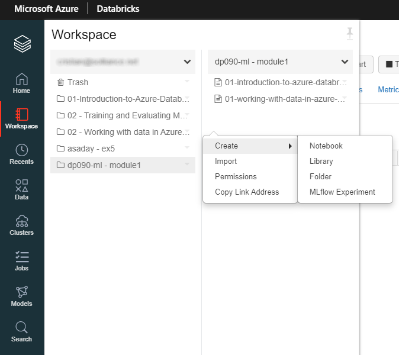
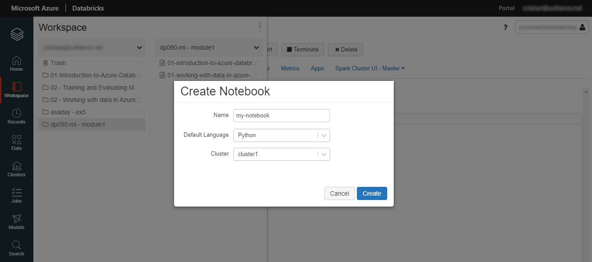
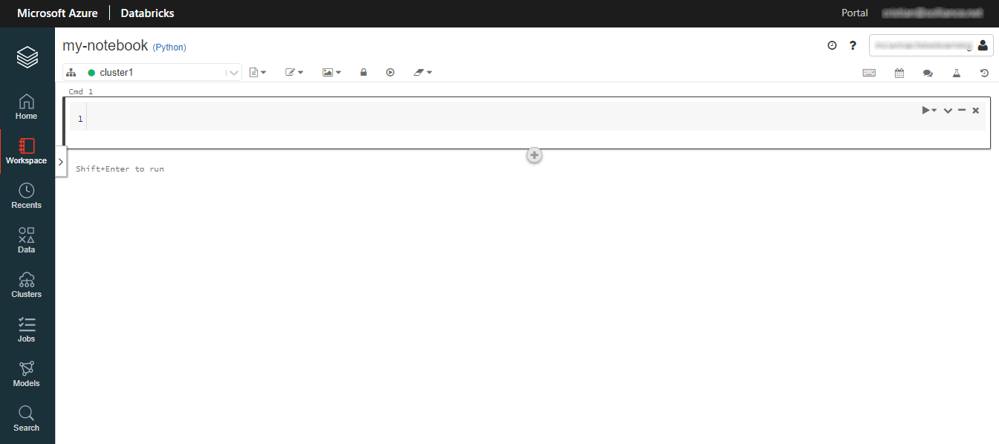

A notebook is a web-based interface to a document that contains: 
- Runnable code
- Descriptive text
- Visualizations

A notebook is a collection of runnable cells (commands). When you use a notebook, you are primarily developing and running cells.

Runnable cells operate on files and tables. Cells can be run in sequence, referring to the output of previously run cells.

To create a notebook, we can select **Workspace**, browse into the desired folder, right-click, and choose **Create**, then select **Notebook**.

A name should be given to the new notebook, and a default language to be used inside the code cells. Choose a cluster to run the code in the cells.

For runnable cells, the following programming languages are supported: Python, Scala, R, and SQL.
You may choose the default language for the cells in a notebook. You may also override that language later.

The notebook editor opens with a first empty cell

By hovering over the **Plus** button below the current cell or by choosing the top-right menu options, we can change the contents of the notebook. We may add new cells, cut, copy, export the cell contents, or run a specific cell.

We can override the default language by specifying the language magic command `%<language>` at the beginning of a cell. 

The supported magic commands are: 
- `%python`
- `%r`
- `%scala`
- `%sql`

Notebooks also support a few auxiliary magic commands:
- `%sh`: Allows you to run shell code in your notebook
- `%fs`: Allows you to use dbutils filesystem commands
- `%md`: Allows you to include various types of documentation, including text, images, and mathematical formulas and equations.
