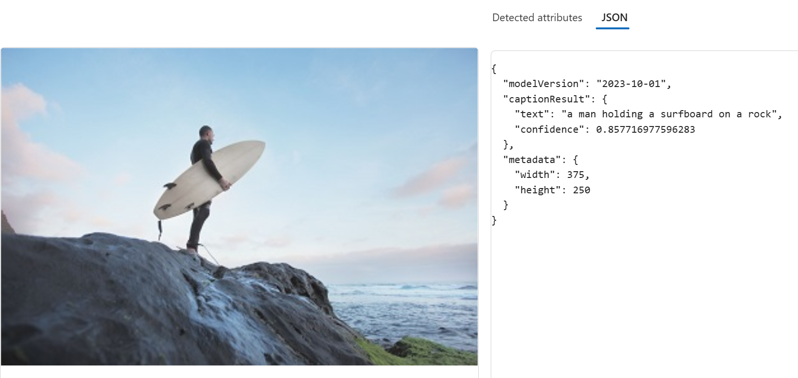
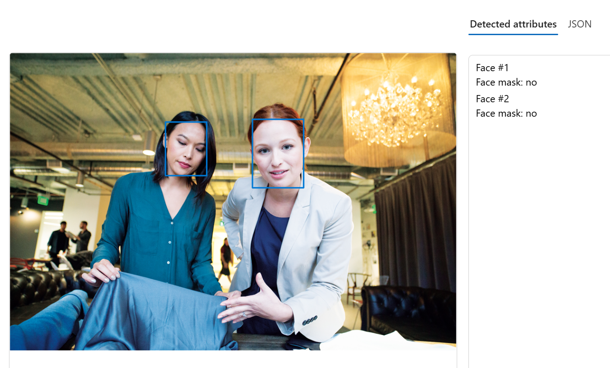

Azure AI provides a wide range of cloud-based services for various AI tasks, including computer vision. Microsoft's **Azure AI Vision** service provides prebuilt and customizable computer vision models that are based on deep learning models and provide various capabilities. Azure AI Vision provides "off-the-shelf" functionality for many common computer vision scenarios, while retaining the ability to create custom models using your own images.

Azure AI Vision service contains several products. Within Azure AI Vision, there are services that handle specific sets of tasks including:

- **Azure AI Vision Image Analysis service**: Detects common objects in images, tags visual features, generates captions, and supports optical character recognition (OCR).
    

- **Azure AI Face service**: Detects, recognizes, and analyzes human faces in images. Provides specific models for facial analysis that extend beyond what is available with image analysis. 
    

There are many applications for Azure AI Vision's *image analysis* and *face* detection, analysis, and recognition. For example:

- Search engine optimization - using image tagging and captioning for essential improvements in search ranking.
- Content moderation - using image detection to help monitor the safety of images posted online.
- Security - facial recognition can be used in building security applications, and in operating systems for unlocking devices.
- Social media - facial recognition can be used to automatically tag known friends in photographs.
- Missing persons - using public cameras systems, facial recognition can be used to identify if a missing person is in the image frame.
- Identity validation - useful at ports of entry kiosks where a person holds a special entry permit.
- Museum archive management - using optical character recognition to preserve information from paper documents. 

> [!NOTE]
> Many modern vision solutions are built with a combination of capabilities. For example, video analysis capabilities are supported by [*Azure AI Video indexer*](/azure/azure-video-indexer/video-indexer-overview). Azure AI Video indexer is built on several Azure AI services, such as  Face, Translator, Image Analysis, and Speech.  

Next, let's take a look at some core Azure AI Vision Image Analysis capabilities. 
