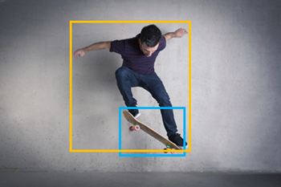
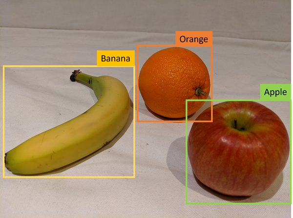

Azure AI Vision's image analysis capabilities can be used with or without customization. Some of the capabilities that do not require customization include: 

- Describing an image with captions
- Detecting common objects in an image
- Tagging visual features
- Optical character recognition

### Describing an image with captions

Azure AI Vision has the ability to analyze an image, evaluate the objects that are detected, and generate a human-readable phrase or sentence that can describe what was detected in the image. For example, consider the following image:


Azure AI Vision returns the following caption for this image:

*A man jumping on a skateboard*


### Detecting common objects in an image

Azure AI Vision can identify thousands of common objects in images. For example, when used to detect objects in the skateboarder image discussed previously,  Azure AI Vision returns the following predictions:

- *Skateboard (90.40%)*
- *Person (95.5%)*

The predictions include a *confidence score* that indicates the probability the model has calculated for the predicted objects.

In addition to the detected object labels and their probabilities, Azure AI Vision returns *bounding box* coordinates that indicate the top, left, width, and height of the object detected. You can use these coordinates to determine where in the image each object was detected, like this:



### Tagging visual features

Azure AI Vision can suggest *tags* for an image based on its contents. These tags can be associated with the image as metadata that summarizes attributes of the image and can be useful if you want to index an image along with a set of key terms that might be used to search for images with specific attributes or contents.

For example, the tags returned for the skateboarder image (with associated confidence scores) include:

- *sport (99.60%)*
- *person (99.56%)*
- *footwear (98.05%)*
- *skating (96.27%)*
- *boardsport (95.58%)*
- *skateboarding equipment (94.43%)*
- *clothing (94.02%)*
- *wall (93.81%)*
- *skateboarding (93.78%)*
- *skateboarder (93.25%)*
- *individual sports (92.80%)*
- *street stunts (90.81%)*
- *balance (90.81%)*
- *jumping (89.87%)*
- *sports equipment (88.61%)*
- *extreme sport (88.35%)*
- *kickflip (88.18%)*
- *stunt (87.27%)*
- *skateboard (86.87%)*
- *stunt performer (85.83%)*
- *knee (85.30%)*
- *sports (85.24%)*
- *longboard (84.61%)*
- *longboarding (84.45%)*
- *riding (73.37%)*
- *skate (67.27%)*
- *air (64.83%)*
- *young (63.29%)*
- *outdoor (61.39%)*

### Optical character recognition

Azure AI Vision service can use optical character recognition (OCR) capabilities to detect text in images. For example, consider the following image of a nutrition label on a product in a grocery store:


The Azure AI Vision service can analyze this image and extract the following text:

```
Nutrition Facts Amount Per Serving
Serving size:1 bar (40g)
Serving Per Package: 4
Total Fat 13g
Saturated Fat 1.5g
Amount Per Serving
Trans Fat 0g
calories 190
Cholesterol 0mg
ories from Fat 110
Sodium 20mg
ntDaily Values are based on
Vitamin A 50
calorie diet
```

## Training custom models

If the built-in models provided by Azure AI Vision don't meet your needs, you can use the service to train a custom model for *image classification* or *object detection*. Azure AI Vision builds custom models on the pre-trained foundation model, meaning that you can train sophisticated models by using relatively few training images.

### Image classification

An image classification model is used to predict the category, or *class* of an image. For example, you could train a model to determine which type of fruit is shown in an image, like this:

| Apple | Banana | Orange |
|--|--|--|
|  |  |  |

### Object detection

Object detection models detect and classify objects in an image, returning bounding box coordinates to locate each object. In addition to the built-in object detection capabilities in Azure AI Vision, you can train a custom object detection model with your own images. For example, you could use photographs of fruit to train a model that detects multiple fruits in an image, like this:



> [!NOTE]
> Details of how to use Azure AI Vision to train a custom model are beyond the scope of this module. You can find information about custom model training in the **[Azure AI Vision documentation](/azure/ai-services/computer-vision/how-to/model-customization?tabs=python)**.

Next, let's look at capabilities specific to Azure AI Vision's Face service.