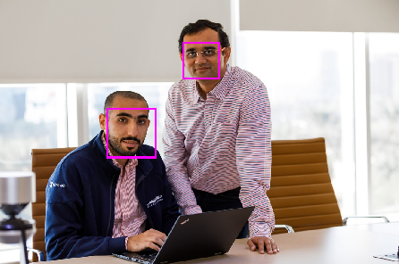

As a product within Azure AI Vision, **Azure AI Face** supports specific use cases such as verifying user identity, liveness detection, touchless access control, and face redaction. Several concepts, including face detection and recognition, are essential to working with Face.

## Facial detection

**Face detection** involves identifying regions of an image that contain a human face, typically by returning *bounding box* coordinates that form a rectangle around the face, like this:

With Face, facial features can be used to train machine learning models to return other information, such as facial features such as nose, eyes, eyebrows, lips, and others.

 
## Facial recognition

A further application of facial analysis is to train a machine learning model to identify known individuals from their facial features. This is known as *facial recognition*, and uses multiple images of an individual to train the model. This trains the model so that it can detect those individuals in new images on which it wasn't trained.

When used responsibly, facial recognition is an important and useful technology that can improve efficiency, security, and customer experiences. 

## Azure AI Face service capabilities

The Azure AI Face service can return the rectangle coordinates for any human faces that are found in an image, as well as a series of related attributes: 

- **Accessories**: indicates whether the given face has accessories. This attribute returns possible accessories including headwear, glasses, and mask, with confidence score between zero and one for each accessory.
- **Blur**: how blurred the face is, which can be an indication of how likely the face is to be the main focus of the image.
- **Exposure**: such as whether the image is underexposed or over exposed. This applies to the face in the image and not the overall image exposure.
- **Glasses**: whether or not the person is wearing glasses.
- **Head pose**: the face's orientation in a 3D space.
- **Mask**: indicates whether the face is wearing a mask.
- **Noise**: refers to visual noise in the image. If you have taken a photo with a high ISO setting for darker settings, you would notice this noise in the image. The image looks grainy or full of tiny dots that make the image less clear.
- **Occlusion**: determines if there might be objects blocking the face in the image.
- **Quality For Recognition**: a rating of high, medium, or low that reflects if the image is of sufficient quality to attempt face recognition on. 

## Responsible AI use 

>[!IMPORTANT]
>To support Microsoft's [Responsible AI Standard](https://blogs.microsoft.com/on-the-issues/2022/06/21/microsofts-framework-for-building-ai-systems-responsibly/), Azure AI Face and Azure AI Vision have a [Limited Access policy](https://aka.ms/AAh91ff).

Anyone can use the Face service to:
* Detect the location of faces in an image.
* Determine if a person is wearing glasses.
* Determine if there's occlusion, blur, noise, or over/under exposure for any of the faces.
* Return the head pose coordinates for each face in an image.

The Limited Access policy requires customers to [submit an intake form](https://aka.ms/facerecognition) to access additional Azure AI Face service capabilities including:
* Face verification: the ability to compare faces for similarity.
* Face identification: the ability to identify named individuals in an image. 
* Liveness detection: the ability to detect and mitigate instances of recurring content and/or behaviors that indicate a violation of policies (e.g., such as if the input video stream is real or fake).

Next, let's take a look at how you can get started with Azure AI Vision.