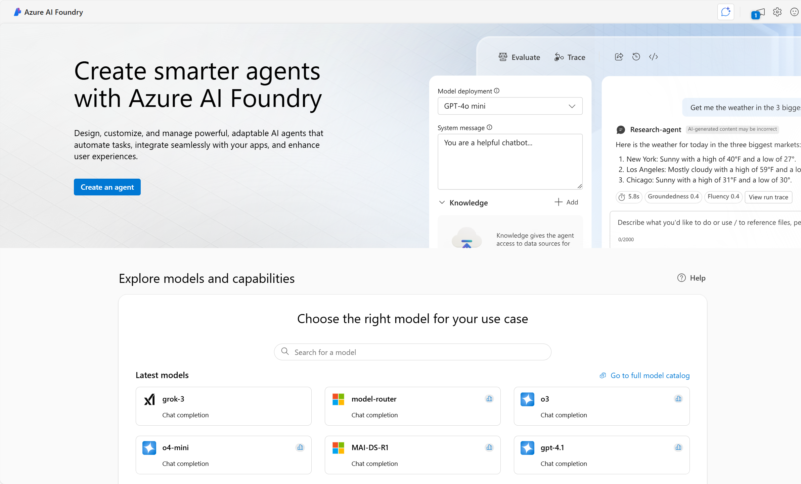
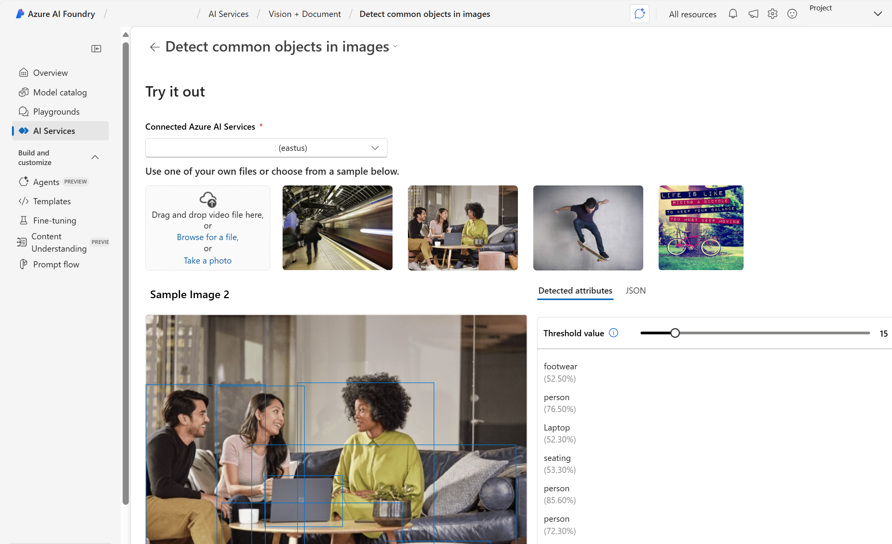

Azure AI Vision provides the building blocks for incorporating vision capabilities into applications. As one of many Azure AI services, you can create solutions with Azure AI Vision in several ways including: 

- The Azure AI Foundry portal
- A software development kit (SDK) or REST API 

## Azure resources for Azure AI Vision service

To use Azure AI Vision, you need to create a resource for it in your Azure subscription. You can use either of the following resource types:

- **Azure AI Vision**: A specific resource for the Azure AI Vision service. Use this resource type if you don't intend to use any other Azure AI services, or if you want to track utilization and costs for your Azure AI Vision resource separately.
- **Azure AI services**: A general resource that includes Azure AI Vision along with many other Azure AI services; such as Azure AI Language, Azure AI Custom Vision, Azure AI Translator, and others. Use this resource type if you plan to use multiple AI services and want to simplify administration and development.

>[!NOTE]
>There are several ways to create resources with Azure. You can use a user interface to create resources or write a script. Both the Azure portal and Azure AI Foundry portal provide user interfaces for resource creation. Choose the Azure AI Foundry portal when you also want to see examples of Azure AI services in action. 

## Get started in Azure AI Foundry portal 

Azure AI Foundry provides a unified platform for enterprise AI operations, model builders, and application development. Azure AI Foundry portal provides a user interface based around **hubs** and **projects**. To use any of the Azure AI services, including Azure AI Vision, you create a project in Azure AI Foundry, which will also create an Azure AI services resource for you. 

Projects in Azure AI Foundry help you organize your work and resources effectively. Projects act as containers for datasets, models, and other resources, making it easier to manage and collaborate on AI solutions.

Within Azure AI Foundry portal, you have the ability to try out service features by testing with sample images or uploading your own. 

Next let's try out Azure AI Vision in Azure AI Foundry portal.

