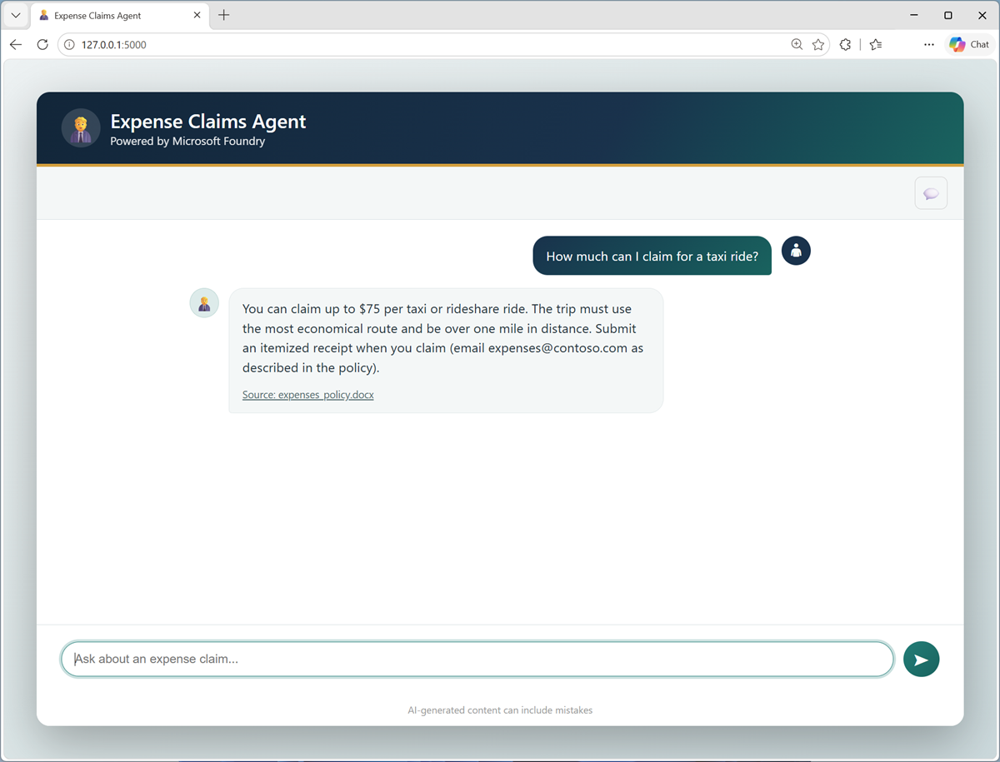

::: zone pivot="video"

> [!VIDEO https://learn-video.azurefd.net/vod/player?id=056788db-8e94-4623-bad4-2dc7dd5bc1e6]

::: zone-end

::: zone pivot="text"

Generative AI models learn broad patterns from their training data, but they don't automatically have access to an organization's private or current information. An employee expense claims assistant, for example, needs approved policies and procedures rather than a general answer based on information from the Internet.

Retrieval-augmented generation (RAG) addresses this need by retrieving relevant information and adding it to the context supplied to a model. Building and maintaining a separate retrieval system for every agent, however, can require significant work.

**Microsoft Foundry IQ** provides a managed knowledge layer for agents and AI applications. It organizes enterprise and web data into reusable knowledge bases and uses agentic retrieval to return relevant, permission-aware information with citations.

In this module, you'll explore the main components of Foundry IQ and learn how an agent uses a knowledge base to produce grounded responses.

::: zone-end

> [!NOTE]
> We recognize that different people like to learn in different ways. You can choose to complete this module in video-based format or you can read the content as text and images. The text contains greater detail than the videos, so in some cases you might want to refer to it as supplemental material to the video presentation.
