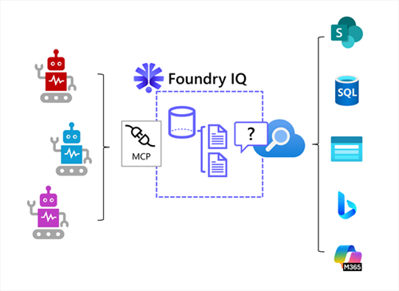
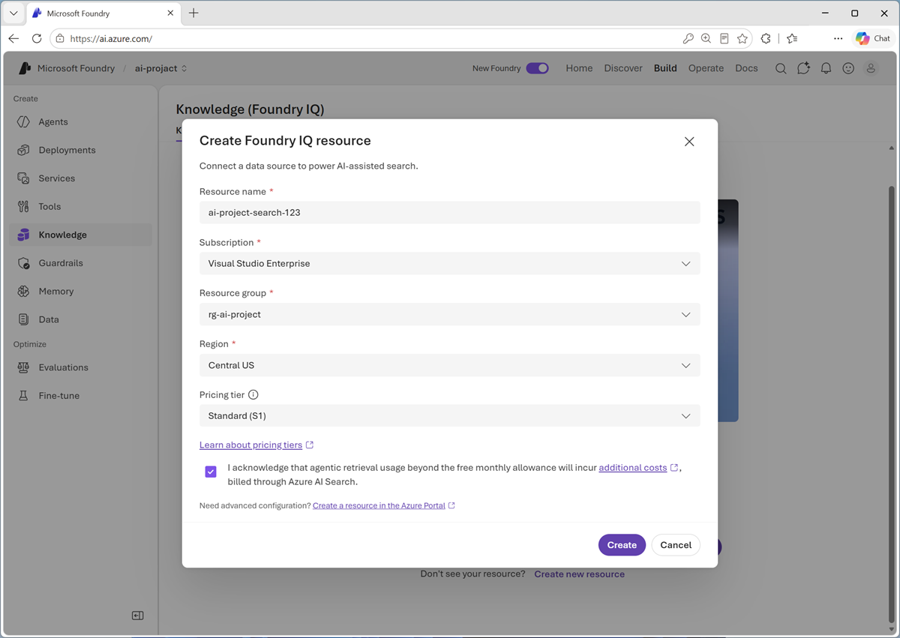

::: zone pivot="video"

> [!VIDEO https://learn-video.azurefd.net/vod/player?id=1d5ae2e4-27dd-4693-91db-db711ec1e355]

> [!TIP]
> See the **Text and images** tab for more details!

::: zone-end

::: zone pivot="text"

Microsoft Foundry provides an integrated environment for building AI applications and agents. Models give agents language and reasoning capabilities, tools enable them to perform actions, and knowledge gives them information that wasn't included in model training.

Foundry IQ is the managed knowledge layer in this environment. It connects structured and unstructured data from supported enterprise systems and the web, making that information available to agents through reusable knowledge bases.

A Foundry IQ solution is based on an Azure AI Search resource that handles the knowledge retrieval, and has three main components:

| Component | Purpose |
|---|---|
| **Knowledge base** | The top-level resource that identifies a collection of related knowledge sources and controls retrieval behavior. |
| **Knowledge source** | A connection to indexed or remote content, such as Microsoft SharePoint content, Azure SQL databases, documents in Azure Storage, public web data, Microsoft 365 Copilot Work IQ, and others. |
| **Agentic retrieval** | A retrieval process that plans searches, finds relevant content, ranks results, and returns a unified response with source references. |

Multiple agents can use the Model Context Protocol (MCP) to connect to the Foundry IQ resource and search its knowledge stores, enabling you to develop and manage a single centrally managed knowledge layer for your agent estate rather than implementing individual RAG pipelines for each agent and data source.

## Why use Foundry IQ?

Consider an organization that wants to create three agents:

- A *finance* agent that advises employees on expense claim guidelines and procedures.
- A *workplace* agent that enables employees to request support with workplace facilities.
- A *vacation* agent that provides information about corporate holidays and enables employees to book personal leave.

Each agent needs reliable information. One approach is to build a separate RAG pipeline for each agent, including document processing, embeddings, search indexes, retrieval logic, permissions, and monitoring. This approach can duplicate work and produce inconsistent results.

With Foundry IQ, developers can create knowledge bases around business domains, such as **Finance policies** or **Workplace and facilities**, and connect them to the agents that need them. Multiple agents can use the same knowledge base, so an improvement to shared knowledge can benefit every connected agent.

Foundry IQ provides capabilities that include:

- Connecting knowledge bases to indexed and remote knowledge sources.
- Preparing indexed content through operations such as chunking, embedding generation, and metadata extraction.
- Retrieving information with keyword, vector, or hybrid search techniques.
- Planning and coordinating retrieval across multiple sources.
- Returning relevant content with citations to its sources.
- Enforcing user permissions for supported sources and configurations.

## Create a Foundry IQ resource

Azure AI Search provides the underlying indexing and retrieval infrastructure for Foundry IQ. The first step in creating s Foundry IQ solution is to configure a Foundry IQ resource with an Azure AI Search instance.

> [!TIP]
> After the Foundry IQ resource has been created, add the managed identify used by your Foundry project to the *Search Index Data Reader* role for the Azure AI Search resource to enable you to test knowledge retrieval in the agent playground. The managed identities for any production agents that will use the Foundry IQ implementation also need to be added to this role.

::: zone-end
