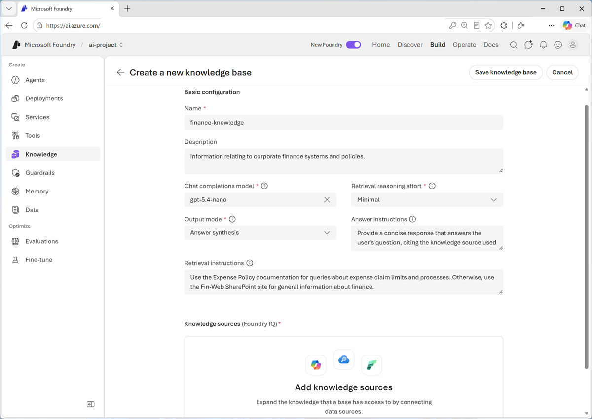
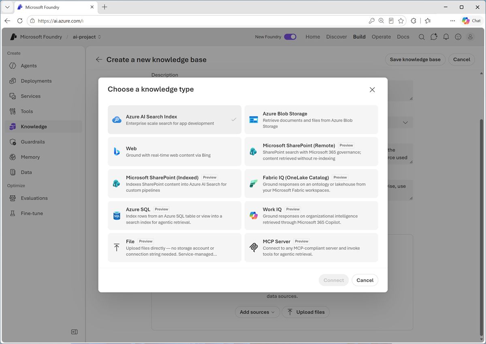

::: zone pivot="video"

> [!VIDEO https://learn-video.azurefd.net/vod/player?id=4fb4041d-9b96-47fa-908b-b526e4ea55d2]

> [!TIP]
> See the **Text and images** tab for more details!

::: zone-end

::: zone pivot="text"

After you've configured a Foundry IQ resource to use Azure AI Search, you can create one or more *knowledge bases* for the information agents need for context, and add *knowledge stores* to each knowledge base to define specific data source connections.

## Create a knowledge base

A knowledge base gives an agent a single retrieval interface across one or more knowledge sources. Instead of teaching an agent about the storage location of every document, you connect the agent to a knowledge base that represents a useful business domain.

For example, a **Finance** knowledge base could combine expense policy documentation in SharePoint with general financial data in a database. The agent queries the knowledge base, and Foundry IQ coordinates retrieval from the configured sources.

The knowledge base configuration includes a generative AI model to support *agentic retrieval*. You can define prompts to help the Foundry IQ layer determine which knowledge sources to prioritize for specific type of information, and to provide guidance for AI-generated responses based on the retrieved knowledge.

## Connect knowledge sources

A *knowledge source* describes content that Foundry IQ can retrieve. Supported source types include:

- Existing Azure AI Search indexes.
- Documents in Azure Blob Storage.
- Microsoft SharePoint content.
- Data in Microsoft OneLake.
- Public web content.

> [!NOTE]
> The exact source options and supported features can change as Foundry IQ evolves.

For example, a corporate finance knowledge store might include a knowledge source for expense policy documentation based on documents in a SharePoint site.

Choose sources according to where the authoritative data lives, how current it must be, and which permissions must apply.

## Considerations for knowledge bases and sources

A knowledge base should contain sources that belong together and support a clear set of user questions. Adding every available source to one knowledge base isn't necessarily helpful. Unrelated or contradictory content can make retrieval less precise.

When planning a knowledge base, consider:

- **Scope**: What questions should this knowledge base answer?
- **Authority**: Which systems contain the approved source of truth?
- **Freshness**: How quickly must source changes become available?
- **Metadata**: Which titles, dates, categories, locations, or identifiers help retrieval and citation?
- **Content quality**: Are documents complete, current, readable, and free from unnecessary duplication?
- **Access**: Which users and agents are authorized to retrieve each item?

::: zone-end
