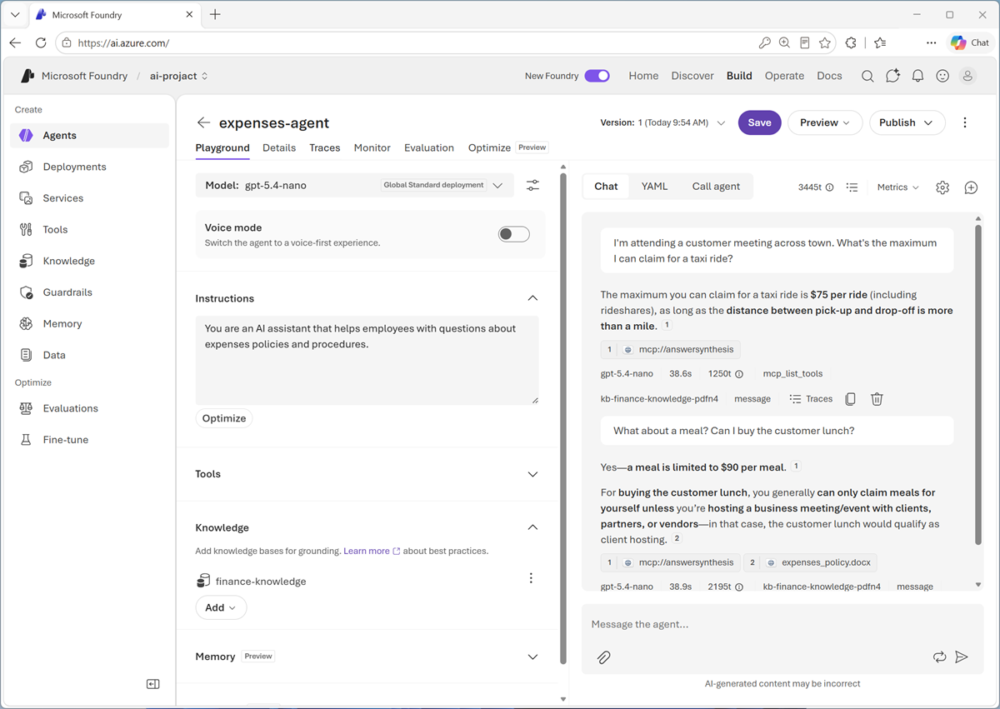

::: zone pivot="video"

> [!VIDEO https://learn-video.azurefd.net/vod/player?id=1afdbe0c-4c35-4ee4-8ca3-72f3b50698c3]

> [!TIP]
> See the **Text and images** tab for more details!

::: zone-end

::: zone pivot="text"

After you create a knowledge base, an agent or application can use it to retrieve relevant information. Foundry IQ knowledge bases can be used by Foundry Agent Service, Microsoft Agent Framework, or custom applications that call the Azure AI Search knowledge base APIs.

## Connect an agent to a knowledge base

Foundry IQ knowledge bases expose a Model Context Protocol (MCP) tool for agent integration. MCP provides a standard way for an agent to call the knowledge base. A typical Foundry workflow is:

1. In a Foundry project, create or connect to an Azure AI Search service that supports agentic retrieval.
2. Create a knowledge base and add appropriate knowledge sources.
3. Create or select an agent with a deployed model.
4. Add the knowledge base connection to the agent as an MCP tool.
5. Define instructions that tell the agent when and how to use the knowledge base.
6. Test questions and inspect answers, citations, and tool activity in the playground.

The project connection should use an appropriate identity and have only the permissions required to retrieve content.

## Write instructions for grounded answers

Connecting a knowledge base doesn't guarantee that an agent uses it consistently. Agent instructions should state the expected behavior. For example:

> Use the knowledge base to answer expense policy questions. Base factual claims on retrieved content and cite the supporting sources. If the knowledge base doesn't contain enough information, say that you don't know rather than guessing.

Effective instructions define:

- **When to retrieve**: Identify the questions or domains that require the knowledge base.
- **How to use evidence**: Require answers to stay grounded in retrieved content.
- **How to cite**: Ask for source references that users can inspect.
- **What to do when evidence is missing**: Tell the agent to acknowledge uncertainty or refer the user to an appropriate person or process.

## Test and improve the experience

Test the knowledge-enhanced agent with realistic questions before using it in production. Include:

- Straightforward questions with one clear source.
- Questions that require information from multiple sources.
- Ambiguous questions that should trigger clarification.
- Questions for which the knowledge base has no answer.
- Questions from users with different source permissions.
- Content containing text that attempts to change the agent's instructions.

Evaluate retrieval and the final response separately. First check whether Foundry IQ returned relevant, current, and authorized evidence. Then check whether the agent's response is grounded, relevant, complete, and correctly cited. Monitoring these behaviors over time helps reveal content gaps, weak retrieval, permission issues, and instructions that need refinement.

::: zone-end
