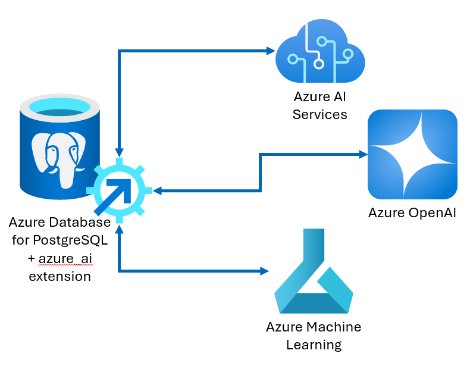

Generative AI, or GenAI, refers to a category of AI algorithms that can learn from existing data and generate new, original content based on natural language input.

The [**azure_ai extension**](/azure/postgresql/flexible-server/generative-ai-azure-overview) is a powerful tool created by the PostgreSQL team at Microsoft that provides seamless integration between your Azure Database for PostgreSQL flexible server and Azure AI and Machine Learning services. It allows you to streamline the development process and harness the power of GenAI directly within their database, providing access to powerful natural language query processing capabilities. With just a few lines of SQL code, you can create vector embeddings, extract insights, and store them in the database. This extension bridges the data and actionable knowledge gap, making it a valuable asset for enterprises building GenAI solutions.

## Azure AI services

[**Azure AI services**](/azure/ai-services/what-are-ai-services) are a set of advanced cloud-based tools and technologies created by Microsoft to enable you to build intelligent apps and systems without requiring specialized AI or data science skills. These services allow the incorporation of powerful AI capabilities into a wide range of applications, such as natural language processing, machine learning, computer vision, and more. By using Azure AI services, you can create innovative solutions that enhance user experiences, automate workflows, and improve business operations across various industries.

### Azure OpenAI service

OpenAI is an AI research organization and technology company known for its groundbreaking work in artificial intelligence and machine learning. Their goal is to ensure that artificial general intelligence (AGI) benefits all of humanity. OpenAI introduced state-of-the-art generative models, including GPT-3, GPT-3.5, and GPT-4.

The [**Azure OpenAI Service**](/azure/ai-services/openai/overview) provides REST API access to OpenAI's powerful language models and is designed to help build GenAI applications using Azure. Exposing a robust suite of artificial intelligence services and models enables you to build innovative applications that use natural language understanding, text generation, and other GenAI capabilities. Azure OpenAI provides access to state-of-the-art generative AI language models capable of understanding context, generating coherent text, and performing translation, summarization, and question-answering tasks. With Azure OpenAI, you can build applications that understand natural language input and respond intelligently.

### Azure AI Language service

The [**Azure AI Language**](/azure/ai-services/language-service/overview) empowers you to build intelligent applications that understand and process natural language. When integrated with an Azure Database for PostgreSQL flexible server instance, these services enhance your database capabilities, allowing you to perform tasks like sentiment analysis, text summarization, and key phrase extraction directly within SQL queries.

## Azure Machine Learning

[**Azure Machine Learning**](/azure/machine-learning/overview-what-is-azure-machine-learning) is a comprehensive cloud service designed for the machine learning project lifecycle. It provides a robust platform for building, deploying, and managing machine learning models.

## Unlock AI-powered applications

Azure AI and Machine Learning services can be seamlessly integrated into your PostgreSQL database using the `azure_ai` extension to help you build highly scalable AI-powered applications. You can use the familiar SQL language and the flexibility of PostgreSQL to create intelligent solutions within your database layer. Azure AI Services provides various capabilities, such as natural language processing, recommendation systems, text summarization, and content generation, which can empower your applications. Azure Machine Learning allows you to build, train, and deploy custom machine learning models, which can be invoked from the `azure_ai` extension to make predictions or generate outputs based on data in your tables.

## Scenario: Rental property search and recommendations application

Imagine you're the lead AI developer for Margie's Travel, a company whose web and mobile apps connect travelers looking for lodging accommodations with homeowners and property managers willing to rent out their properties. These apps are backed by an Azure Database for PostgreSQL database. You're tasked with enhancing these apps with new GenAI functionality. You're researching how Azure AI and ML services and the `azure_ai` extension can be used to add these capabilities.

## Learning objectives

This module examines the `azure_ai` extension and how it enables the seamless integration of generative AI capabilities into applications using an Azure Database for PostgreSQL flexible server. It equips you with the knowledge to create powerful generative AI applications. In this module, you:

- Examine the concepts of Generative AI and generative language models and explore how they can be used to build rich AI applications.
- Evaluate the capabilities of `azure_ai` extension for PostgreSQL.
- Install and explore the `azure_ai` extension in an Azure Database for PostgreSQL flexible server instance.

By the end of this module, you will be able to start building powerful GenAI applications using an Azure Database for PostgreSQL flexible server extended with the `azure_ai` extension.
