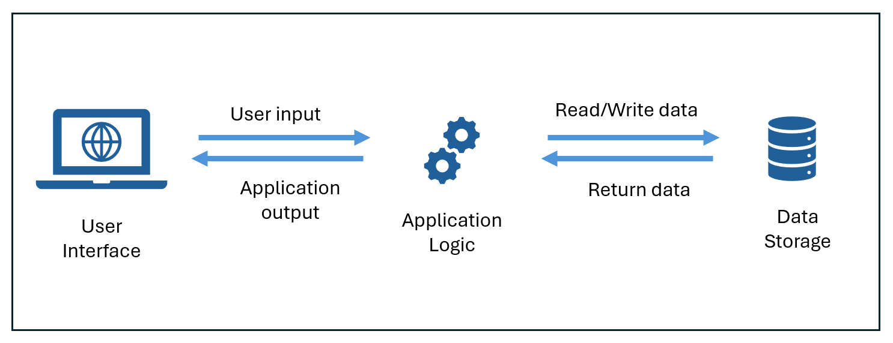

Generative AI applications are built with language models. These language models power the 'app logic' component of the interaction between users and generative AI. 

## Understand assistants

Generative AI often appears as chat-based assistants that are integrated into applications to help users find information and perform tasks efficiently. One example of such an application is [Microsoft Copilot](https://copilot.microsoft.com), an AI-powered productivity tool designed to enhance your work experience by providing real-time intelligence and assistance. 

> [!NOTE]
> Microsoft Copilot is a generative AI based assistant that is integrated into a wide range of Microsoft applications and user experiences. Business users can use Microsoft Copilot to boost their productivity and creativity with AI-generated content and automation of tasks. Developers can extend Microsoft Copilot by creating plug-ins that integrate Copilot into business processes and data, or even create copilot-like agents to build generative AI capabilities into apps and services. You can learn extensively about Microsoft Copilot [here](/copilot/microsoft-365/).  

## Understand agents 

Generative AI that can executes tasks such as filing taxes or coordinating shipping arrangements, just as a few examples, are known as *agents*. **Agents** are applications that can respond to user input or assess situations *autonomously*, and take appropriate actions. These actions could help with a series of tasks. For example, an "executive assistant" agent could provide details about the location of a meeting on your calendar, then attach a map or automate the booking of a taxi or rideshare service to help you get there.  

Agents contain three main components: 
- A language model that powers reasoning and language understanding
- Instructions that define the agent’s goals, behavior, and constraints
- Tools, or functions, that enable the agent to complete tasks

> [!NOTE]
> Today's AI solutions often contain a combination of assistant, agentic, and other AI capabilities. The process of coordinating and managing multiple AI components—such as models, data sources, tools, and workflows—to work together efficiently in a unified solution is known as *orchestration*.   

## Use a framework for understanding generative AI applications

One way to think of different generative AI applications is by grouping them in buckets. In general, you can categorize industry and personal generative AI into three buckets, each requiring more customization: ready-to-use applications, extendable applications, and applications you build from the foundation.

|**Category**|**Description**|
|-|-|
|**Ready-to-use**| These applications are ready-to-use generative AI applications. They do not require any programming work on the user's end to utilize the tool. You can start simply by asking the assistant a question.|
|**Extendable**| Some ready-to-use applications can also be extended using your own data. These customizations enable the assistant to better support specific business processes or tasks. Microsoft Copilot is an example of technology that is ready-to-use and extendable.| 
|**Applications you build from the foundation**| You can build your own assistants and assistants with agentic capabilities starting from a language model.| 

Often, you will use services to extend or build generative AI applications. These services provide the infrastructure, tools, and frameworks necessary to develop, train, and deploy generative AI models. For example, Microsoft provides services such as Copilot Studio to extend Microsoft 365 Copilot and Microsoft Azure AI Foundry to build AI from different models.  

Next let's look at tools used to extend and build generative AI applications.
