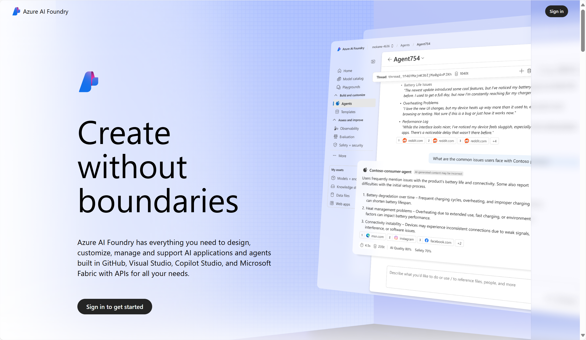

Microsoft offers a powerful ecosystem of tools and services for building generative AI solutions, designed to support developers, data scientists, and enterprises at every stage of the AI lifecycle. You can develop generative AI solutions with several Microsoft solutions. This module will focus on **Microsoft Foundry**, Microsoft's unified platform for enterprise AI operations, model builders, and application development. 

As a PaaS (platform as a service), Microsoft Foundry gives developers control over the customization of language models used for building applications. These models can be deployed in the cloud and consumed from custom-developed apps and services. 

You can use **Microsoft Foundry portal**, a user interface for building, customizing, and managing AI applications and agents—especially those powered by generative AI. 

Components of Microsoft Foundry include: 

|**Component**|**Description**|
|-|-|
|**Microsoft Foundry model catalog**|A centralized hub for discovering, comparing, and deploying a wide range of models for generative AI development.| 
|**Playgrounds**|Ready-to-use environments for quickly testing ideas, trying out models, and exploring Foundry Models.|
|**Foundry Tools**|In Microsoft Foundry portal, you can build, test, see demos, and deploy Foundry Tools.|
|**Solutions**|You can build agents and customize models in Microsoft Foundry portal.|
|**Observability**|Ability to monitor usage and performance of your application's models.| 

>[!NOTE]
>Microsoft's *Copilot Studio* is another generative AI development tool. It is designed to work well for low-code development scenarios in which technically proficient business users or developers can create conversational AI experiences. The resulting agent is a fully managed SaaS (software as a service) solution, hosted in your Microsoft 365 environment and delivered through chat channels like Microsoft Teams. With Copilot Studio, the infrastructure considerations and model deployment details are taken care of for you, making it easy to focus on creating an effective solution. For more information, see https://www.microsoft.com/microsoft-copilot/microsoft-copilot-studio.

