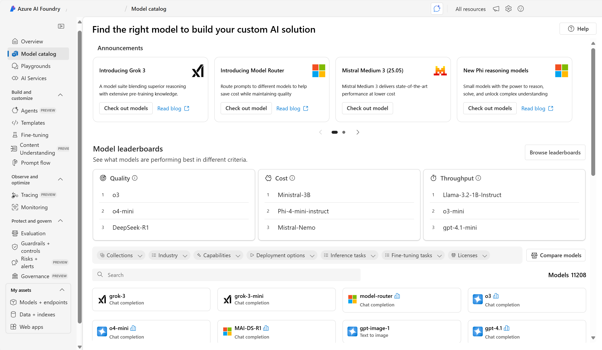
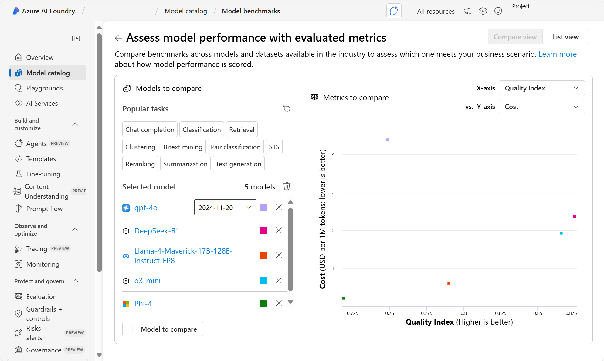

Azure AI Foundry provides a comprehensive and dynamic marketplace containing models sold directly by Microsoft and models from its partners and community. 

**Azure OpenAI in Foundry models** make up Microsoft's first-party model family and are considered *foundation models*. Foundation models are pretrained on large texts and can be fine-tuned for specific tasks with a relatively small dataset.

You can deploy the models from Azure AI Foundry model catalog to an endpoint without any extra training. If you want the model to be specialized in a task, or perform better on domain-specific knowledge, you can also choose to customize a foundation model.

To choose the model that best fits your needs, you can test out different models in a *playground* setting and utilize *model leaderboards (preview)*. Model leaderboards provide a way to see what models are performing best in different criteria such as quality, cost, and throughput. You can also see graphical comparisions of models based on specific metrics.

Next, let's take a closer look at how to get started with Azure AI Foundry capabilities.
