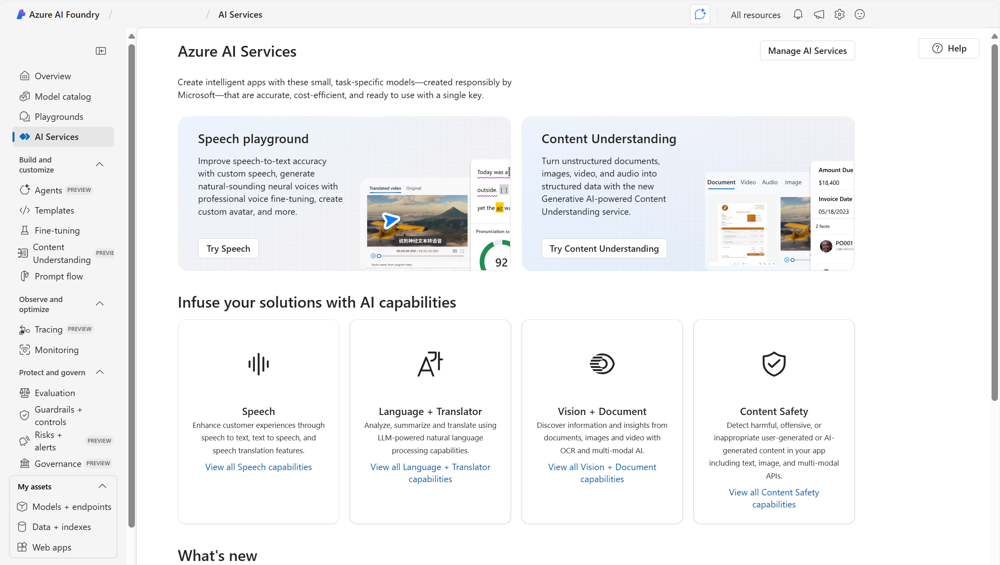
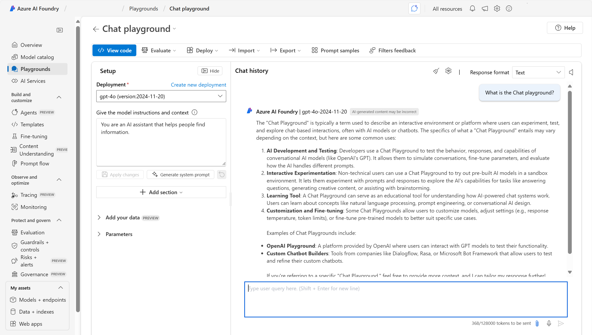

Azure AI Foundry portal provides a user interface based around **hubs** and **projects**. In general, creating a **hub** provides more comprehensive access to Azure AI and Azure Machine Learning. Within a hub, you can create projects. **Projects** provide more specific access to models and agent development. 

When you create an Azure AI Hub, several other resources are created in tandem, including an **Azure AI services** resource. In Azure AI Foundry portal, you can test all kinds of Azure AI services, including Azure AI Vision, Azure AI Language, Azure AI Speech, and Azure AI Foundry Content Safety. 

In addition to demos, Azure AI Foundry portal provides playgrounds to test Azure AI services and other models from the model catalog. 

There are many ways to customize the models in generative AI applications. The purpose of customizing your model is to improve aspects of its performance, including quality  and safety of the responses. Let's take a look at four of the main ways you can customize models in Azure AI Foundry. 

|**Method**|**Description**|
|-|-|
|**Using grounding data**| Grounding refers to the process of ensuring that a system's outputs are aligned with factual, contextual, or reliable data sources. Grounding can be done in various ways, such as linking the model to a database, using search engines to retrieve real-time information, or incorporating domain-specific knowledge bases. The goal is to anchor the model's responses to these data sources, enhancing the trustworthiness and applicability of the generated content.|
|**Retrieval-Augmented Generation (RAG)**| RAG augments a language model by connecting it to an organization's proprietary database. This technique involves retrieving relevant information from a curated dataset and using it to generate contextually accurate responses. RAG enhances the model's performance by providing it with up-to-date and domain-specific information, which helps in generating more accurate and relevant answers. RAG is useful for applications where real-time access to dynamic data is crucial, such as customer support or knowledge management systems.|
|**Fine-tuning**| Involves taking a pretrained model and further training it on a smaller, task-specific dataset to make it more suitable for a particular application. This process allows the model to specialize and perform better at specific tasks that require domain-specific knowledge. Fine-tuning is useful for adapting models to domain-specific requirements, improving accuracy, and reducing the likelihood of generating irrelevant or inaccurate responses.|
|**Managing security and governance controls**| Security and governance controls are needed to manage access, authentication, and data usage. These controls help prevent the publication of incorrect or unauthorized information.|

Next, let's understand how Azure AI Foundry provides tools for generative AI application performance evaluation. 