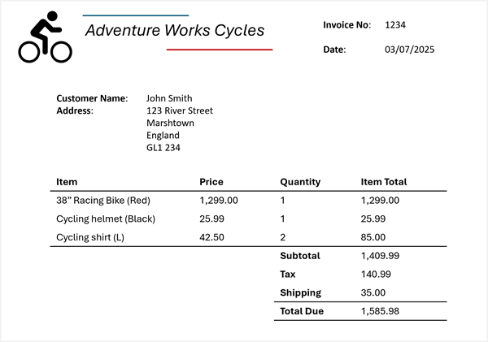

::: zone pivot="video"

>[!VIDEO https://learn-video.azurefd.net/vod/player?id=5bc63a09-15ea-478a-8a86-3547fa6d25fc]

> [!NOTE]
> See the **Text and images** tab for more details!

::: zone-end

::: zone pivot="text"

Today's business processes depend heavily on data contained in documents like forms, receipts, and invoices. Manual processing can introduce delays and errors, making data extraction automation more important than ever.

## How Azure Content Understanding works

Azure Content Understanding follows a model‑driven extraction workflow in which unstructured content is ingested, analyzed, and returned as structured data. 

1. **Ingest content**: You submit content to Azure Content Understanding.

2. **AI-powered analysis**: The service uses a combination of: Optical Character Recognition (OCR), speech recognition, natural language understanding, and multimodal AI models to analyze the content. 

3. **Structured output**: The service returns structured results (for example, in JSON) that match your model—making the data easy to store, search, or integrate into downstream systems. 

>[!NOTE]
> JSON (JavaScript Object Notation) is a text‑based data format used to store and exchange structured data between systems. It's easy for humans to read and write, and easy for machines to parse and generate. 

#### Understand schemas 

OCR (optical character recognition) allows a computer to 'read' text from pictures, such as scanned documents, photos of receipts, or images of printed pages, and turn that text into editable and searchable digital text. Basic OCR helps recognize printed text, focuses on text extraction, and *doesn't* understand meaning, context, or relationships between words. 

Azure Content Understanding's document analysis capabilities go beyond simple OCR-based text extraction to include **schema-based** extraction of fields and their values. The schema-driven approach is what differentiates Azure Content Understanding from basic OCR or transcription services.

A schema describes *what information you want to extract* and *how that information should be structured*. When you define a schema, you specify fields to extract. A schema lists the specific fields or entities you care about.

For example, suppose you define a schema that includes the common fields typically found in an invoice, such as:

- Vendor name
- Invoice number
- Invoice date
- Customer name
- Custom address
- Items - the items ordered, each of which includes:
    - Item description
    - Unit price
    - Quantity ordered
    - Line item total
- Invoice subtotal
- Tax
- Shipping Charge
- Invoice total

Now suppose you need to extract this information from the following invoice:



Azure Content Understanding can apply the invoice schema to your invoice and identify the corresponding fields, even when they're labeled with different names (or not labeled at all). The resulting analysis produces a result like this:


The schema also defines the field structure. Schemas support *structured and nested fields*, not just flat text. For example: 

- `Items` is a collection
- Each item has `description`, `unit price`, `quantity`, and `line total`

Identifying structured fields allows Azure Content Understanding to understand relationships between values, something OCR alone cannot do. 

In the invoice example, for each detected *field*, you can extract nested values:

- **Vendor name**: Adventure Works Cycles
- **Invoice number**: 1234
- **Invoice date**: 03/07/2025
- **Customer name**: John Smith
- **Custom address**: 123 River Street, Marshtown, England, GL1 234
- **Items**:
    - Item 1:
        - **Item description**: 38" Racing Bike (Red)
        - **Unit price**: 1299.00
        - **Quantity ordered**: 1
        - **Line item total**: 1299.00
     - Item 2:
        - **Item description**: Cycling helmet (Black)
        - **Unit price**: 25.99
        - **Quantity ordered**: 1
        - **Line item total**: 25.99
     - Item 3:
        - **Item description**: Cycling shirt (L)
        - **Unit price**: 42.50
        - **Quantity ordered**: 2
        - **Line item total**: 85.00
- **Invoice subtotal**: 1409.99
- **Tax**: 140.99
- **Shipping Charge**: 35.00
- **Invoice total**: 1585.98

Azure Content Understanding extracts expected meaning, not just labels. Schemas are applied *semantically*, meaning:
- Fields can be extracted even if labels differ
- Fields can be extracted even if labels are missing

For example, *Invoice No.*, *Invoice #*, or an unlabeled number can all map to `InvoiceNumber` if the analyzer determines they represent the same concept. 

#### Understand analyzers 

An **analyzer** is a unit in Azure Content Understanding that takes input, applies AI analysis, and produces structured results. Analyzers consistently apply the same extraction logic to all incoming content. Once it's configured, an analyzer ensures a schema is reused consistently for every analysis request. Analyzers also produce predictable JSON results. The structured results make downstream processing (storage, search, automation) easier.

Azure Content Understanding offers prebuilt analyzers for common scenarios and supports custom analyzers tailored to your needs. At a high level:

1. You choose or create an analyzer.
2. The analyzer includes a schema defining fields and structure.
3. You submit content for analysis
4. The service applies the schema
5. You receive structured JSON results matching the schema

## Using Azure Content Understanding in the Foundry portal 

> [!NOTE]
> Foundry portal has a *classic* user interface (UI) and a *new* user interface.

After you create a *Microsoft Foundry resource*, you can use the ***classic* Foundry portal interface** to test out 
Azure Content Understanding. The Foundry portal provides content examples and allows you to upload your own material for analysis. 

You can use the visual interface to select a source document and extract default fields of information. For example, when you try out Azure Content Understanding on an image of a document, the service returns the document text and text layout information. 

:::image type="content" source="../media/document-analysis-playground.png" alt-text="Screenshot of the classic Foundry portal with a document analyzed with Azure Content Understanding." lightbox="../media/document-analysis-playground.png":::

Azure Content Understanding's analyzers identify text values in documents and map them to specific fields. For example, given an invoice, the service returns the fields (such as Vendor address) and the data in the fields (such as 123 456th Street). 

:::image type="content" source="../media/invoice-playground.png" alt-text="Screenshot of the classic Foundry portal with an invoice analyzed with Azure Content Understanding." lightbox="../media/invoice-playground.png":::

In Foundry portal, you can also view the JSON results of the processing. 

:::image type="content" source="../media/invoice-json-result-playground.png" alt-text="Screenshot of the classic Foundry portal with the JSON result of an invoice analyzed with Azure Content Understanding." lightbox="../media/invoice-json-result-playground.png":::

## Building a client application with Azure Content Understanding 

You can use the **Content Understanding API** to build a lightweight client application that extracts data programmatically. 

>[!NOTE]
> A client application is a software program that runs on a user's device and requests services or data from another system, typically a server, over a network. The *client* is the part of an application that users interact with, while the *server* does the heavy work behind the scenes. Applications can request data or actions from a service and receive a structured response using an API.

When you use the Content Understanding API, you can choose a prebuilt analyzer or create a custom analyzer. Prebuilt analyzers include: `prebuilt-invoice`, `prebuilt-imageSearch`, `prebuilt-audioSearch`, and `prebuilt-videoSearch`. When you submit content for analysis to the analyzer, the analysis is **asynchronous**, which means you get the result later when it's ready. Because the analysis is asynchronous, you need to *poll* the Operation-Location URL (or `analyzerResults`) until the job succeeds. 

#### Using the Azure Content Understanding Python SDK

Let's take a look at the process of using the Python SDK to analyze an invoice from a URL.  

1. Install the Azure Content Understanding Python SDK. 

```bash
python -m pip install azure-ai-contentunderstanding
```

2. Identify your Foundry resource endpoint and API key or Microsoft Entra ID. Your endpoint typically looks like: `https://<your-resource-name>.services.ai.azure.com/`

3. Create and run the client application code. The `analzyer_id` is the ID of the prebuilt analyzer. You can find a list of prebuilt analyzer ID values [here](/azure/ai-services/content-understanding/concepts/prebuilt-analyzers). 

```python
import os
from azure.ai.contentunderstanding import ContentUnderstandingClient
from azure.core.credentials import AzureKeyCredential

endpoint = os.environ["FOUNDRY_ENDPOINT"]
key = os.environ["FOUNDRY_KEY"]

client = ContentUnderstandingClient(endpoint=endpoint, credential=AzureKeyCredential(key))

# 1) start analysis with analyzer id + inputs
analyzer_id = "prebuilt-invoice"
inputs = [
    {"url": "https://github.com/Azure-Samples/azure-ai-content-understanding-python/raw/refs/heads/main/data/invoice.pdf"}
]

# 2) wait for the Long Running Operation (LRO) to complete
poller = client.begin_analyze(analyzer_id=analyzer_id, inputs=inputs)  # starts LRO
result = poller.result()  # waits for completion (polling handled by SDK)

# 3) read structured fields + markdown
# The result typically includes extracted "fields" and "markdown" per input content item.
for content in result.contents:
    print(content.markdown)
    print(content.fields)
```

The resulting output is JSON that shows the extracted markdown, fields, data in the fields, and confidence score. For example: 

```json
{
	"status": "Succeeded",
	"result": {
		"analyzerId": "prebuilt-invoice",
		"apiVersion": "2025-05-01-preview",
		"contents": [
			{
				"markdown": "# INVOICE\n\nCONTOSO LTD.\n\nContoso Headquarters\n123 456th St\nNew York, NY, 10001\n\nINVOICE: INV-100\n\nINVOICE DATE: 11/15/2019\n\nDUE DATE: 12/15/2019\n\nCUSTOMER NAME: MICROSOFT CORPORATION\n",
				"fields": {
					"CustomerName": {
						"type": "string",
						"valueString": "MICROSOFT CORPORATION",
						"confidence": 0.95,
					},
					"InvoiceDate": {
						"type": "date",
						"valueDate": "2019-11-15",
						"confidence": 0.994,
					}
                }
            }
        ]
    }
}
```

Next, learn how to use Azure Content Understanding analyzers to extract structured data from audio and video. 
 
::: zone-end