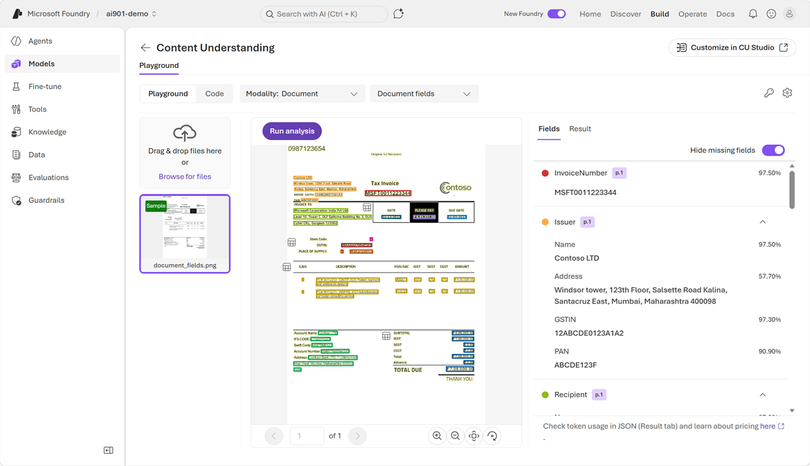

In this exercise, you'll use Azure Content Understanding to analyze documents and extract information from them.

If you have an Azure subscription, you can use it to explore Content Understanding in Microsoft Foundry Tools.

> [!NOTE]
> If you don't already have one, you can [sign up for an Azure subscription](https://azure.microsoft.com/pricing/purchase-options/azure-account?cid=msft_learn), which includes free credits for the first 30 days.

*Use the following button to start the exercise*

