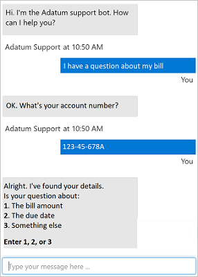
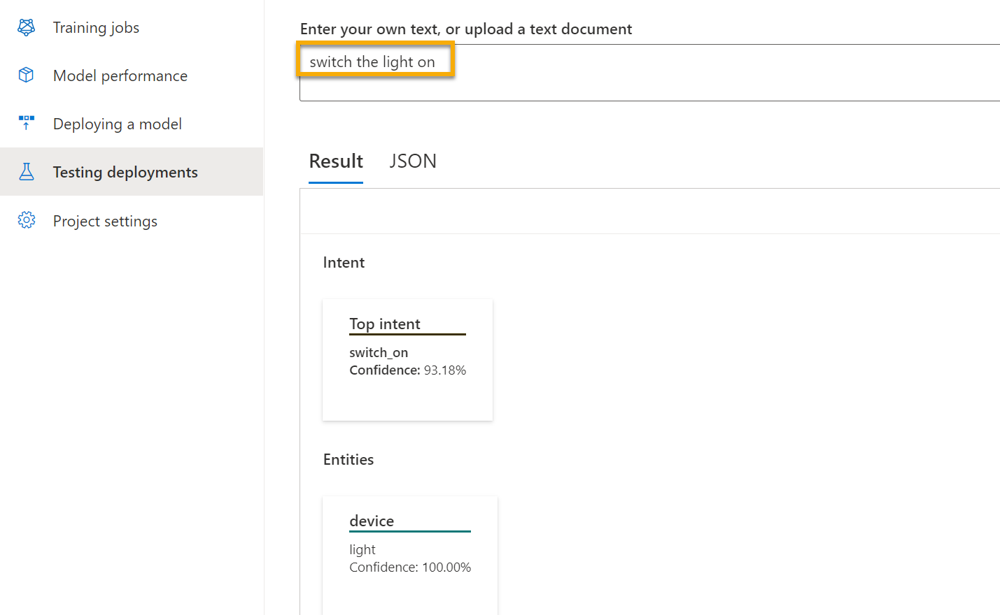

Azure AI Language also includes other features that encompass *conversational AI*. Conversational AI describes solutions that enable a dialog between AI and a human. 

## Question answering

Azure AI Language's question answering feature provides you with the ability to create conversational AI solutions. Question answering supports natural language AI workloads that require an automated conversational element. Typically, question answering is used to build bot applications that respond to customer queries. Question answering capabilities can respond immediately, answer concerns accurately, and interact with users in a natural multi-turned way. Bots can be implemented on a range of platforms, such as a web site or a social media platform.

You can easily create a question answering solution on Microsoft Azure using Azure AI Language service. Azure AI Language includes a custom question answering feature that enables you to create a knowledge base of question and answer pairs that can be queried using natural language input.

## Conversational language understanding

Azure AI Language service supports conversational language understanding (CLU). You can use CLU to build language models that interpret the meaning of phrases in a conversational setting. Conversational language understanding describes a set of features that can be used to build an end-to-end conversational application. In particular, the features enable you to customize natural language understanding models to predict the overall intention of an incoming phrase and extract important information from it.

One example of a CLU application is one that's able to turn devices on and off based on speech. The application is able to take in audio input such as, "Turn the light off", and understand an action it needs to take, such as turning a light off. Many types of tasks involving command and control, end-to-end conversation, and enterprise support can be completed with Azure AI Language's CLU feature.

>[!NOTE]
> In modern AI solutions, multiple AI capabilities are often working together, evolving from, or building off of one another. These conversational AI capabilities may look similar to what generative AI capabilities look like today. Generative AI uses NLP as a foundation but extends beyond it by creating new content.

Next, let's look at Azure AI Translator's capabilities.