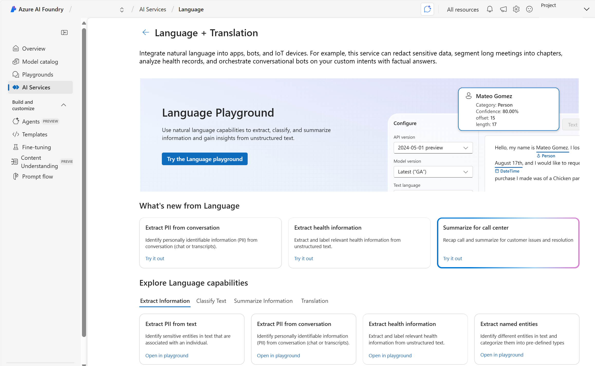
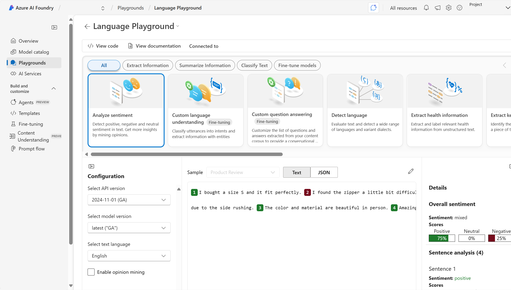
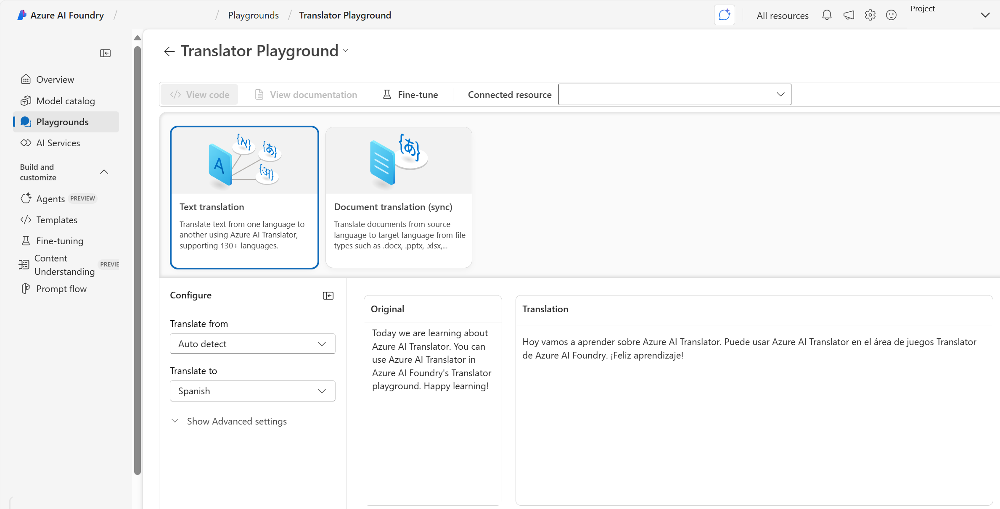

Azure AI Language and Azure AI Translator provide the building blocks for incorporating language capabilities into applications. As one of many Azure AI services, you can create solutions in several ways including: 

- The Azure AI Foundry portal
- A software development kit (SDK) or REST API 

To use Azure AI Language or Azure AI Translator in an application, you must provision an appropriate resource in your Azure subscription. You can choose either a single-service resource or a multi-service resource. 

- A **Language** resource - choose if you only plan to use Azure AI Language services, or if you want to manage access and billing for the resource separately from other services.
- A **Translator** resource - choose if you want to manage access and billing for each service individually.
- An **Azure AI services** resource - choose if you plan to use Azure AI Language in combination with other Azure AI services, and you want to manage access and billing for these services together.

>[!NOTE]
>There are several ways to create resources with Azure. You can use a user interface to create resources or write a script. Both the Azure portal and Azure AI Foundry portal provide user interfaces for resource creation. Choose the Azure AI Foundry portal when you also want to see examples of Azure AI services in action. 

## Get started in Azure AI Foundry portal 

Azure AI Foundry provides a unified platform for enterprise AI operations, model builders, and application development. Azure AI Foundry portal provides a user interface based around **hubs** and **projects**. To use any of the Azure AI services, including Azure AI Language or Azure AI Translator, you create a project in Azure AI Foundry, which will also create an Azure AI services resource for you. 

Projects in Azure AI Foundry help you organize your work and resources effectively. Projects act as containers for datasets, models, and other resources, making it easier to manage and collaborate on AI solutions.

Within Azure AI Foundry portal, you have the ability to try out service features in a playground setting. Azure AI Foundry portal provides a language playground and a translator playground.

Next let's try out language capabilities in Azure AI Foundry portal.