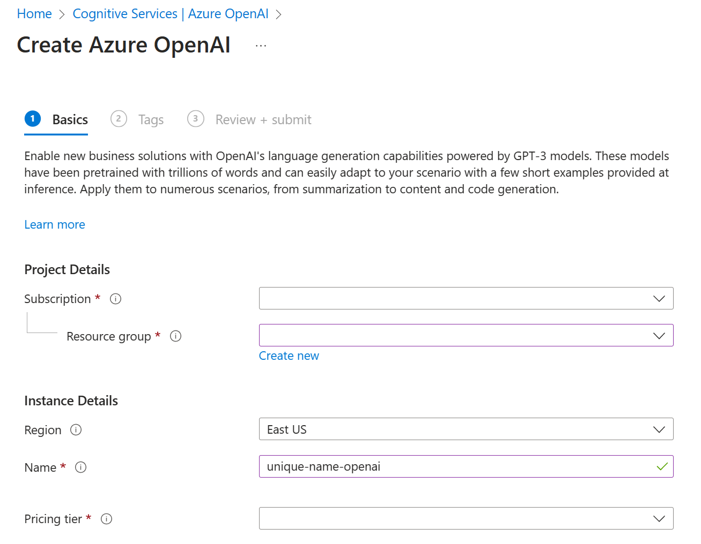

Currently Azure OpenAI Service is in limited access and users need to apply for service access at [https://aka.ms/oai/access]( https://aka.ms/oai/access?portal=true). Azure OpenAI Service has been released with the intention of protecting the rights of individuals and society and fostering transparent human-computer interaction. The role of limited access is to support the ethical use of the service.

Once you have access to Azure OpenAI Service, you can begin to use it by creating a resource in the [Azure portal](https://portal.azure.com/?portal=true) or via a script that accesses your Azure subscription from the command line. 

## Create an Azure OpenAI Service resource in the Azure portal 
When you create a resource, you will need to provide your subscription, resource group, region, instance name, and pricing tier.


## Create an Azure OpenAI Service resource in the Command Line 

You can also use the command line to create a resource: 

```dotnetcli
POST {endpoint}/openai/deployments?api-version=2022-12-01
```

You can view command line instructions [here](https://learn.microsoft.com/azure/cognitive-services/openai/how-to/create-resource?pivots=cli/?portal=true).   

### Regional availability 
Azure OpenAI Service provides access to many types of models. You will learn more about the types of models later in this module. It is important to keep in mind that certain models are only available in select regions. Consult the [Azure OpenAI model availability guide](https://learn.microsoft.com/en-us/azure/cognitive-services/openai/concepts/models#model-summary-table-and-region-availability/?portal=true) for region availability. You can create two Azure OpenAI resources per region. 


 