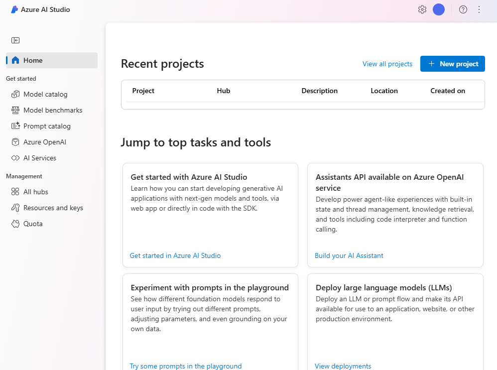
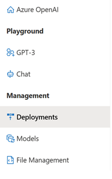

Azure OpenAI Studio provides access to model management, deployment, experimentation, customization, and learning resources. 

You can access the Azure OpenAI Studio  through the Azure portal after creating a resource, or at [https://oai.azure.com](https://oai.azure.com/?azure-portal=true) by logging in with your Azure OpenAI resource instance. During the sign-in workflow, select the appropriate directory, Azure subscription, and Azure OpenAI resource.

When you first open Azure OpenAI Studio, you'll see a call-to-action button at the top of the screen to deploy your first model. Selecting the option to create a new deployment opens the **Deployments** page, from where you can deploy a base model and start experimenting with it.

