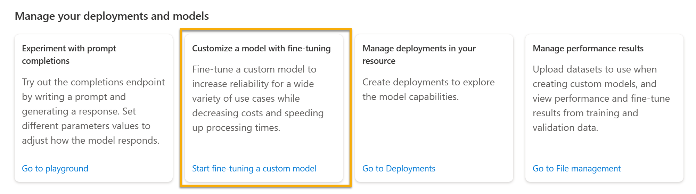

To begin building with Azure OpenAI, you need to choose a base model and deploy it. Microsoft provides base models and the option to create customized base models. This module will cover the currently available out-of-the-box base models.   

## Model families 

Azure OpenAI's generative AI models are grouped by family and capability. The family groupings are by workload. The base models within the families are distinguished how well they can complete the workload.

|Family|Description|Base models within the Family|
|:--------|:-------------------------------------|:---------------|
|**GPT-4**|Models that generate natural language *and* code. These models are currently in preview. For access, existing Azure OpenAI customers can apply by [filling out this form](https://aka.ms/oai/get-gpt4).|gpt-4, gpt-4-32k|
|**GPT-3**|Models that can understand and generate natural language.|text-davinci-003, text-curie-001, text-babbage-001, text-ada-001, gpt-35-turbo|
|**Codex**|Models that can understand and generate code, including translating natural language to code.|code-davinci-002, code-cushman-001|
|**Embeddings**| Embeddings are further broken down into three families of models for different functionalities: similarity, text search, and code search.| [See the list.](https://learn.microsoft.com/azure/cognitive-services/openai/concepts/models#embeddings-models?portal=true) | 

>[!NOTE]
>The underlying generative AI capabilities in OpenAI's ChatGPT are in the **gpt-35-turbo** model, which belongs to the GPT-3 family. This model is in preview. You can learn more in the [documentation](https://learn.microsoft.com/azure/cognitive-services/openai/how-to/chatgpt?pivots=programming-language-chat-completions?portal=true). 

## Choosing a model 
The models within the family differ by speed, cost, and how well they complete tasks. You can learn more about the differences and latest models offered in the [documentation](https://learn.microsoft.com/azure/cognitive-services/openai/concepts/models?portal=true).

>[!NOTE]
>Pricing is determiend by tokens and by model type. Learn more about the latest [pricing here](https://azure.microsoft.com/pricing/details/cognitive-services/openai-service/). 

## Azure OpenAI Studio navigation

In the Azure OpenAI Studio, you can find the base models and fine-tune a custom model by selecting **Start fine-tuning a custom model** from the home page.

You are taken to a page for models and model customization, which lists the available base models. 

 

Next, you will learn how to deploy the model.
   
