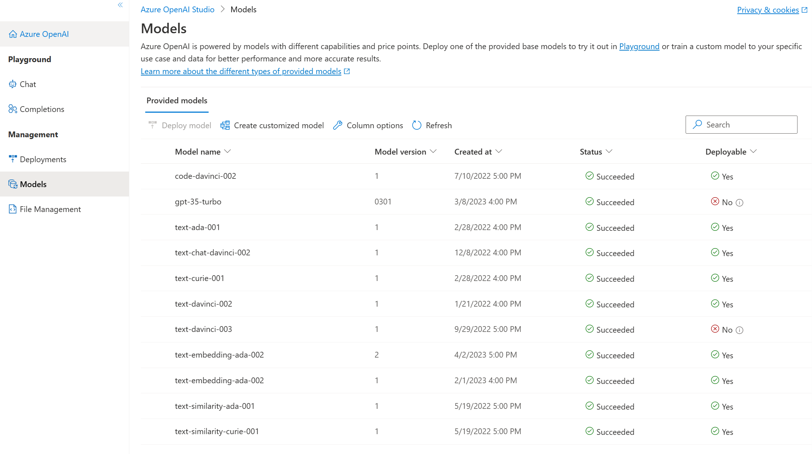

To begin building with Azure OpenAI, you need to choose a base model and deploy it. Microsoft provides base models and the option to create customized base models. This module covers the currently available base models.   

Azure OpenAI includes several types of model:

- **GPT-4 models** are the latest generation of *generative pretrained* (GPT) models that can generate natural language and code completions based on natural language prompts. Access to GPT-4 models is currently restricted - for access, existing Azure OpenAI customers can apply by [filling out this form](https://aka.ms/oai/get-gpt4).
- **GPT 3.5 models** can generate natural language and code completions based on natural language prompts. In particular, **GPT-35-turbo** models are optimized for chat-based interactions and work well in most generative AI scenarios.
- **Embeddings models** convert text into numeric vectors, and are useful in language analytics scenarios such as comparing text sources for similarities.
- **DALL-E models** are used to generate images based on natural language prompts. Currently, DALL-E models are in preview. DALL-E models aren't listed in the Azure OpenAI Studio interface and don't need to be explicitly deployed.

Models differ by speed, cost, and how well they complete specific tasks. You can learn more about the differences and latest models offered in the [Azure OpenAI Service documentation](/azure/cognitive-services/openai/concepts/models).

>[!NOTE]
>Pricing is determined by tokens and by model type. Learn more about the latest [pricing here](https://azure.microsoft.com/pricing/details/cognitive-services/openai-service/). 

In the Azure OpenAI Studio, the **Models** page lists the available base models (other than DALL-E models) and provides an option to create additional customized models by fine-tuning the base models. The models that have a *Succeeded* status mean they're successfully trained and can be selected for deployment.

 

   
