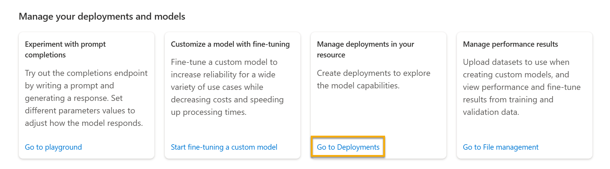

Whether you use the Azure OpenAI Studio interface or REST API to start, you first need to deploy a model to make API calls to receive completions to prompts. When you create a new deployment, you need to indicate which base model to deploy. There are several ways you can deploy your base model. 

## Deploy using Azure OpenAI Studio 
In Azure OpenAI Studio, you can navigate from the home page to deployments in the **Manage your deployments and models** section and by selecting **Go to deployments**.  



From the deployments page, you are able to create a new deployment by selecting a model from the menu. The available base models are based on the list in the models page.  


## Deploy using the Command Line 

You can deploy a model using the console. Using the example below, you want to replace the following variables with your own: 
- $myResourceGroupName: Your resource group name 
- $myResourceName: Your resource name
- MyModel: *replace with a unique name for your model*
- text-curie-001: *replace with the base model you wish to deploy*

```dotnetcli
az cognitiveservices account deployment create \
   -g $myResourceGroupName \
   -n $myResourceName \
   --deployment-name MyModel \
   --model-name text-curie-001 \
   --model-version "1"  \
   --model-format OpenAI \
   --scale-settings-scale-type "Standard"
```

## Deploy using the REST API 

An example of a request looks like: 

```http
POST https://aoairesource.openai.azure.com/openai/deployments?api-version=2022-12-01


{
  "scale_settings": {
    "capacity": 2,
    "scale_type": "manual"
  },
  "model": "curie"
}
```

An example of a response looks like: 

```json
{
  "scale_settings": {
    "capacity": 2,
    "scale_type": "manual"
  },
  "model": "curie",
  "owner": "organization-owner",
  "id": "deployment-afa0669ca01e4693ae3a93baf40f26d6",
  "status": "notRunning",
  "created_at": 1646126127,
  "updated_at": 1646127311,
  "object": "deployment"
}
```
You can review the [documentation](https://learn.microsoft.com/en-us/rest/api/cognitiveservices/azureopenaistable/deployments/create?tabs=HTTP?portal=true) 
 

Once the model is deployed, you can test it in the playground. 
