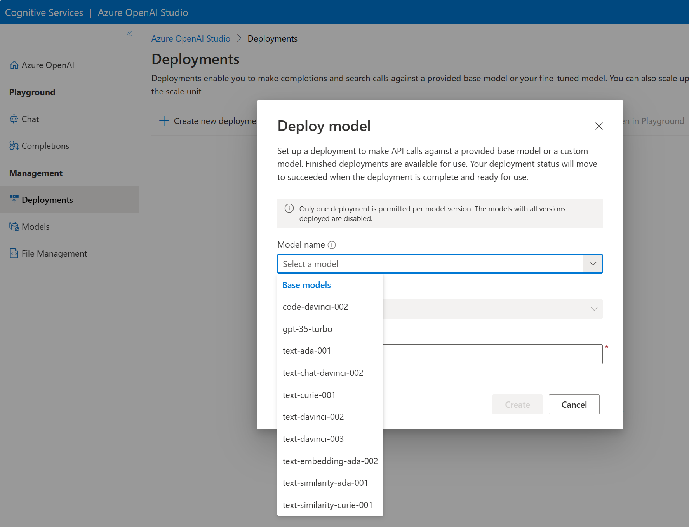

You first need to deploy a model to make API calls to receive completions to prompts. When you create a new deployment, you need to indicate which base model to deploy. You can only deploy one instance of each model. There are several ways you can deploy your base model. 

## Deploy using Azure OpenAI Studio

In Azure OpenAI Studio's **Deployments** page, you can create a new deployment by selecting a model name from the menu. The available base models come from the list in the models page.  



From the *Deployments* page in the Studio, you can also view information about all your deployments including deployment name, model name, model version, status, date created, and more.

## Deploy using Azure CLI

You can also deploy a model using the console. Using this example, replace the following variables with your own resource values:

- myResourceGroupName: *replace with your resource group name*
- myResourceName: *replace with your resource name*
- MyModel: *replace with a unique name for your model*
- gpt-35-turbo: *replace with the base model you wish to deploy*

```dotnetcli
az cognitiveservices account deployment create \
   -g myResourceGroupName \
   -n myResourceName \
   --deployment-name MyModel \
   --model-name gpt-35-turbo \
   --model-version "0301"  \
   --model-format OpenAI \
   --scale-settings-scale-type "Standard"
```

## Deploy using the REST API

You can deploy a model using the REST API. In the request body, you specify the base model you wish to deploy. See an example in the [Azure OpenAI documentation](/rest/api/cognitiveservices/azureopenaistable/deployments/create?azure-portal=true). 
