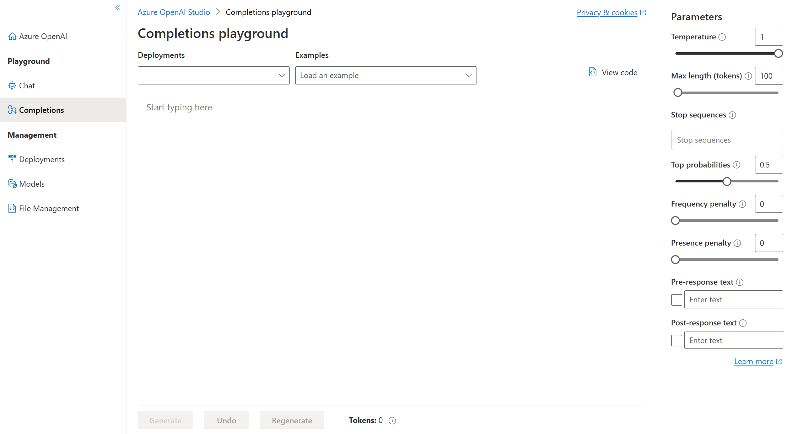
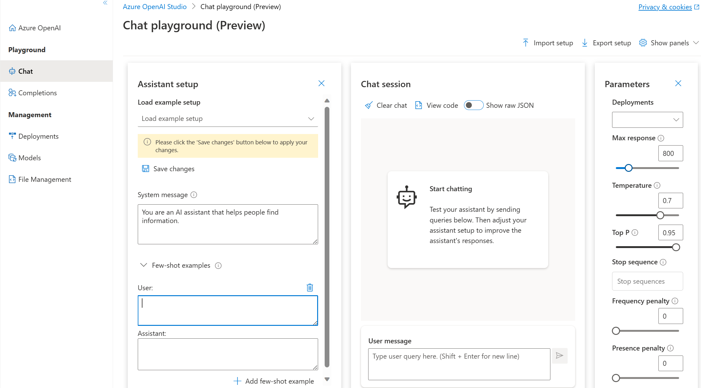

Playgrounds are useful interfaces in Azure OpenAI Studio that you can use to experiment with your deployed models without needing to develop your own client application. Azure OpenAI Studio offers multiple playgrounds with different parameter tuning options.  

## Completions playground
The Completions playground allows you to make calls to your deployed models through a text-in, text-out interface and to adjust parameters. You need to select the deployment name of your model under Deployments. Optionally, you can use the provided examples to get you started, and then you can enter your own prompts. 

#### Completions Playground parameters

There are many parameters that you can adjust to change the performance of your model:

- **Temperature**: Controls randomness. Lowering the temperature means that the model produces more repetitive and deterministic responses. Increasing the temperature results in more unexpected or creative responses. Try adjusting temperature or Top P but not both.
- **Max length (tokens)**: Set a limit on the number of tokens per model response. The API supports a maximum of 4000 tokens shared between the prompt (including system message, examples, message history, and user query) and the model's response. One token is roughly four characters for typical English text.
- **Stop sequences**: Make responses stop at a desired point, such as the end of a sentence or list. Specify up to four sequences where the model will stop generating further tokens in a response. The returned text won't contain the stop sequence.
- **Top probabilities (Top P)**: Similar to temperature, this controls randomness but uses a different method. Lowering Top P narrows the model’s token selection to likelier tokens. Increasing Top P lets the model choose from tokens with both high and low likelihood. Try adjusting temperature or Top P but not both.
- **Frequency penalty**: Reduce the chance of repeating a token proportionally based on how often it has appeared in the text so far. This decreases the likelihood of repeating the exact same text in a response.
- **Presence penalty**: Reduce the chance of repeating any token that has appeared in the text at all so far. This increases the likelihood of introducing new topics in a response.
- **Pre-response text**: Insert text after the user’s input and before the model’s response. This can help prepare the model for a response.
- **Post-response text**: Insert text after the model’s generated response to encourage further user input, as when modeling a conversation.

## Chat playground

The Chat playground is based on a conversation-in, message-out interface. You can initialize the session with a system message to set up the chat context. 

In the Chat playground, you're able to add *few-shot examples*. The term few-shot refers to providing a few of examples to help the model learn what it needs to do. You can think of it in contrast to zero-shot, which refers to providing no examples. 

In the *Assistant setup*, you can provide few-shot examples of what the user input may be, and what the assistant response should be. The assistant tries to mimic the responses you include here in tone, rules, and format you've defined in your system message.

#### Chat playground parameters

The Chat playground, like the Completions playground, also includes the Temperature parameter. The Chat playground also supports other parameters *not* available in the Completions playground. These include:

- **Max response**: Set a limit on the number of tokens per model response. The API supports a maximum of 4000 tokens shared between the prompt (including system message, examples, message history, and user query) and the model's response. One token is roughly four characters for typical English text.
- **Top P**: Similar to temperature, this controls randomness but uses a different method. Lowering Top P narrows the model’s token selection to likelier tokens. Increasing Top P lets the model choose from tokens with both high and low likelihood. Try adjusting temperature or Top P but not both.
- **Past messages included**: Select the number of past messages to include in each new API request. Including past messages helps give the model context for new user queries. Setting this number to 10 will include five user queries and five system responses.

The **Current token count** is viewable from the Chat playground. Since the API calls are priced by token and it's possible to set a max response token limit, you'll want to keep an eye out for the current token count to make sure the conversation-in doesn't exceed the max response token count.
