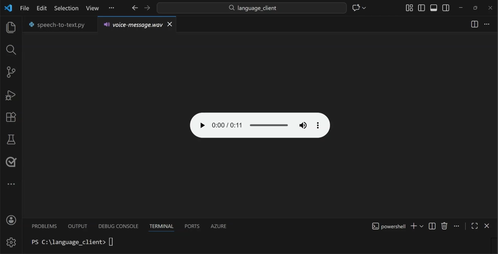
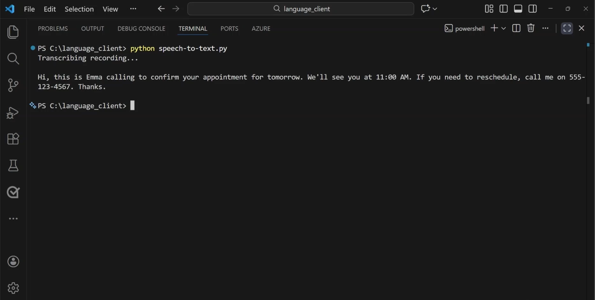

::: zone pivot="video"

>[!VIDEO https://learn-video.azurefd.net/vod/player?id=df58c72f-3ca5-4af7-a8e4-f9a760622045]

> [!NOTE]
> See the **Text and images** tab for more details!

::: zone-end

::: zone pivot="text"

**Speech recognition**, often called **speech-to-text (STT)**, is an AI capability that enables apps and agents to respond to spoken input. Speech recognition takes the spoken word and converts it into data, usually text. Speech-to-text software typically uses multiple models, including:

- An *acoustic* model that converts the audio into phonemes (representations of specific sounds).
- A *language* model that maps phonemes to words.

The words AI speech recognizes are converted to text. You can use the text for various purposes, such as providing closed captions, creating call transcripts, automating note dictation, and much more. 

## Azure Speech - Speech to Text

**Azure Speech** includes a **speech-to-text API** that you can use to process voice input from a microphone or audio file. 

>[!NOTE]
>An *API* (Application Programming Interface) is a set of rules and endpoints that allows one software application to communicate with and use the functionality or data of another application.

**Microsoft Foundry** is a Microsoft platform that helps developers build, test, and deploy AI applications and agents by bringing together models, tools, data, and services in one place.

In the *new Microsoft Foundry portal*, we can explore Azure Speech's speech-to-text capabilities in the *Foundry playground*. To get to the playground, navigate to the *Build* page, then to *Models*, then to the *AI services* tab. In the tab, you can find a selection of AI services available for testing, including *Azure Speech - Speech to Text*. 

In the playground, you can either upload an audio file or  record yourself speaking. Azure Speech transcribes what is said, giving you a feel for how your own application would respond to audio input. 

:::image type="content" source="../media/speech-to-text-playground.png" alt-text="Screenshot of speech-to-text in the Foundry playground." lightbox="../media/speech-to-text-playground.png":::

The playground in the Foundry portal is a great place to experiment with Azure Speech, but to use speech-to-text in an application, we need to write some code. 

## Using the Azure speech-to-text SDK 

The **Azure Speech – Speech-to-Text SDK** is a client library that lets applications convert spoken audio into written text. The speech-to-text SDK is designed to make speech recognition easy to add to applications. 

>[!NOTE]
>A client library is a set of ready‑made code that developers can use in their application to easily talk to a service or API. 

The SDK enables your application to:

- Capture or send audio from a microphone, audio file, or audio stream
- Send that audio to Azure Speech securely
- Receive transcribed text in near real time or after processing completes

The SDK handles networking, authentication, audio streaming, and response parsing so developers can focus on application logic.

## Developing an application

The Speech-to-Text SDK is typically used in the client or service layer of an application. The SDK acts as the bridge between your application code and the Azure Speech service.

To use the Azure Speech Python SDK, you need to have compatible version of Python and the Azure Speech Python SDK installed. 

The Python SDK can be installed in the Visual Studio Code *terminal* using: 

```bash
pip install azure-cognitiveservices-speech
```

>[!NOTE]
> Application code is written in *code editors*, such as Visual Studio Code. A code editor’s *terminal* is a built‑in command‑line window inside the editor where you can run commands without leaving your development environment.  

To use Azure Speech, you also need to create a Foundry resource. The Foundry resource endpoint and key is used in your code to authenticate your connection. 

After you install the Python SDK and create a Foundry resource, you can create and run your program. Consider the following Python code. When you run it:  

1. **Your app initializes the Speech SDK**: Provides an endpoint and authentication (key or Microsoft Entra ID)
2. **Audio is captured or loaded**: Microphone input or an audio file/stream
3. **Audio is sent to Azure Speech**: The SDK streams or uploads audio securely
4. **Speech recognition runs in the cloud**: Azure’s speech models analyze the audio
5. **Text results are returned**: Your app receives recognized text and optional metadata

```python
import azure.cognitiveservices.speech as speechsdk

# Set up the speech config using resource endpoint
endpoint_url = "ENDPOINT"
speech_key = "FOUNDRY_KEY"

speech_config = speechsdk.SpeechConfig(
    subscription=speech_key,
    endpoint=endpoint_url
)

# Create a recognizer with microphone input
audio_config = speechsdk.audio.AudioConfig(use_default_microphone=True)
speech_recognizer = speechsdk.SpeechRecognizer(
    speech_config=speech_config, 
    audio_config=audio_config
)

# Event handlers
def recognized_handler(evt):
    print(f"Recognized: {evt.result.text}")

def recognizing_handler(evt):
    print(f"Recognizing: {evt.result.text}")

# Connect event handlers
speech_recognizer.recognized.connect(recognized_handler)
speech_recognizer.recognizing.connect(recognizing_handler)

# Start continuous recognition
speech_recognizer.start_continuous_recognition()
print("Say something...")

# Keep the program running
input("Press Enter to stop...")
speech_recognizer.stop_continuous_recognition()
```

#### Client app example
For example, let's say you want to develop a lightweight app that automatically transcribes voicemail messages. In the code editor, we have one audio file, and one Python file, which contains application code. 



Say you have an audio file containing a voicemail recording. To transcribe the message, start by specifying the endpoint and key and the audio source you want to transcribe. Then  use a `SpeechRecognizer` object to perform the transcription, before displaying the results. 

:::image type="content" source="../media/speech-to-text-python.png" alt-text="Screenshot of speech-to-text python code in Visual Studio Code." lightbox="../media/speech-to-text-python.png":::

Once you run the code, you can see the transcription text. 



#### Audio processing options

You can use Azure Speech's speech-to-text API to perform real-time or batch transcription of audio into a text format. The audio source for transcription can be a real-time audio stream from a microphone or an audio file.

**Real-time transcription**: Real-time speech to text allows you to transcribe audio streams to text. You can use real-time transcription for presentations, demos, or any other scenario where a person is speaking.

In order for real-time transcription to work, your application needs to be listening for incoming audio from a microphone, or other audio input source such as an audio file. Your application code streams the audio to the service, which returns the transcribed text.

**Batch transcription**: Not all speech to text scenarios are real time. You might have audio recordings stored on a file share, a remote server, or even on Azure storage. You can point to audio files with a shared access signature (SAS) URI and asynchronously receive transcription results.

Batch transcription should be run in an asynchronous manner because the batch jobs are scheduled on a *best-effort basis*. Normally a job starts executing within minutes of the request but there's no estimate for when a job changes into the running state.

Speech Recognition in Azure Speech is a great way to build solutions that transcribe recorded audio or automate speech captioning. Next, learn how to incorporate speech synthesis into an application.  

::: zone-end