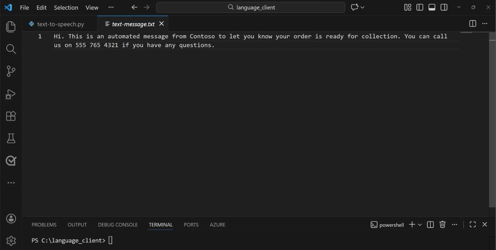
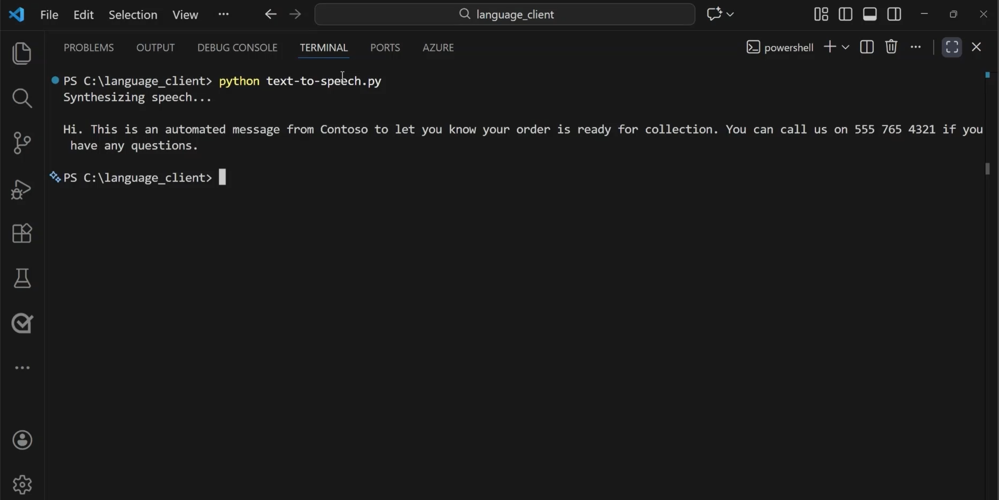

::: zone pivot="video"

>[!VIDEO https://learn-video.azurefd.net/vod/player?id=d0bb8f5e-f075-4cf9-be73-4aa064fcb819]

> [!NOTE]
> See the **Text and images** tab for more details!

::: zone-end

::: zone pivot="text"

**Speech synthesis**, often called **text-to-speech (TTS)**, is concerned with vocalizing data, usually by converting text to speech. Speech synthesis usually generates audible speech from a text-based source. 

A text-to-speech solution typically requires the following information:

- The text to be spoken
- The voice to be used to vocalize the speech

To synthesize speech, the system typically *tokenizes* the text to break it down into individual words, and assigns phonetic sounds to each word. It then breaks the phonetic transcription into *prosodic* units (such as phrases, clauses, or sentences). The system creates phonemes from the prosodic units. These phonemes are then synthesized as audio and can be assigned a particular voice, speaking rate, pitch, and volume.

You can use the output of speech synthesis for many purposes, such as:
- Generating spoken responses to user input.
- Reading messages aloud.
- Broadcasting announcements.

## Azure Speech - Text to Speech

Azure Speech includes a **text-to-speech API** that we can explore in the Microsoft Foundry portal. 

The text-to-speech API enables you to convert text input to audible speech, which can either be played directly through a computer speaker or written to an audio file. The service includes multiple predefined voices with support for multiple languages and regional pronunciation, including *neural* voices that use *neural networks*. Neural voices can overcome common limitations in speech synthesis such as issues with intonation, resulting in a more natural sounding voice. You can also develop custom voices and use them with the text to speech API.

In the *new Microsoft Foundry portal*, we can explore Azure Speech's text-to-speech capabilities in the *Foundry playground*. In the *Azure Speech - Text to Speech* Foundry playground, you can choose a synthetic voice from the available selection. You can also adjust some parameters to control the delivery of the audio, such as speed and pitch. The audio output is generated from the synthesized text. 

:::image type="content" source="../media/text-to-speech-playground.png" alt-text="Screenshot of text-to-speech in the Foundry playground." lightbox="../media/text-to-speech-playground.png":::

## Using the Azure text-to-speech SDK 

You can use Azure Speech to develop an application that uses voice synthesis. The **Azure Text-to-Speech SDK** enables applications to convert written text into natural‑sounding spoken audio. 

The SDK lets your application:

- Send text to Azure Speech
- Generate spoken audio using neural voices
- Play or save the audio to speakers or an audio file

The SDK handles authentication, network communication, audio formatting, and play back so you can focus on your app’s experience. 

## Developing an application

The text-to-speech SDK is typically used in:

- **Client applications** to convert text to speech and play it immediately (for example, a desktop or mobile app)
- **Backend services**: to generate audio files for later play back 
 
After you install the Python SDK, you can create and run your program. Consider the following Python code. When you run it: 

1. **Your app initializes the Speech SDK**: Provides an endpoint and authentication (key or Microsoft Entra ID)
2. **Text is provided**
3. **Text is sent to Azure Speech**: The SDK handles the request and formatting
4. **Speech synthesis runs in the cloud**: Neural models generate audio
5. **Audio is returned**: Your app plays, streams, or saves the audio temporarily

```python
import os
import azure.cognitiveservices.speech as speechsdk

# This example requires environment variables named "FOUNDRY_KEY" and "ENDPOINT"
speech_config = speechsdk.SpeechConfig(subscription=os.environ.get('FOUNDRY_KEY'), endpoint=os.environ.get('ENDPOINT'))
audio_config = speechsdk.audio.AudioOutputConfig(use_default_speaker=True)

# The neural multilingual voice can speak different languages based on the input text.
speech_config.speech_synthesis_voice_name='en-US-Ava:DragonHDLatestNeural'

speech_synthesizer = speechsdk.SpeechSynthesizer(speech_config=speech_config, audio_config=audio_config)

# Get text from the console and synthesize to the default speaker.
print("Enter some text that you want to speak >")
text = input()

speech_synthesis_result = speech_synthesizer.speak_text_async(text).get()

if speech_synthesis_result.reason == speechsdk.ResultReason.SynthesizingAudioCompleted:
    print("Speech synthesized for text [{}]".format(text))
elif speech_synthesis_result.reason == speechsdk.ResultReason.Canceled:
    cancellation_details = speech_synthesis_result.cancellation_details
    print("Speech synthesis canceled: {}".format(cancellation_details.reason))
    if cancellation_details.reason == speechsdk.CancellationReason.Error:
        if cancellation_details.error_details:
            print("Error details: {}".format(cancellation_details.error_details))
            print("Did you set the speech resource key and endpoint values?")
```

#### Client app example

For example, suppose you create an app that vocalizes text messages. In the code editor, you have one text file, and one Python file which contains application code. 



First, connect to the endpoint for Azure Speech. Then, create a `SpeechSynthesizer` object. Then application processes  the text file containing the message and uses the `SpeechSynthesizer` object to generate the spoken audio. 

:::image type="content" source="../media/text-to-speech-python.png" alt-text="Screenshot of text-to-speech Python code." lightbox="../media/text-to-speech-python.png":::

When you run the application, it will take the text and return an audio output of the message.



Next, learn how to incorporate speech-to-speech capabilities into an application with Azure Speech - Voice Live.

::: zone-end