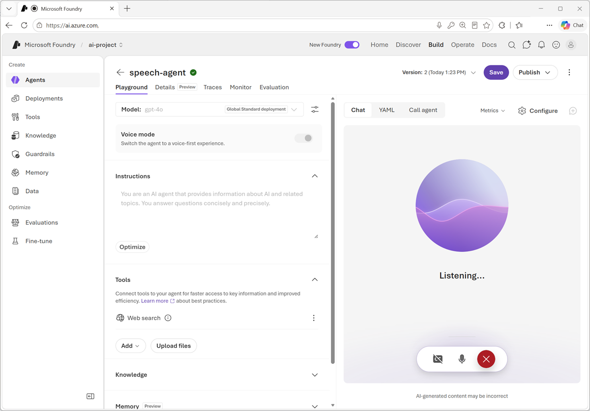

In this exercise, use Azure Speech in Microsoft Foundry Tools to create a speech-capable agent. You'll use Azure Speech Voice Live, a service used to build real-time voice-based agents.

If you have an Azure subscription, you can use it to explore the capabilities of Azure Speech in Microsoft Foundry Tools.

> [!NOTE]
> If you don't already have one, you can [sign up for an Azure subscription](https://azure.microsoft.com/pricing/purchase-options/azure-account?cid=msft_learn), which includes free credits for the first 30 days.

*Use the following button to start the exercise*

