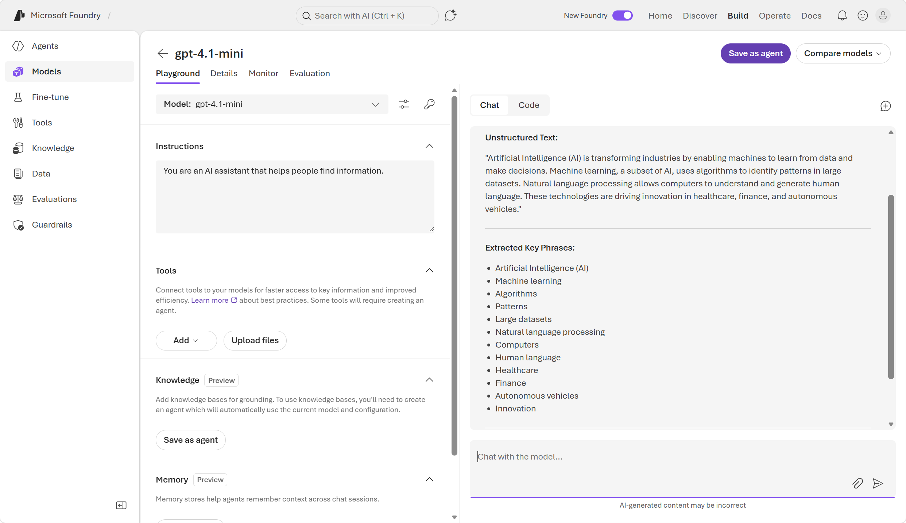
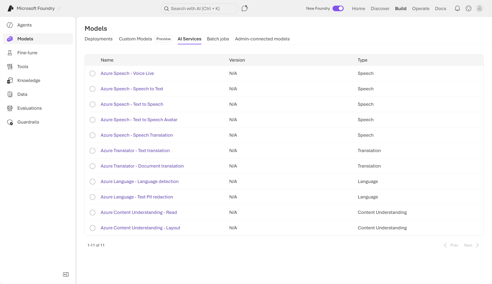

::: zone pivot="video"

>[!VIDEO https://learn-video.azurefd.net/vod/player?id=9137a26f-82cc-414d-b515-f83880392fee]

> [!NOTE]
> See the **Text and images** tab for more details!

::: zone-end

::: zone pivot="text"

**Microsoft Foundry** is the platform for building AI apps and agents on Azure. Foundry portal offers two approaches to text analysis: general-purpose AI models that handle a broad range of tasks through natural language prompts, and purpose-built language tools that return structured, deterministic results for specific tasks.

>[!NOTE]
> Foundry has a web-based portal where you can build, test, and deploy AI applications. The portal has two user interfaces (UIs) — a *classic* UI and a *new* UI — the **new** Foundry portal. This content describes capabilities in the *new* Foundry portal.

To get started with text analysis in the *new* Foundry portal, you need to create a *Foundry resource* and *Foundry project*.

A **Foundry resource** is an Azure resource that provides access to AI services and deployed models. A **Foundry project** is a workspace within that resource where you organize your work, deploy models, and access tools like the chat playground and AI services.

## Using general-purpose AI models for text analysis

From your project in the Foundry portal, you can deploy a general-purpose AI model. A **general-purpose AI model** is a language model trained on vast amounts of text data, giving it a broad understanding of language and the ability to handle many different tasks. A general-purpose model can follow natural language instructions to analyze sentiment, extract entities, summarize text, translate content, answer questions, and much more — all without any configuration or training on your part.

You can use a general-purpose AI model to handle text analysis tasks such as:

- **Key phrase extraction** lists the main concepts from unstructured text.
- **Named entity recognition** identifies people, places, events, and more. This feature can also be customized to extract custom categories.
- **Entity linking** identifies known entities together with a link to Wikipedia.
- **Sentiment analysis and opinion mining** identifies whether text is positive or negative.
- **Summarization** summarizes text by identifying the most important information.

You can explore the text analysis capabilities of AI models in the Foundry portal's chat playground. After deploying a model, the playground gives you a chat interface where you type a prompt and the model responds. Because the model understands context, you can also follow up with additional questions or refine the analysis in the same conversation. This makes the playground a useful way to explore what's possible before building a full application.

Let's take a closer look at some of the responses a general-purpose AI model can give when given a text analysis task. 

#### Key phrase extraction

You can use a language model to extract the keywords and phrases used in some text, which can be helpful in processes like indexing and searching for relevant documents. **Key phrase extraction** identifies the main points from text. 

For example, you might receive a review such as:

> "*I had a fantastic meal at the diner in Seattle on Saturday. The mushroom risotto was perfectly prepared, and really tasty. Our waiter, Pete, was friendly and efficient; and gave us a great recommendation for a dessert (strawberry cheesecake). I'd definitely recommend this place for a casual dinner.*"

Key phrase extraction can provide some context to this review by extracting the following phrases:
- casual dinner
- dessert
- fantastic meal
- diner
- great recommendation
- mushroom risotto
- Pete
- place
- Saturday
- Seattle
- strawberry cheesecake
- waiter

#### Entity recognition

You can also use **named entity recognition** to find people, places, dates, and other specific entities mentioned in the text.

You can provide a language model with unstructured text and retrieve a list of *entities* in the text that it recognizes. An entity is an item of a particular type or a category; and in some cases, subtype. 

Consider this short text: 

> "*On May 2nd, 2017, John Smith visited New York to attend a conference hosted by Microsoft. The event started at 8:00 AM and lasted 3 hours. Over 25% of the 40 attendees traveled more than 10 miles to participate.*"

Entities detected include:  

| **Entity Type** | **Subtype / Category** | **Value** |
|------------|-------------------|-------|
| Person | — | John Smith |
| Location | — | New York |
| Organization | — | Microsoft |
| DateTime | Date | May 2nd, 2017 |
| DateTime | Time | 8:00 AM |
| DateTime | Duration | 3 hours |
| Quantity | Percentage | 25% |
| Quantity | Number | 40 |
| Quantity | Dimension | 10 miles |

#### Sentiment analysis and opinion mining

You can also use **sentiment analysis** to classify a document as positive, negative, or neutral. This is useful for detecting sentiment in social media, customer reviews, discussion forums, and more.

Consider the following restaurant review: 

> "*I had a wonderful dinner at a cozy bistro in Portland on Friday evening. The grilled salmon was cooked perfectly and full of flavor, and the seasonal vegetables were a great complement. Our server, Maria, was attentive and personable, and she suggested the lemon tart for dessert—which was excellent. I’d absolutely recommend this spot for a relaxed and enjoyable night out.*"

>[!NOTE]
>Because a general-purpose AI model responds to natural language prompts, the output depends on how you phrase your request. For example, you can ask for an overall sentiment score, or you can ask for a sentence-by-sentence breakdown. The more specific your prompt, the more structured and detailed the response.

Analyzing the restaurant review might return:

- Sentence-by-sentence sentiment analysis:
    
    "I had a wonderful dinner at a cozy bistro in Portland on Friday evening."
    Sentiment: Positive
    Explanation: The words "wonderful dinner" and "cozy bistro" convey a highly positive experience.

    "The grilled salmon was cooked perfectly and full of flavor, and the seasonal vegetables were a great complement."
    Sentiment: Positive
    Explanation: "Cooked perfectly," "full of flavor," and "great complement" all indicate strong satisfaction with the food.
    
    "Our server, Maria, was attentive and personable, and she suggested the lemon tart for dessert—which was excellent."
    Sentiment: Positive
    Explanation: Positive descriptions of the server's qualities and the dessert ("attentive," "personable," "excellent") reflect a very happy customer.
    
    "I’d absolutely recommend this spot for a relaxed and enjoyable night out."
    Sentiment: Positive
    Explanation: A clear recommendation with the words "absolutely," "relaxed," and "enjoyable" show strong positive sentiment.

- Overall Document Sentiment: strongly positive. The review is filled with complimentary language about the food, atmosphere, service, and overall experience. There are no neutral or negative statements.

#### When to use a general-purpose AI model for text analysis 

Beyond key phrase extraction, entity recognition, and sentiment analysis, general-purpose AI models can also *summarize* long documents into concise paragraphs, *translate* text between languages, *classify* content into categories you define, *answer questions* about a passage, and more. Because these capabilities are all driven by natural language prompts, you can combine them freely — for example, asking the model to translate a long review, and then summarize it in a single conversation.

## Using Azure Language in Foundry tools

While a large language model trained for general generative AI workloads can often do a great job of text analysis, sometimes a more specialized tool gets more predictable results. 

**Azure Language in Foundry tools** is a natural language processing service with purpose-built analyzers for specific text analysis tasks. These analyzers use statistical techniques to return structured, deterministic output — making them well-suited for automated pipelines where consistent results matter.

In the *new* Foundry portal, you can explore some of Azure Language's capabilities in the chat playground. To test out the capabilities of AI services, navigate to the *Build* page, then to *Models*, then to the *AI services* tab. In the tab, you can find a selection of AI services available for testing. 

Consider the following Azure Language capabilities: 

- **Language detection** evaluates text and detects the language and dialect.
- **Personal identifying information (PII) detection** identifies personally sensitive information, including personal health information (PHI). 

#### Language detection

In a multi-language workflow, the first step is often to identify the language a document is written in, so the text can be routed to the most appropriate model or process. **Language detection** evaluates text and identifies the primary language along with a confidence score. Azure Language supports a wide range of languages and regional dialects.

For example, given the following text:

> "*¡Hola! Me llamo Josefina y vivo en Madrid, España.*"

Language detection returns the following result:

| Language | ISO 6391 code | Confidence score |
|---|---|---|
| Spanish | es | 1.00 |

In the Foundry portal, you can test Azure Language's language detection feature in the chat Playground.

:::image type="content" source="../media/language-detection.png" alt-text="Screenshot of the chat playground's language detection capability." lightbox="../media/text-04.png":::

#### Personally identifiable information detection

Organizations often need to identify and redact sensitive personal details from text before it's stored or shared, to comply with privacy regulations. **Personally identifiable information (PII) detection** identifies personal details in text—such as names, phone numbers, email addresses, and street addresses—and can optionally redact them.

For example, given the following text:

> "*Maria Garcia called from 020 7946 0958 and asked to send documents to 42 Market Road, London, UK, SW1A 1AA.*"

PII detection identifies the following entities:

| Text | Category |
|---|---|
| Maria Garcia | Person |
| 020 7946 0958 | Phone number |
| 42 Market Road, London, UK, SW1A 1AA | Address |

In the Foundry portal, you can test Azure Language's PII detection feature in the Language Playground.

:::image type="content" source="../media/pii-redaction.png" alt-text="Screenshot of the Language playground's PII detection capability." lightbox="../media/text-05.png":::

Next, learn how to create a client application with text analysis capabilities using both the OpenAI responses API and the Azure Language SDK.

::: zone-end