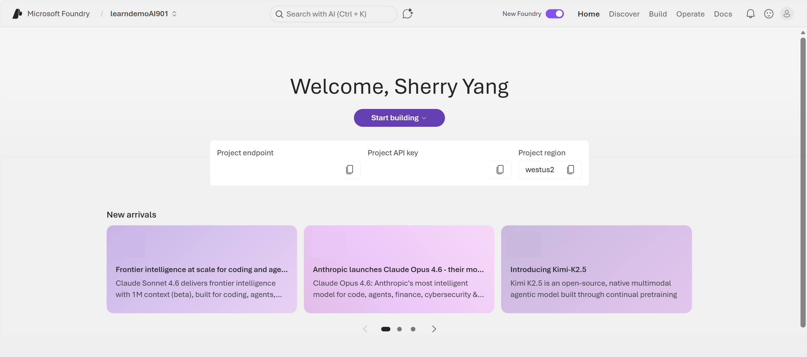
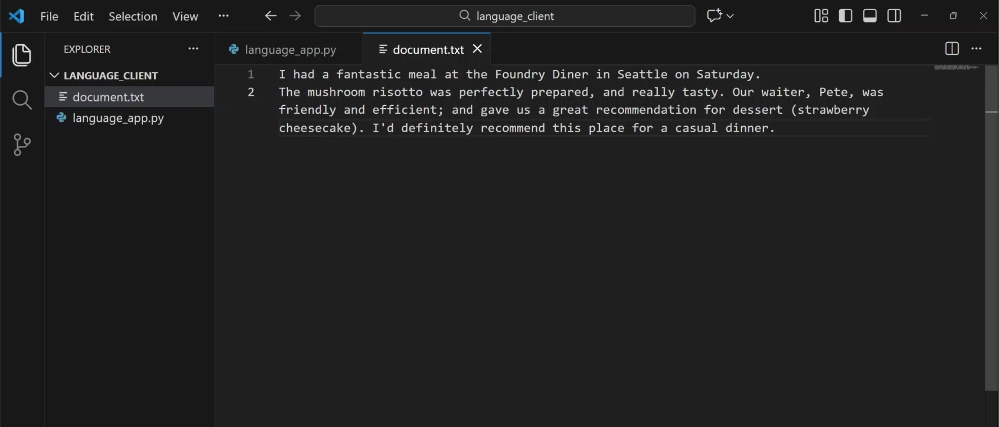

::: zone pivot="video"

>[!VIDEO https://learn-video.azurefd.net/vod/player?id=f1bffd16-9605-4826-ab76-f750057a74e3]

> [!NOTE]
> See the **Text and images** tab for more details!

::: zone-end

::: zone pivot="text"

The **Azure Language SDK** is a client library that makes it easy for developers to add natural language processing (NLP) features—such as sentiment analysis, entity recognition, key phrase extraction, language detection, and text summarization—to their applications without having to call REST APIs directly. You would use the SDK when writing applications in *Python*, *JavaScript*, *C#*, or *Java*.

>[!NOTE]
>An *API* (Application Programming Interface) is a set of rules and endpoints that allows one software application to communicate with and use the functionality or data of another application. A client library is a set of ready made code that developers can use in their application to easily talk to a service or API. You can review foundational material on applications and using endpoints in: [Get started with AI in Azure](/training/modules/get-started-with-ai-in-azure/5-endpoints?pivots=text?azure-portal=true). 



To use the Azure Language SDK, you need to have a *Foundry resource*. When you create a Foundry resource, Azure creates an *endpoint*. You can find your resource endpoint and key in the *new* Foundry portal's home page. When you run your application code, your application sends a request, or call, to the endpoint. The call can be sent using the REST API or SDK. The service returns a response, such as key phrases detected, in a format known as JSON. 

## Use the Azure Language Python SDK 

Let's see how you can use the Azure Language Python SDK to build an application that analyzes a document. To use the Azure Language Python SDK, you need to have compatible version of Python and the Azure Language Python SDK installed. 

Application code is written in *code editors*, such as Visual Studio Code. A code editor’s *terminal* is a built‑in command‑line window inside the editor where you can run commands without leaving your development environment.  

The Python SDK can be installed in the Visual Studio Code *terminal* using: 

```bash
pip install azure-ai-textanalytics
```

In the code editor, we can create one text file, and one Python file which contains application code. 



At the start of the application code, import the SDK. 

```python
from azure.ai.textanalytics import TextAnalyticsClient
from azure.core.credentials import AzureKeyCredential
```

:::image type="content" source="../media/python-sdk-client-example.png" alt-text="Screenshot of Visual Studio Code with a Python file open with a focus on the client object created." lightbox="../media/python-sdk-client-example.png":::

Then we use our Foundry resource endpoint and key to create an authenticated **client object**, the tool your code uses to communicate with a service. The client object knows the service's endpoint, carries credentials (like keys or tokens), exposes methods (for example: `analyze_sentiment()`), and handles sending requests and receiving responses under the hood.

We use the client's methods to call Azure Language functions. For example, we can extract key phrases with `client.extract_key_phrases()`, recognize entities with the function `client.recognize_entities()`, and analyze sentiment with `client.analyze_sentiment()`. To generate a summary, we need to use an asynchronous technique to begin the summarization task and retrieve the results. 

:::image type="content" source="../media/python-sdk-text-analysis-example.png" alt-text="Screenshot of Visual Studio Code with a Python file open with a focus on the text analysis functions." lightbox="../media/python-sdk-text-analysis-example.png":::

We can display the results of the analysis by running the application code in the terminal with the command `python <file_name>.py`. When we run the app, it uses Azure Language in our Foundry resource to perform each of the tasks. 

:::image type="content" source="../media/python-sdk-results.png" alt-text="Screenshot of Visual Studio Code with the terminal open with a focus on the results." lightbox="../media/python-sdk-results.png":::

## Examples of code to use with the Azure Language Python SDK 

Take a look at examples of code that can be used with the Azure Python SDK for the same text analysis tasks found in the previous unit. Regardless of the text analysis feature used, a client is needed to call the feature.      

```python
# Import packages
import os
from azure.core.credentials import AzureKeyCredential
from azure.ai.textanalytics import TextAnalyticsClient

# Create a client 
endpoint = os.environ["FOUNDRY_ENDPOINT"]
key = os.environ["FOUNDRY_KEY"]

client = TextAnalyticsClient(endpoint=endpoint, credential=AzureKeyCredential(key))
```

#### Key phrase extraction 

```python
text = "I had a fantastic meal at the diner in Seattle on Saturday. The mushroom risotto was perfectly prepared, and really tasty. Our waiter, Pete, was friendly and efficient; and gave us a great recommendation for a dessert (strawberry cheesecake). I'd definitely recommend this place for a casual dinner."

result = client.extract_key_phrases([text])[0]

print("Key phrases:")
for phrase in result.key_phrases:
    print("-", phrase)
```

#### Entity extraction 

```python
text = "I had a fantastic meal at the diner in Seattle on Saturday. The mushroom risotto was perfectly prepared, and really tasty. Our waiter, Pete, was friendly and efficient; and gave us a great recommendation for a dessert (strawberry cheesecake). I'd definitely recommend this place for a casual dinner."

result = client.recognize_entities([text])[0]

for entity in result.entities:
    print(f"{entity.text} | category={entity.category} | confidence={entity.confidence_score}")
```

#### Sentiment analysis

```python
text = "I had a fantastic meal at the diner in Seattle on Saturday. The mushroom risotto was perfectly prepared, and really tasty. Our waiter, Pete, was friendly and efficient; and gave us a great recommendation for a dessert (strawberry cheesecake). I'd definitely recommend this place for a casual dinner."

result = client.analyze_sentiment([text])[0]

print("Sentiment:", result.sentiment)
print("Confidence scores:", result.confidence_scores)
```

#### Summarization

In the Python SDK, **extractive summarization** is done as a long‑running action. 

```python
from azure.ai.textanalytics import ExtractiveSummaryAction

text = (
    "I had a fantastic meal at the diner in Seattle on Saturday. The mushroom risotto was perfectly prepared, and really tasty. Our waiter, Pete, was friendly and efficient; and gave us a great recommendation for a dessert (strawberry cheesecake). I'd definitely recommend this place for a casual dinner."
)

poller = client.begin_analyze_actions(
    documents=[text],
    actions=[ExtractiveSummaryAction(max_sentence_count=2)]
)

# Wait for the operation to finish and print the summary sentences
for doc_actions in poller.result():
    extractive_results = doc_actions[0]  # first (and only) document
    for action_result in extractive_results:
        if action_result.is_error:
            print("Error:", action_result.code, action_result.message)
        else:
            print("Summary sentences:")
            for sentence in action_result.sentences:
                print("-", sentence.text)
```

With Foundry and the Azure Language SDK, you can write code for AI applications that process natural language text and generate insight from your documents. Next, let's take a look at how to include Azure Language capabilities in AI agents.  

::: zone-end
