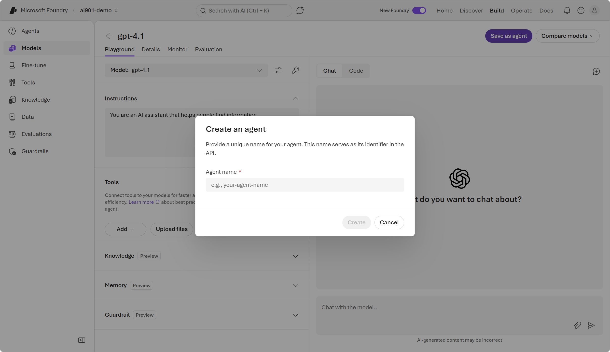
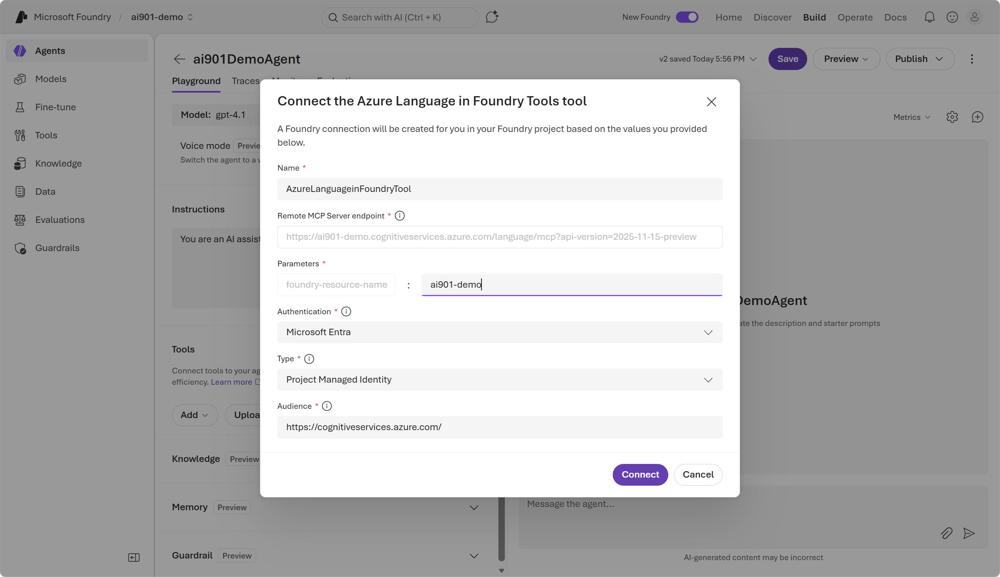
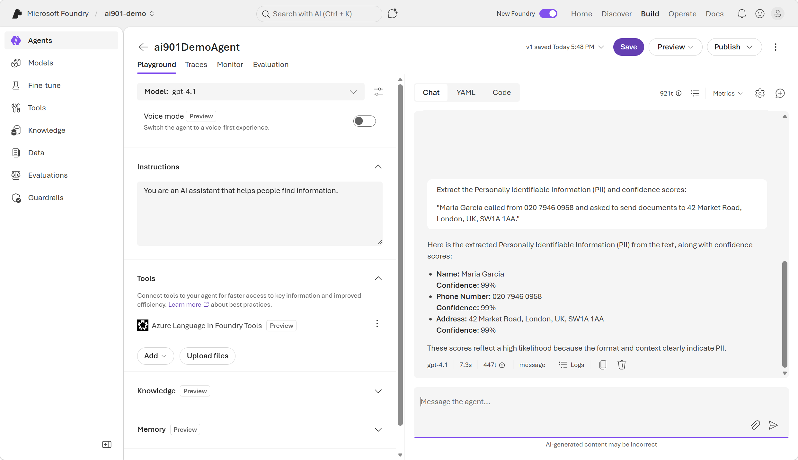

::: zone pivot="video"

>[!VIDEO https://learn-video.azurefd.net/vod/player?id=0ae8972e-6108-4858-ba10-9e0c4b32f810]

> [!NOTE]
> See the **Text and images** tab for more details!

::: zone-end

::: zone pivot="text"

AI agents use tools and models to perform tasks such as reasoning, planning, retrieval, and calling external services. While an agent can use a generative AI model to understand and generate language, that model alone can't perform text analysis tasks that require deterministic, structured analysis. Adding **Azure Language in Foundry Tools** to an agent gives it consistent and predictable text analysis functionality.

## Understand MCP

The **Model Context Protocol (MCP)** is an open standard that defines how AI agents connect to external tools and data sources. Think of MCP like a universal adapter: instead of writing custom integration code for every service an agent needs, you connect the agent to an MCP server that already exposes those capabilities in a standard way.

MCP uses a client-server architecture:

- The *MCP client* is the AI agent (or the host application running the agent). It sends requests and receives responses.
- The *MCP server* is the service that exposes tools, data, or actions. It listens for requests, executes the appropriate capability, and returns a structured result.

When an agent connects to an MCP server, it can discover what tools the server offers and invoke them as needed—without any custom integration work. The server might respond to a request by:

- Providing *data* (for example: sentiment scores, key phrases, or entity records)
- Taking *action* (for example: processing a batch of documents)

This separation of concerns keeps agent logic clean and makes it easy to swap or extend capabilities by connecting to different MCP servers.

## Azure Language MCP server

The **Azure Language MCP server** is a managed service that exposes *Azure Language in Foundry Tools* capabilities through MCP. It acts as the bridge between your agent and the full suite of Azure Language features—named entity recognition, sentiment analysis, language detection, and more.

Because the server follows the MCP standard, your agent can call these language analysis tools using the same protocol it uses for any other MCP server. You don't need to call the Azure Language REST API directly or manage authentication tokens in your agent code.

## Use the Azure Language MCP server in Foundry portal

To build an agent that uses Azure Language, you can start in the Foundry portal by deploying a model and saving it as an agent.

You can add the Azure Language MCP server as a tool in the Foundry playground by searching tools for *Azure Language in Foundry Tools*. To connect to the Azure Language MCP server, configure your connection with your *Foundry resource name*. Once you've connected the MCP server to your agent, use prompts to instruct the agent to analyze text using the tool.

With the MCP server connected, your agent can combine the reasoning capability of the language model with the precision of Azure Language's text analysis features—making it well suited for tasks like routing support tickets by detected language or identifying and redacting personally identifiable information (PII).

> [!NOTE]
> A Foundry resource provides a unified environment that already includes access to Language tools. You don't need to create a separate Azure Language resource to access the Azure Language MCP server.

Next, try out text analysis in Foundry yourself.

::: zone-end