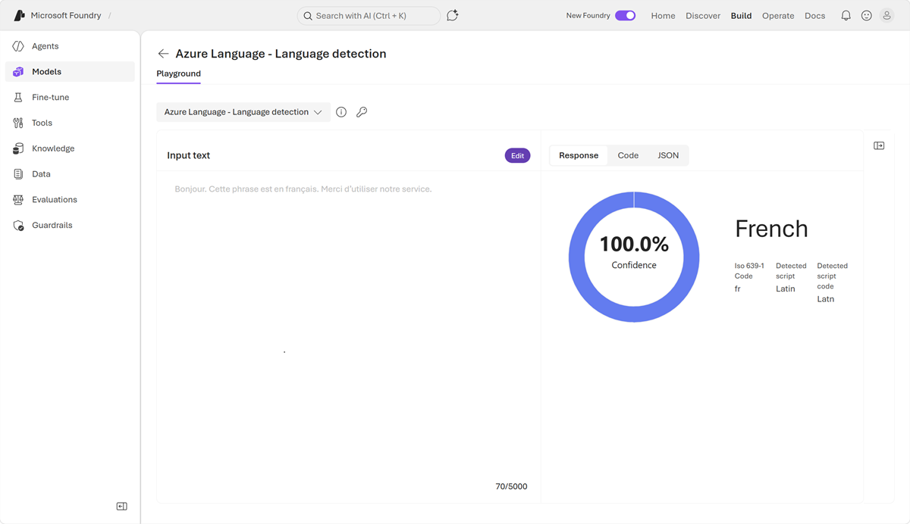

In this exercise, you’ll use a generative AI model in Foundry portal to perform some common natural language processing tasks. Then, you’ll explore some features of Azure Language in Foundry tools.

If you have an Azure subscription, you can use it to explore Foundry's text analysis capabilities.

> [!NOTE]
> If you don't already have one, you can [sign up for an Azure subscription](https://azure.microsoft.com/pricing/purchase-options/azure-account?cid=msft_learn), which includes free credits for the first 30 days.

*Use the following button to start the exercise*

