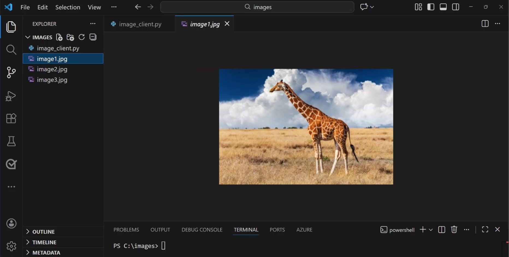

::: zone pivot="video"

>[!VIDEO https://learn-video.azurefd.net/vod/player?id=c32c67e3-3b23-4bc9-a3f1-6e1d680bdd07]

> [!NOTE]
> See the **Text and images** tab for more details!

::: zone-end

::: zone pivot="text"

Increasingly, new AI models are multimodal. In other words, they support multiple kinds of input data, including images and text. **Multimodal models** are AI models that can understand and work with more than one type of data at the same time, such as text, images, audio, or video. For instance, the multimodal model could describe an image in natural language or answer a question about a photo.

Multimodal models are commonly used as part of:

- **AI applications**, where image understanding enhances user workflows
- **AI agents**, where visual input helps the agent make better decisions

Examples include:

- An agent that reviews uploaded documents and screenshots
- A support app that analyzes photos submitted by customers
- A learning tool that explains diagrams or charts in plain language

Because multimodal models accept both text and images, they reduce the need for separate vision pipelines and make it easier to build end‑to‑end intelligent experiences.

The ability for models to combine visual understanding with natural language responses is referred to as **vision‑enabled GPT models** or GPT with vision. Vision‑enabled models are designed for flexible, general‑purpose visual reasoning. They can analyze visual input and respond in natural language, making it easy to build intelligent applications without needing deep computer vision expertise.

## Multimodal models in Microsoft Foundry

Microsoft Foundry includes many models that accept image-based input, enabling you to create intelligent, vision-based solutions. Multimodal models in Microsoft Foundry allow applications and agents to understand, analyze, and reason over images and visual content. 

For example, vision‑enabled GPT models in Foundry can:

- Describe the contents of an image in natural language
- Answer questions about objects, text, or scenes in an image
- Extract meaning from charts, screenshots, documents, or photos
- Combine image understanding with text instructions in a single prompt
 
Foundry's model catalog contains many multimodal models including:

- **GPT‑4.1 / GPT‑4.1‑mini / GPT‑4.1‑nano**: These general‑purpose multimodal GPT models can process text and images together. They're commonly used for image description and visual question answering, document and screenshot analysis, and chart and diagram interpretation.

- **GPT‑5 series (for example, GPT‑5.1, GPT‑5.2)**: The GPT‑5 family available in Foundry includes advanced multimodal models designed for enterprise and agentic scenarios. These models support multimodal inputs (including text and images), structured outputs, and tool use, large‑context reasoning across modalities. The GPT-5 series models are typically used in production‑grade AI agents and complex multimodal applications.

Foundry also hosts partner‑provided multimodal models in its model catalog, including models from providers such as Anthropic and others that support text and image understanding. 

#### Image analysis in the Foundry playground

> [!NOTE]
> Foundry portal has a *classic* user interface (UI) and a *new* user interface.

In the *new Microsoft Foundry portal*, you can use the model playground to chat with a deployed model. You can select a vision‑enabled model, upload images, and test prompts interactively to understand how the model interprets visual information.

:::image type="content" source="../media/playground-upload-image.png" alt-text="Screenshot of Foundry Playground with a gpt-4.1 mini model deployed and the user uploading an image of an animal." lightbox="../media/playground-upload-image.png":::

For example, you can attach an image file and get the multimodal model (such as gpt-4.1 mini) to analyze and describe it. 

:::image type="content" source="../media/image-analysis-result-playground.png" alt-text="Screenshot of Foundry Playground with a prompt asking the model to describe what is in an image and a response with a description." lightbox="../media/image-analysis-result-playground.png":::

Once validated, the same capabilities can be accessed programmatically using APIs, allowing images to be submitted alongside text prompts in application code.

## Using the Azure OpenAI API for image analysis

In order to develop an application, you need to move from the Foundry playground to code. In a code editor, you can write your application code using the **OpenAI Responses API** in Foundry. The OpenAI Responses API is designed for agentic apps and supports native multimodal inputs (including images).

At a high level:

- A single request can include text input and image input together
- Images can be provided as URLs or as base64‑encoded image data
- The model processes both inputs simultaneously to generate a response

Conceptually, the prompt structure looks like:

- A text instruction (for example, *What objects are visible in this image?*)
- One or more image inputs attached to the same request

This approach allows developers to build applications where users upload images and ask questions about them in real time.  

## Using the Azure OpenAI Python SDK 

You can use a Microsoft Foundry resource with the OpenAI API to perform image analysis—including sending images in prompts and getting text responses—by using the Responses API with a vision‑capable model deployment. 

The Python SDK can be installed in the Visual Studio Code *terminal* using: 

```bash
pip install openai
```

In the code editor, we can create one Python file, which contains application code. Importantly, you need your **Foundry resource** *key* and *endpoint*, and the *name of your deployed model*. 

>[!NOTE]
>When you deploy a model in Foundry, it has a *base* or *original* name, and an original **deployment name** you give it. Foundry hosts the deployed model (for example, GPT‑class models with vision) and provides you with an endpoint. 

In the code example, you create the *client*, point it to your endpoint, and pass your *model deployment name* (the name you gave the model) as the `MODEL_NAME`.

```python
import os
from openai import OpenAI

# Environment variables you set locally or in your app service:
FOUNDRY_KEY = "... your key ..."
ENDPOINT = "https://YOUR-RESOURCE-NAME.openai.azure.com/openai/v1/"
MODEL_NAME = "your-model-deployment-name"  # e.g., "gpt-4.1-mini" deployed as "my-vision-deploy"

client = OpenAI(
    api_key=os.getenv("FOUNDRY_KEY"),
    base_url=os.getenv("ENDPOINT"),
)

image_url = ""

response = client.responses.create(
    model=os.getenv("MODEL_NAME"),  # your deployment name 
    input=[
        {
            "role": "user",
            "content": [
                {"type": "input_text", "text": "What is in this image? Provide 3 bullet points."},
                {"type": "input_image", "image_url": image_url}
            ],
        }
    ],
)

print(response.output_text)

```

#### Client app example

You can build a custom application that uses a vision-enabled model to analyze an image with the OpenAI Python SDK. For example, suppose you want to build an app that can identify animals photographed on Safari. You can upload your photos and create a Python file in your code editor. 



Then you can write application code that uses the OpenAI API to connect to your model's endpoint in Foundry. 

:::image type="content" source="../media/vision-analysis-python.png" alt-text="Screenshot of Visual Studio Code with a python file containing application code for image analysis." lightbox="../media/vision-analysis-python.png":::

The application code needs to load the image data and get a natural language prompt from a user. To submit the input to the model, you need to create a multi-part message that includes both the image and text data. The model can respond with an appropriate output based on both the text and image in the prompt. 

:::image type="content" source="../media/image-analysis-result-vs-code.png" alt-text="Screenshot of Visual Studio Code with the result of the image analysis." lightbox="../media/image-analysis-result-vs-code.png":::

Next, learn how to use Foundry models and the Azure OpenAI SDK for image generation.

::: zone-end