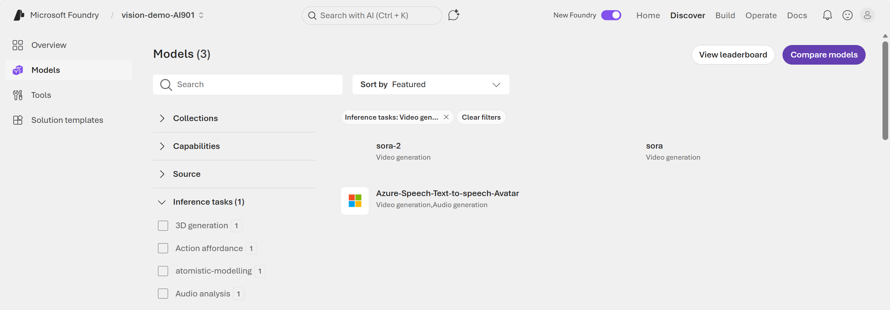

::: zone pivot="video"

>[!VIDEO https://learn-video.azurefd.net/vod/player?id=b7427abf-4c1d-4b95-b0b0-fe0cbf1584c2]

> [!NOTE]
> See the **Text and images** tab for more details!

::: zone-end

::: zone pivot="text"

In addition to static images, we increasingly expect to consume visual content as video. 

## Using video generation models from Foundry
Microsoft Foundry includes models for video generation, which you can use to create original video content. 



Video generation models in Foundry include: 

- **Sora 1**: *Sora* is OpenAI’s first **text‑to‑video** model made available in Microsoft Foundry. It generates short video clips from **text prompts** and can also use **images as input** to guide video creation. Sora 1 supports multiple resolutions and durations and is exposed through the Azure OpenAI Service and the Foundry **Video Playground** for experimentation.  

Typical uses:
- Concept videos and storyboards
- Short animations from text descriptions
- Visual prototyping for creative workflows

**Sora 2 (public preview)**: **Sora 2** is the **next‑generation video generation model** in Foundry and represents a significant upgrade over Sora 1. It supports multiple modalities, including: **Text → video**, **Image → video**, **Video → video (remix)**. Sora 2 also introduces **audio generation**, improved realism, and remixing capabilities that allow targeted edits instead of regenerating an entire video. It's available via the Azure OpenAI **v1 API** and the Foundry Video Playground, with built‑in Responsible AI safeguards. 

Typical uses:
- Marketing and promotional videos
- Cinematic concept previews and trailers
- Educational and immersive media content

>[!NOTE]
> Importantly, Sora models are currently the only native video generation models provided directly through Foundry. Other Foundry models may be multimodal (text, image, audio), but they do **not** generate video output. Both Sora 1 and Sora 2 include *Responsible AI restrictions*, such as limits on real people, copyrighted characters, and certain content types.

#### Video generation in the Foundry playground

Once you deploy an appropriate video generation model, you can test it in the Foundry portal playground. In the playground, you can also specify parameters like video dimensions and duration. 

:::image type="content" source="../media/video-prompt-playground.png" alt-text="Screenshot of the Sora model in the Foundry Playground with parameters and a prompt." lightbox="../media/video-prompt-playground.png":::

Your prompts to the video generation model should include a description of the content in the desired video. After a few minutes, the model produces a video.

You can take a look at the sample code in the playground. 

:::image type="content" source="../media/video-code-sample-playground.png" alt-text="Screenshot of the Sora model in the Foundry Playground with sample code." lightbox="../media/video-code-sample-playground.png":::

The sample code uses the REST Interface for video generation. 

## Using the REST Interface for video generation 

You can use the **Foundry REST interface** to *request* a video generation job and *retrieve* the finished MP4 *programmatically*. Programmatic video generation enables you to automate the video generation process. 

>[!NOTE]
> A REST API (Representational State Transfer API) is a web interface that lets programs communicate using HTTP. An SDK as a developer-friendly toolkit built on top of that interface. You can always work with the underlying REST API, especially if an SDK in the programming language you are familiar with does not exist. 
> You can use **curl** (short for Client URL) to call, or talk to, the REST API. Curl is a command line tool used to send and receive data over the internet. At its core, curl: makes HTTP requests (and other protocols), sends data to a server, and receives and prints the server’s response. 

Video generation is resource‑intensive and typically runs as an **asynchronous job**. 

Asynchronous means you:
1. Create a job
1. Poll for the job's status
1. Download the video once the job is complete. 

Video generation times are often 1–5 minutes, depending on settings. In order to run an asynchronous job using the Foundry REST interface, you need: 

- An **Azure OpenAI / Foundry resource** in a supported region and a **Sora deployment** (you deploy Sora from Foundry's Models + endpoints). 
- An authorization method: **API key** or **Microsoft Entra ID**

Let's take a look at using the **Azure OpenAI v1 API** with the Sora 2 model. 

The Sora 2 API provides distinct endpoints for:

- Starting a render job
- Polling for the status of the job 
- Downloading the video

#### 1. Create a video job 

In the example, the script starts an **async render job** and returns a response that includes a **video id** to poll.

>[!NOTE]
> **Bash** is a command line shell and scripting language. Curl is a command that you run inside Bash. 

```bash
curl -X POST "https://YOUR-RESOURCE-NAME.openai.azure.com/openai/v1/videos" \
  -H "Content-Type: application/json" \
  -H "api-key: $AZURE_OPENAI_API_KEY" \
  -d '{
    "model": "sora-2",
    "prompt": "A cinematic close-up of raindrops sliding down a neon-lit window at night.",
    "size": "1280x720",
    "seconds": "8"
  }'
```

#### 2. Poll job status until completed

In the example, the script polls the endpoint until the job reaches `completed` (or `failed`).

```bash
curl -X GET "https://YOUR-RESOURCE-NAME.openai.azure.com/openai/v1/videos/{video_id}" \
  -H "api-key: $AZURE_OPENAI_API_KEY"
```

#### 3. Download the completed video

The video is downloaded only after status is `completed`.

```bash
curl -L "https://YOUR-RESOURCE-NAME.openai.azure.com/openai/v1/videos/{video_id}/content?variant=video" \
  -H "api-key: $AZURE_OPENAI_API_KEY" \
  --output output.mp4
```

Video models are improving all the time, and Microsoft Foundry makes it easy to integrate them into creative solutions. Next, try out vision-enabled models, image generation, and video generation in Foundry yourself.

::: zone-end
