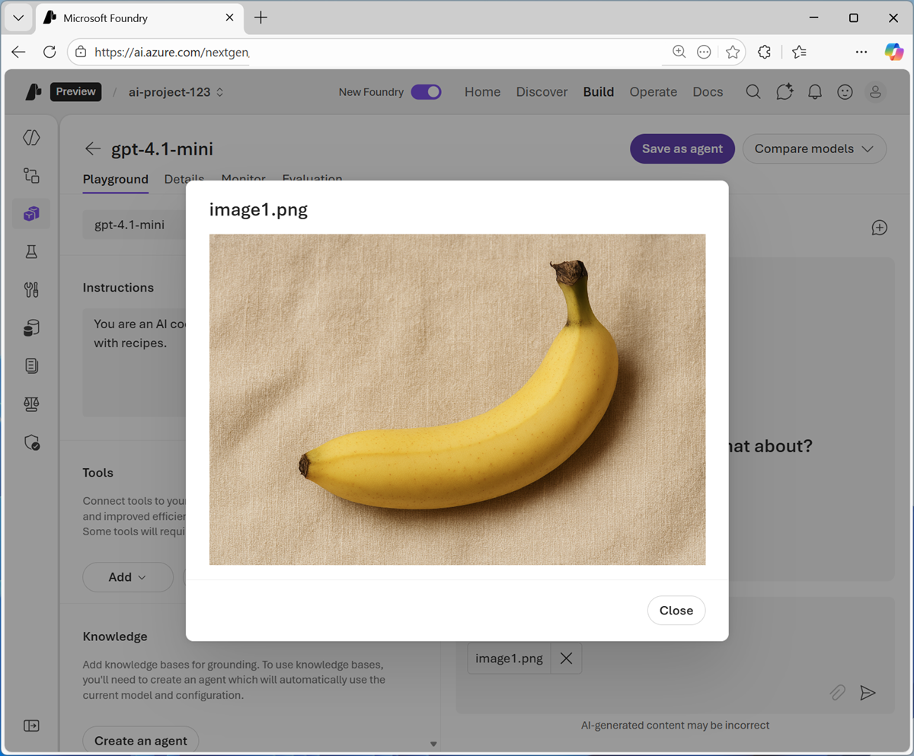

In this exercise, you’ll use generative AI models in Microsoft Foundry to work with visual data.

If you have an Azure subscription, you can use it to explore the vision-capable models in Microsoft Foundry.

> [!NOTE]
> If you don't already have one, you can [sign up for an Azure subscription](https://azure.microsoft.com/pricing/purchase-options/azure-account?cid=msft_learn), which includes free credits for the first 30 days.

*Use the following button to start the exercise*

