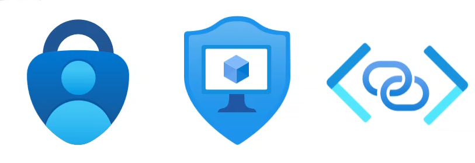
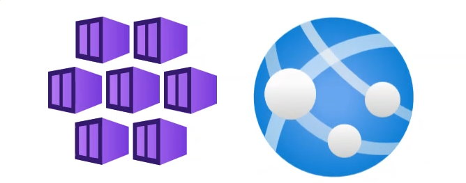
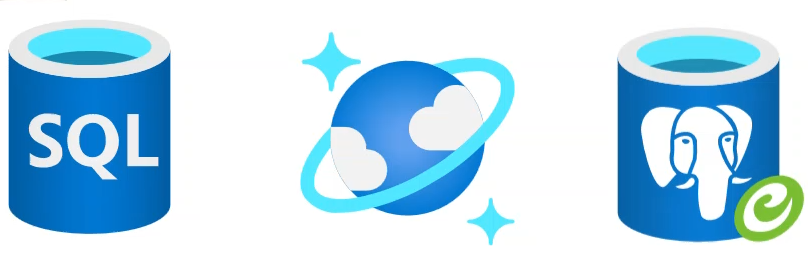

::: zone pivot="video"

>[!VIDEO https://learn-video.azurefd.net/vod/player?id=d4915d82-e141-4ff6-9d4a-2dcde745629a]

::: zone-end

::: zone pivot="text"

The AI applications we use and trust today rely on robust **security**, **networking**, **hosting**, **scaling**, **data storage**, and **AI capabilities**. Azure gives you everything you need to build scalable and secure AI applications quickly and using common technologies of your choice. 

## Security and networking

The foundation of AI applications is security and networking. Azure is secure by design, offering built in identity, access control and network isolation to protect your AI solutions.

AI applications require strong protection and stable connectivity. Azure's security tools protect your AI applications from unauthorized access and threats. For example, *Azure Entra ID* ensures that only the right people and services can access your AI resources. It enables role-based access control (RBAC) to limit access to model deployments, resources, and data.

Azure also protects an AI application's secrets. A **secret** is any sensitive value that your AI application must keep hidden because it grants access to a system, service, or data. Secrets can include API keys, database connection strings, OAuth tokens, passwords, and more. A *key* is a type of secret that is usually a long, randomly generated string—that *authenticates your request* when you call an *endpoint* (a URL). In Azure, secrets are typically stored in *Azure Key Vault*, not in code or GitHub.

For example, suppose you're building an AI chatbot with Azure. 
1. Your application calls the model's *endpoint*.
2. Your request includes a *key* to authenticate the call.
3. The key is stored in *Azure Key Vault* as a *secret*.
4. Your application retrieves the secret at runtime using a secure method (managed identity).

Azure's security tools cover identity, secret, and data protection, compliance, threat detection, monitoring, and security controls such as firewalls. Its *networking* services ensure the application runs reliably, privately, and efficiently across cloud and hybrid environments.

## Hosting and scaling

Applications run on computers or environments known as a **host**. In cloud contexts, a host can be a virtual machine (VM), providing the compute, memory, and networking your application needs to execute. 

To host and scale your applications, you can use Azure Kubernetes Service (AKS) for containerized workloads or Azure App Service to modernize and deploy web apps quickly. AKS orchestrates, or manages, a large number of containers, which hold what your code needs to run. Azure App Service hosts web applications, APIs, and background jobs. These services accelerate time to market while ensuring reliability.

**Scaling** your applications means to automatically or manually adjust the amount of compute power your app uses—usually by adding or removing instances. In cloud applications, 'instances' refer to copies of your application running at the same time.

Two types of scaling:

- Scale out (horizontal): Add more instances
- Scale up (vertical): Increase CPU/memory on the existing instance

Cloud platforms like Azure make scaling automatic based on CPU usage, number of requests, or custom metrics.

## Data storage

AI applications rely on **multiple types of data**, each serving a different purpose in the system. 

Some examples include:
- *Training data*: which teaches the AI model patterns
- *Inference input data*: real-time user or system input
- *AI model output data*: predictions or generated responses
- *Application state*: data that supports user-specific continuity
- *System/configuration data*: supporting how the AI app behaves
- *Logs & telemetry*: monitoring and optimization
- *Security & access data*: safe authentication and authorization

AI apps need robust data storage. **Data storage** is any system or service used to save, organize, and retrieve data so that applications can use it later. Storage plays a critical role because it lets you safely hold the information your AI system needs to *learn*, *operate*, and *improve*. The stored data can also support personalization, analytics, quality improvement, and debugging.

Azure offers multiple options including *Azure SQL Database* for mission critical workloads, *Azure Cosmos DB* for real time globally distributed data, and *Azure Database* for PostgreSQL for intelligent, scalable solutions. No matter the type, storage gives your application a persistent place to keep information.

## AI capabilities 

Finally, to bring your AI agents to life, you can use **Microsoft Foundry**, an enterprise-grade platform for developing and operating AI agents securely on Azure. 

Administrators can manage all of these cloud resources in the Azure portal or by using shell scripting and templates to automate resource deployment and configuration.

The huge range of services and tools in Azure means that whatever your organizational requirements for security, application infrastructure and database platform, you can deliver a great AI solution.

Next, take a closer look at how to use Microsoft Foundry to build AI applications.

::: zone-end