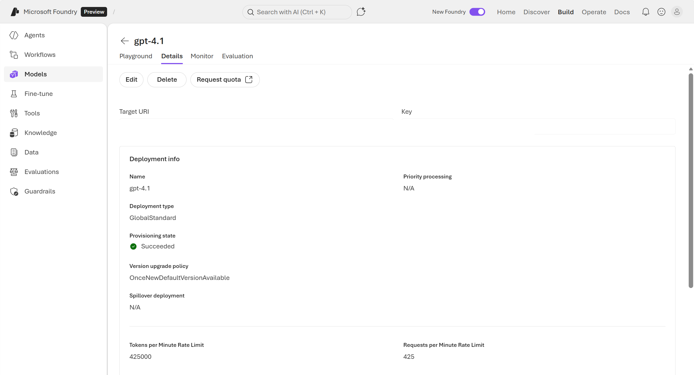

::: zone pivot="video"

>[!VIDEO https://learn-video.azurefd.net/vod/player?id=644a92d5-fcaa-42b7-97aa-3b1a33139b61]

::: zone-end

::: zone pivot="text"

In Foundry, you can define the models and agents that you want to use in custom AI applications. Since Foundry resources are cloud-based, you can consume them as *Application Programming Interfaces* (APIs) across internet connections through programmatic interfaces. 

>[!NOTE]
>An API is a set of rules that allows one application to talk to another application or service. An API defines what requests you can make, what data you get back, and how to format your request.  

## Understand endpoints
 
Like most cloud services, Microsoft Foundry resources are accessed through an **API endpoint**, representing a service entry point. The endpoint has a unique HTTP address, like a website, but it's for client application code rather than human users with a web browser. When you view the endpoint for your model, it looks something like:

`https://<foundry-project>-resource.cognitiveservices.azure.com/openai/deployments/gpt-4o/chat/completions?api-version=2024-05-01-preview`

The interfaces provided at the endpoint are known as *Representational State Transfer Interfaces*, or *REST interfaces* for short. 

To keep your Foundry resources secure, the endpoint is protected. Applications can only access it if they present the correct API key or a token confirming that your Microsoft Entra ID credentials are valid. The model endpoint and key can be found in the Foundry Playground's details page. 

  

Two common types of endpoints in Foundry include: 

- *Project-level endpoints*: for working with your Foundry project and its resources
- *Model endpoints*: for sending prompts to deployed models

## Using endpoints

Applications communicate with the endpoint by sending REST requests. REST requests consist of headers containing metadata, such as authentication and data format information, and a body consisting of data in JSON format. For example, a request might include a prompt entered by a user in a chat application such as "What is an AI application?".  

```rest
curl -X POST https://YOUR-FOUNDRY-RESOURCE-NAME.services.ai.azure.com/api/projects/YOUR-PROJECT-NAME/openai/responses?api-version=2025-11-15-preview \
  -H "Content-Type: application/json" \
  -H "Authorization: Bearer $AUTH_TOKEN" \
-d '{
        "model": "gpt-4.1-mini",
        "input": "What is an AI application?"
}'
```

The results of the request are returned as a response, also with headers and a body. For example, the response might include the reply generated by a model from the prompt. The response comes back in a JSON format. A section of that JSON may look like the following: 

```json
{
    "metadata": {},
    "temperature": 1,
    "model": "gpt-4.1-mini",
    "object": "response",
    "status": "completed",
    "output": [
        {
            "type": "message",
            "status": "completed",
            "role": "assistant",
            "content": [
                {
                    "type": "output_text",
                    "text": "An AI application is a software program or system that utilizes artificial intelligence technologies to perform tasks that typically require human intelligence. These tasks can include recognizing speech, understanding natural language, making decisions, learning from data, recognizing images, and solving complex problems. AI applications are used in various fields such as healthcare, finance, customer service, autonomous vehicles, and more to enhance efficiency, accuracy, and user experience."
                }
            ]
        }
    ]
}
```

While developers can write code that works directly with the REST interfaces, most developers prefer to work with **software development kits (SDKs)** that abstract the REST interfaces with code libraries for their preferred programming language, such as Python, JavaScript, or C#. These language-specific helpers build REST calls for you.

The endpoint for your Foundry resources is the central point of service for client applications, enabling you to build custom solutions that are backed by the security, scalability, and reliability of the Azure Cloud Platform. 

Next, let's try creating a Foundry resource and using its endpoint. 

::: zone-end
