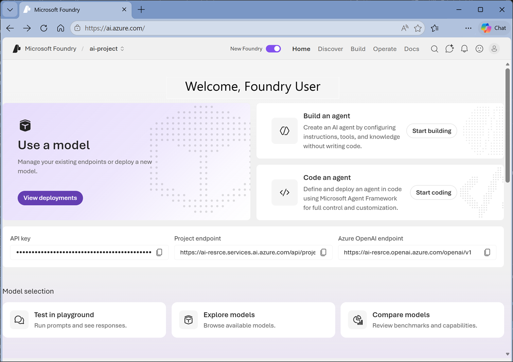

In this exercise, you’ll create and explore a Microsoft Foundry project, and explore the assets that you can create to support an AI application; including generative AI models and tools to support AI functionality like speech. Then you’ll connect a client application to your project so it can use those assets to implement common AI workloads.

If you have an Azure subscription, you can use it to create and explore an AI project.

> [!NOTE]
> If you don't have one, you can [sign up for an Azure subscription](https://azure.microsoft.com/pricing/purchase-options/azure-account?cid=msft_learn), which includes credits for the first 30 days.

*Use the button below to start the exercise*

