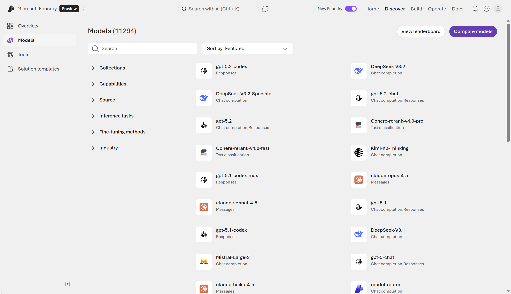
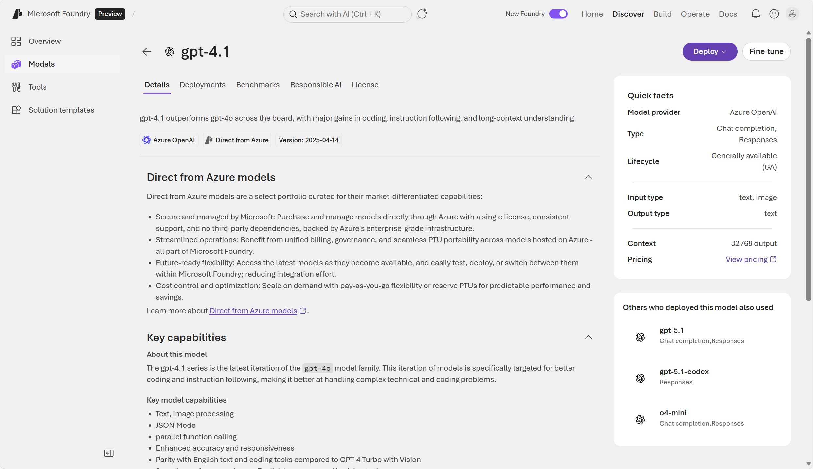
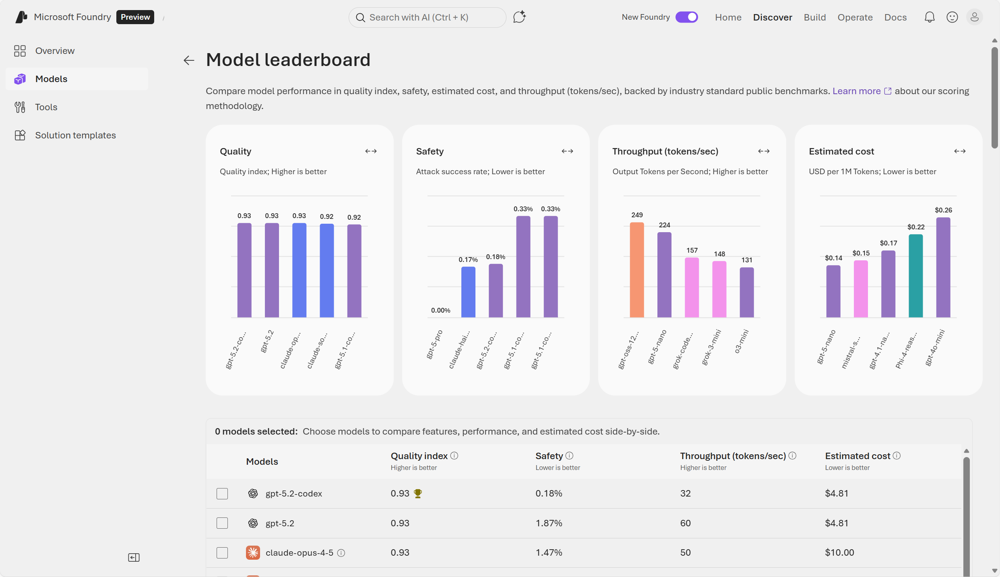

::: zone pivot="video"

>[!VIDEO https://learn-video.azurefd.net/vod/player?id=7c40837e-776e-4097-89b0-fd224f1c6005]

> [!NOTE]
> See the **Text and images** tab for more details!

::: zone-end

::: zone pivot="text"

Generative AI and agentic solutions are based on language models. Large language models (LLMs) form the foundation of  generative AI solutions that can provide a wide variety of responses. Today, a broad range of models exist that serve different needs. For example, the AI capabilities in a lightweight phone application may run best on a small language model, while a government application may require a domain-specialized model. 

**Microsoft Foundry** provides an integrated environment for discovering, evaluating, deploying, and operating generative AI models. It brings together a rich model catalog, flexible deployment options, and built‑in governance capabilities so teams can build copilots, agents, and AI-powered applications with enterprise confidence.

> [!NOTE] 
> In order to use Microsoft Foundry, you need an Azure subscription. To utilize Foundry's capabilities, start by creating a project in Foundry. For more information, review [Get started in Microsoft Foundry](/training/modules/get-started-ai-in-foundry/). 

## Discover models in Foundry's model catalog

**Foundry's model catalog** is a central hub for discovering and using a wide selection of generative AI models from an extensive range of providers. In Foundry, you can filter models by source, capabilities, inference tasks, and more. Foundry enables you to understand and compare model capabilities, as well as test and build scalable, secure, responsible AI solutions. 

> [!NOTE]
> The Foundry portal has a *classic* user interface (UI) and a *new* UI. Images of the Foundry portal reflect the *new* UI where it's relevant. 

  

The model catalog offers a broad selection of models including models sold directly by Azure alongside models from partners and open-source communities.

- **Models Sold Directly by Azure**: These models are hosted by Microsoft under Microsoft Product Terms. They offer high levels of integration with Azure, enterprise-grade service level agreements (SLAs), preconfigured security, and compliance alignment. 

- **Models from Partners and the Community**: Includes open-source or vendor-hosted models integrated through the catalog. These models support broader experimentation and rapid innovation and are often suitable for specialized or domain‑specific tasks.

Each model entry typically includes:
- Model descriptions and capabilities (text generation, reasoning, coding, multimodal, embeddings, etc.)
- Benchmark results and performance comparisons
- Supported inference tasks and fine‑tuning options
- Responsible AI documentation (model cards, constraints, caveats)

#### Commonly used model families 

Among the thousand-plus models available in Foundry, there are many grouped by **model family**. A model family refers to a group of related models that share the same underlying architecture or lineage, but differ in size, capability, specialization, or version. 

Commonly used model families include: 
 
- **GPT‑5.x**: Optimized for multi‑step reasoning, structured logic, planning, and agentic workflows. It does well in scenarios needing high‑accuracy reasoning and long‑context understanding—such as generating technical reports, code analysis, or orchestrating multi‑tool agents. It supports adjustable "thinking levels", letting developers trade speed for accuracy when needed.

- **Claude Opus 4.5** (Anthropic): When you need a frontier‑level model for sophisticated agents, complex code reasoning, or multi‑step computer‑use tasks. Opus 4.5 is described as Anthropic’s most intelligent model with strong performance across coding, agents, and computer use, and large context/output windows—useful for long specifications, multi-file diffs, or extended research notes. 

- **Mistral Large 3** (Mistral AI): is a state‑of‑the‑art, general‑purpose model ideal for where you want strong quality with efficient throughput. The model does well with multilingual drafting, structured business report generation, or mid‑latency agent tasks that balance cost and performance. Mistral Large 3 is a "state‑of‑the‑art" general model and part of the curated Foundry catalog, making it a practical alternative to flagship models when you want high capability with flexible cost/latency trade‑offs.

>[!NOTE]
> Registration is currently required for the GPT-5 model family, restricting its availability. All Foundry users can use **GPT‑4.1**, which is ideal for real‑time chat, customer support, and interactive applications that must respond quickly and at scale. It's optimized for speed, efficiency, and low‑latency inference, making it better than reasoning‑heavy models for high‑volume production workloads.

In Foundry, **foundation models** are large, pretrained models—such as GPT, Claude, Mistral, and others—that provide general language, reasoning, or multimodal capabilities out of the box. These models can be deployed immediately or customized through fine‑tuning, and serve as the base layer for building AI applications. 

## Evaluate models in Foundry 

Choosing the right model in Foundry starts with understanding **your workload, task type, and constraints**. 

#### Select a model by task type 

|**Task**|**Recommended model types**|**Model details**|
|-|-|-|
|**Chat**| GPT‑5.x chat, Claude Sonnet/Opus, Mistral‑Large‑3, DeepSeek V3.1, small language models (SLMs) like Phi‑4 or Llama| Strong reasoning, conversation tuning, safety |
|**Coding**|GPT‑5.1‑codex, Claude‑Sonnet|Support for complex agent flows|
|**Summarization**| GPT‑5.x reasoning models, Claude Opus/Sonnet| Long-context, high-quality compression |
|**Embeddings**| text‑embedding‑3-small or other embedding models| Built for semantic vector representations |
|**Multimodal**| Phi‑4‑multimodal‑instruct, GPT‑5.x chat multimodal, Mistral‑Large‑3 | Support for images, audio, and video in chat completions|
|**Industry or domain-specific**|Domain-tuned models in the catalog|Applications specific to an industry such as finance, healthcare, legal|

> [!NOTE]
> When the use case is well‑defined, instead of choosing a model from the model catalog, you may choose a [**Foundry tool**](https://azure.microsoft.com/products/ai-foundry/tools/?msockid=2bbfe2e7589c63f40fd5f7ea5c9c654c#Tools). Foundry tools are powered by prebuilt models that provide predictable performance, built‑in compliance, and fast time‑to‑value without custom modeling.  

#### Score and compare models in Foundry 

Foundry's model catalog includes benchmarking results that show how models perform on standard datasets. Benchmark scores simplify model selection by using consistent evaluation criteria. 

Through the Foundry portal, you can also view: 
- **Model leaderboards**: leaderboards rank models based on attributes like quality, safety, and throughput. This helps identify the best model for a task. Examples of tasks include reasoning, summarization, code generation.
- **Comparisons and filters**: Side‑by‑side model comparison by quality and accuracy, cost, security and compliance, and performance metrics. You can filter by industry, use case, model type, licensing, and more.

A common way you can evaluate is to start in Foundry's model catalog, choose a model, then select *Benchmarks → Try with your own data*. You can try out prompts and see if the responses are as expected. 

There are various ways to score a model in Foundry portal, including *Natural Language Processing (NLP) metrics* and *AI‑assisted quality metrics*. Examples of classic *NLP quality metrics* are: accuracy, precision, recall, and F1. Examples of *AI‑assisted metrics* include groundedness, relevance, coherence and fluency, and GPT similarity. Choose AI-assisted metrics for qualitative scoring beyond traditional metrics. 

Safety evaluators can be used help ensure responsible AI output. They scan for harmful or unsafe content, bias and unfairness, violence, self‑harm, or protected‑class harms. Foundry's Evaluator Library offers reusable evaluators for quality scoring, safety scanning, and more.

## Deploy models in Foundry 

Once you select a model, Foundry provides flexible deployment mechanisms that let you tailor performance, cost, and governance. **Deploying a model** takes an AI model and makes it available for use in production through a stable, scalable, and secure endpoint. Deployment of a configured model turns the model into a service that applications can call—usually through an API. Deploying a configured model helps ensure consistent performance and reliability. It also allows developers to prevent unauthorized or unsafe use. 

Deployment parameters that you can customize in Foundry include: 

- **Deployment type**: such as standard, global batch, and regional provisioned throughput, determine where and how inference is processed in Foundry. Deployment types are tied to throughput and data‑processing requirements. 
- **Model version**
- **Tokens per minute (TPM)** rate limit 

> [!NOTE]
> A **token** is the smallest unit of text or data that a generative AI model can process. Models break input into tokens—such as words, subwords, characters, or punctuation—so they can understand and generate language efficiently.

When you deploy a model, you can assign it a *Tokens Per Minute* (TPM) allocation. TPM determines the speed and scale the model can process inputs and the rate‑limit boundaries such as requests per minute (RPM).

Limits differ by model family, for example:
- High‑end reasoning models (for example: DeepSeek R1, Grok, large Llama versions) may have high TPM ceilings.
- Specialized or image models often operate under capacity units instead of TPM.

*Throttling*, in a compute context, means intentionally slowing down or limiting how much compute work can happen at one time. It's a protective mechanism used when a system is close to hitting its processing limits. Throttling temporarily restricts resource usage so the system can remain stable and responsive. 

Deployment‑level quotas define how many tokens or requests can be processed before throttling occurs. Larger prompts and higher max output token settings consume more TPM, leading to rate-limit errors if exceeded (covered in throttling description search results). If you see throttling, lower **max tokens** or reduce concurrent requests in code. 

When you deploy a model in Foundry, several things occur:
- Compute resources are allocated: Foundry assigns the hardware needed to run the model—CPUs, GPUs, memory, networking, and scaling rules.
- An API endpoint is created: You're able to securely invoke the model through the OpenAI Responses API, validated through management API checks. 
- Configuration (such as model version, response style, safety settings) is locked in
- Monitoring and logging become active: usage metrics, performance, latency, errors, and costs are tracked

Next, learn how to configure these models in the Foundry portal playground and use them in a client application.

::: zone-end