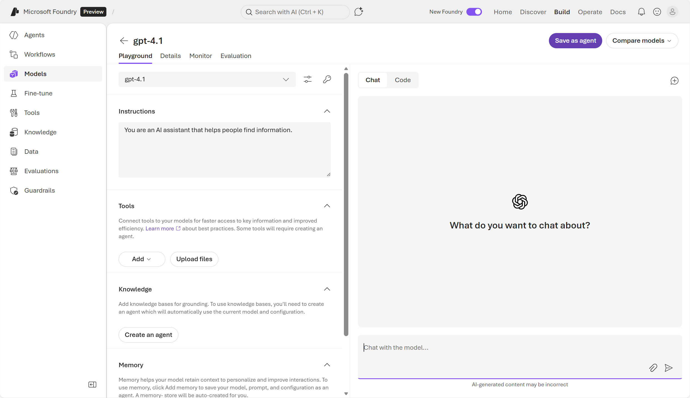
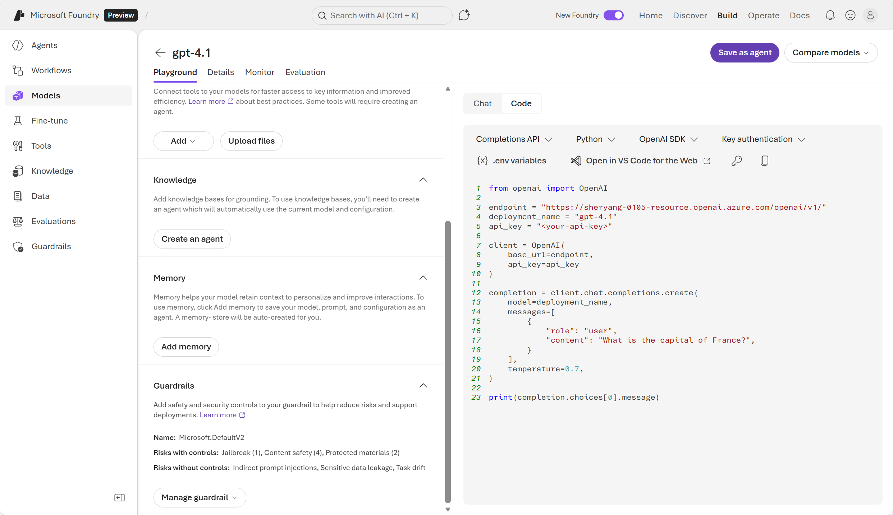

::: zone pivot="video"

>[!VIDEO https://learn-video.azurefd.net/vod/player?id=3dcbc522-beb9-4890-9e75-d8086bba1c2e]

> [!NOTE]
> See the **Text and images** tab for more details!

::: zone-end

::: zone pivot="text"

The easiest way to interact with a deployed model is to use the model playground in the Foundry portal. You can use the **Foundry Playgrounds** to try prompts, compare models, and capture working settings before you write any code.



## Key configuration parameters

Several *model arguments* or *parameters* influence runtime behavior, performance, and cost. In the playground settings, you can configure parameters such as **temperature**, **max output tokens**, and **system instructions**. In the playground chat interface you can submit prompts and see the responses generated by the model.

- **Temperature**: controls creativity vs. determinism.
- **Max output tokens** – caps response length; affects token consumption and throttling behavior.
- **System instructions** – sets behavior and role of the model.

Unlike the user prompt, which is the end-user request or question (example: Where should I travel?), a **System prompt** sets behavior, tone, tools, and guardrails for the assistant. An example of a system prompt is: "You are a helpful, step‑by‑step tutor. Cite sources. Decline medical advice." 

The playground is a useful bridge between Foundry and code. After you test representative prompts, you can use the same system and user prompts and parameter values in your code. The playground provides code that can call your Foundry deployment via the OpenAI‑compatible *Responses* API. The code is essentially what is running when you use the chat interface to configure settings and send user prompts. 



You can take the code as a starting point for creating your own chat client. 

## Create a lightweight chat client by using the Foundry SDK

A **lightweight client application** is a small, minimal app whose primary job is to **collect user input**, **call a remote service/API**, and **display results**, without heavy UI frameworks, complex backend logic, or large local dependencies. In practice, it typically:

- Runs as a **CLI (command-line interface)**, small desktop utility, or simple web page.
- Keeps **state and compute mostly on the server** (the model runs remotely).
- Has a **small code footprint** and minimal configuration (often just environment variables + a short script).
- Is easy to prototype, easy to run locally, and easy to extend later.

For Foundry, a lightweight chat client is often a **single Python file** that connects to a Foundry project endpoint and sends chat messages to a deployed model. The Foundry SDK exposes a **Project client** (Foundry‑native ops) and an **OpenAI‑compatible client** for calling models via the **Responses API**. Most apps use both. 

#### Build a Python chat client

After you created a **Foundry project** and **deployed a chat model** (for example, `gpt-4.1`), you can use the Foundry SDK. In the example, the client application uses authentication to connect to the endpoint for the model, submit a prompt, and display the response. 

>[!NOTE]
>In order to use the SDK, you need to install the `azure-ai-projects` package. The package is the core Azure AI Projects (Foundry) SDK used to connect to your Foundry project and obtain an OpenAI-compatible client.

```python
# pip install openai>=1.3.0
# pip install azure-ai-projects azure-identity openai

import os
from openai import OpenAI

client = OpenAI(
    base_url=f"{os.environ['AZURE_OPENAI_ENDPOINT']}/openai",
    api_key=os.environ["AZURE_OPENAI_API_KEY"]
)

response = client.responses.create(
    model=os.environ["DEPLOYMENT_NAME"],          # e.g., "gpt-4o-mini"
    input=[{"role": "system", "content": "You're a helpful assistant."},
           {"role": "user", "content": "Summarize the key points from our release notes in 3 bullets."}],
    max_output_tokens=300,
    temperature=0.7
)

print(response.output_text)
```

## Understand the difference between models and agents

In Microsoft Foundry, **generative AI models** and **agents** are related but serve different purposes. You can think of it this way:

- **Models = raw intelligence**
- **Agents = packaged, task‑oriented workers built on top of that intelligence**

When you use a generative AI model on its own: 
- You want pure inference: "Take this prompt and generate output."
- You’re experimenting in the Playground
- You call the model via the **OpenAI Responses API**

Next, learn how to create an agent in Foundry.

::: zone-end