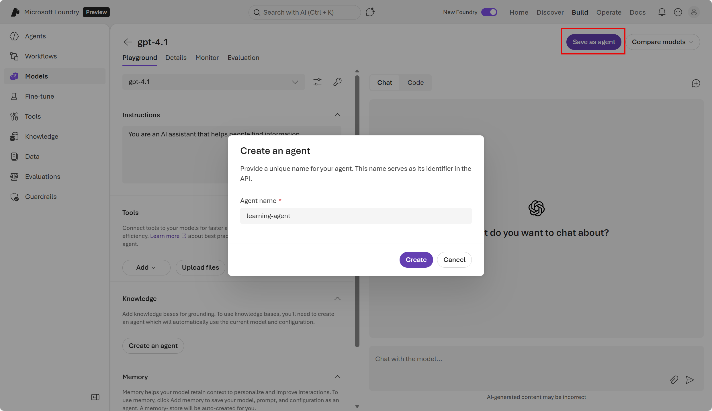
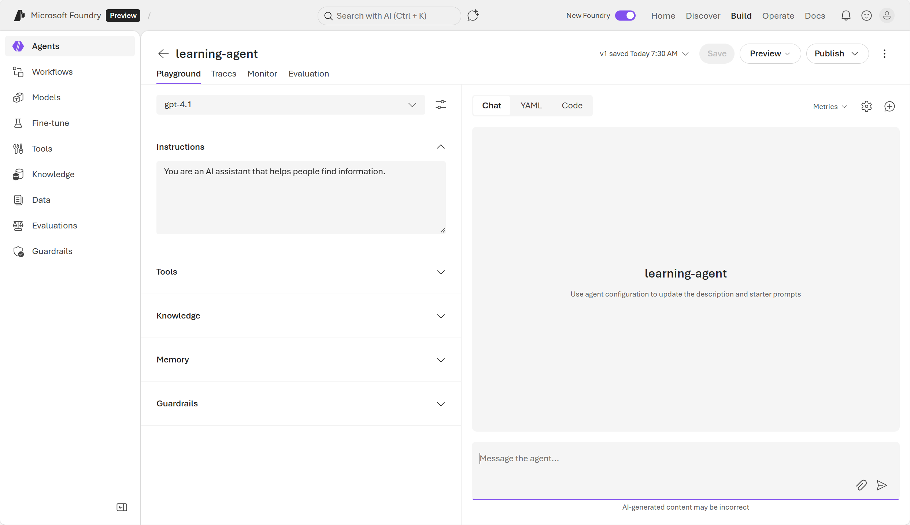
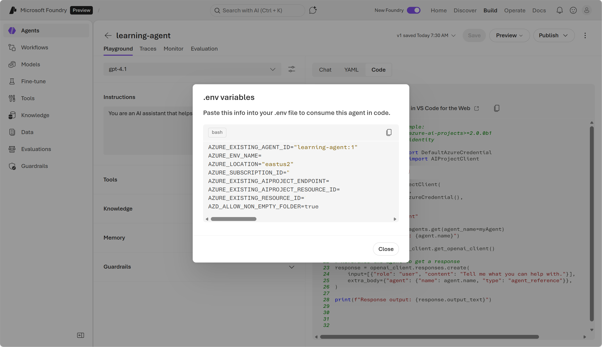
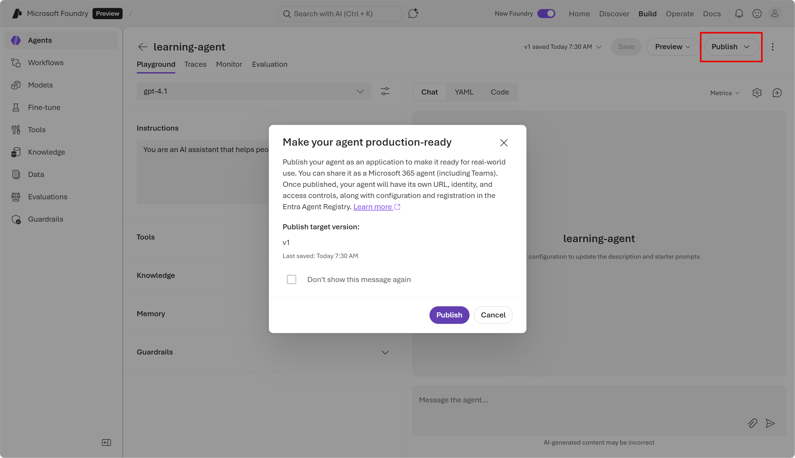
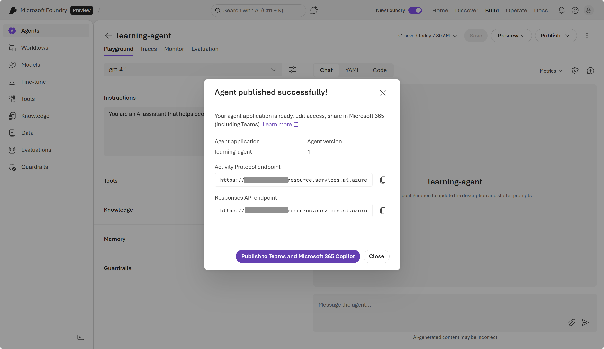

::: zone pivot="video"

>[!VIDEO https://learn-video.azurefd.net/vod/player?id=5f4b8cbc-cba8-4394-9130-e167af01d0e3]

> [!NOTE]
> See the **Text and images** tab for more details!

::: zone-end

::: zone pivot="text"

**Agents** are *applications* built with generative AI models. Agentic AI moves beyond one‑off prompts and instead defines a consistent, workflow-like behavior that can be reused across apps, experiences, and services. 

An agent in Microsoft Foundry is a packaged, reusable AI component that brings together three things:
- **A model**: the generative AI model the agent uses for reasoning (for example, GPT‑4.1)
- **Instructions**: the system prompt that defines the agent’s role, behavior, style, constraints, and output rules
- **Tools**: the actions the agent can take 

Agents can: 
- Call external tools (APIs, functions, retrieval) automatically
- Break goals into structured steps
- Maintain working memory during a conversation
- Process user input, decide actions, and generate structured outputs

## Create an agent in Foundry portal

To create an agent in Foundry, you can start by exploring a model or just go straight to agent development. In Foundry portal, creating an agent looks similar at first to testing a model in the playground.  

1. Choose the model your agent uses.
2. Write the system instructions, such as "You're a helpful scheduling assistant who returns answers in concise bullet points."
 
What sets the agent apart from using the model alone is the addition of tools, which allow the model to act on  information and knowledge, which grounds the model with information. 

Tools = *actions*.  
Knowledge = *context*.

#### Add Tools 

**Tools** in Foundry allow a model to perform actions by calling external systems. They represent **callable capabilities** such as searching the web, querying a database, or using an MCP server. 

When enabled in the model playground, the model can inspect available tools, then call them when relevant to a user request. Examples of tools include: 
- Code Interpreter (data analysis, file handling)
- Using knowledge sources
- Custom functions or APIs

Tools allow the model to:
- Take real actions (read/write files, search, update systems)
- Execute workflows
- Integrate into enterprise systems

In Foundry, tools form the basis for action-taking agents. They can be configured centrally using the **Foundry Tool Catalog**, where you can discover and manage tools. 

#### Add Knowledge

**Knowledge** allows the model to **access and retrieve external content** (your documents, datasets, internal sites) through retrieval-augmented generation (RAG).

Knowledge in Foundry refers to **documents or datasets** provided to the model so it can retrieve highly relevant context during generation. Data can include internal PDFs, SharePoint content, Azure Storage files, and multi‑source knowledge bases. 

In the playground, Foundry uses retrieval pipelines to:

1. **Ingest + index** your content
2. **Search + ground** responses
3. Make answers more accurate, traceable, and domain‑specific

Agents rely heavily on knowledge when answering domain-specific questions. When knowledge is used, the response includes a citation for the knowledge store the agent used.

Knowledge enables:

- Document-grounded Q\&A
- Context-rich assistance
- Enterprise-safe retrieval
 
In the Foundry portal, you can save your model, instructions, and tools as an agent. You can continue to test and refine your agent in the Playground. 





## Using an agent

You can use an agent from a client application by using the **Foundry Projects SDK** to connect to the project and call it from a client using the **Project API**.

The Project API enables you to:
- Integrate agents into web apps, bots, or backend workflows
- Orchestrate multi‑step tasks
- Pass structured inputs or tool calls
- Run agents at scale with your Foundry deployments

### Create a client application for an agent

To call the agent programmatically using Foundry’s Project API, you need the `agent-id` of your agent. You can find the `agent-id` in the Playground view of the agent when you select the *code* view and open the *.env variables*.  

 

Let's take a look at a Python code sample to use an agent: 

```python
# Before running the sample, install the packages:
#    pip install --pre azure-ai-projects>=2.0.0b1
#    pip install azure-identity

from azure.identity import DefaultAzureCredential
from azure.ai.projects import AIProjectClient

myEndpoint = "https://<resource>.services.ai.azure.com/api/projects/<resource-name>"

project_client = AIProjectClient(
    endpoint=myEndpoint,
    credential=DefaultAzureCredential(),
)

myAgent = "learning-agent"
# Get an existing agent
agent = project_client.agents.get(agent_name=myAgent)
print(f"Retrieved agent: {agent.name}")

openai_client = project_client.get_openai_client()

# Reference the agent to get a response
response = openai_client.responses.create(
    input=[{"role": "user", "content": "Tell me what you can help with."}],
    extra_body={"agent": {"name": agent.name, "type": "agent_reference"}},
)

print(f"Response output: {response.output_text}")

```

### Publishing an agent

**Publishing** an agent changes it from a saved development asset to a managed Azure resource with a stable endpoint. A published agent can be shared without exposing the Foundry project or source code. You can publish an agent through the Foundry portal. 




Publishing an agent gives you a stable endpoint to integrate the agent into applications. 

::: zone-end