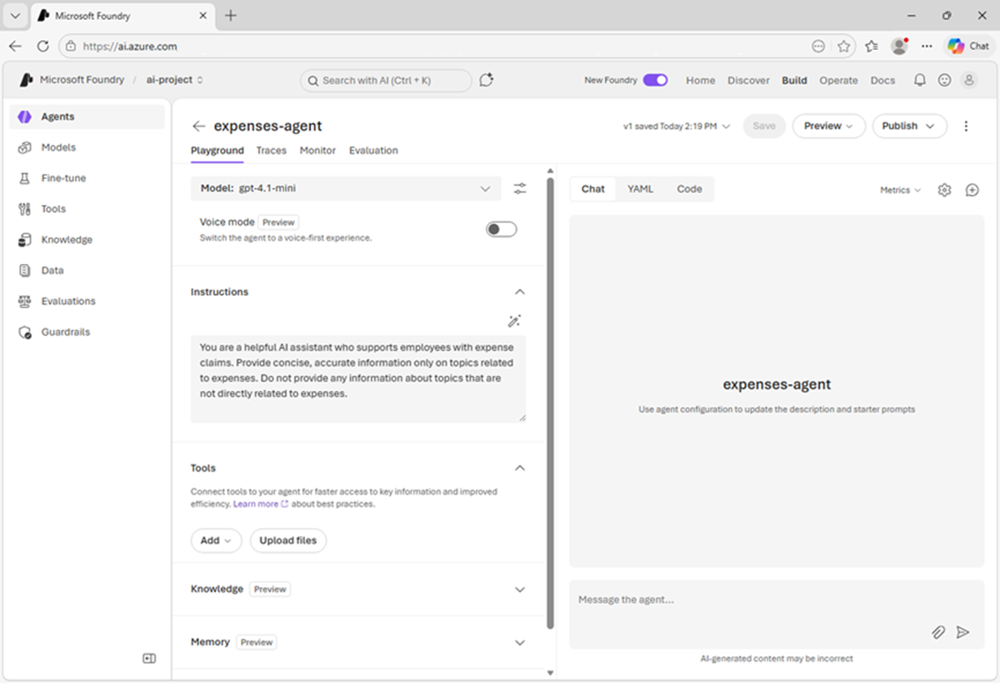

In this exercise, you’ll use Microsoft Foundry to deploy and explore a generative AI model. You’ll then use the model in an agent that includes knowledge tools to answer user questions.

If you have an Azure subscription, you can use it to explore generative AI in Microsoft Foundry for yourself.

> [!NOTE]
> If you don't have an Azure subscription, and you want to explore Microsoft Foundry, you can [sign up for an account](https://azure.microsoft.com/pricing/purchase-options/azure-account?cid=msft_learn), which includes credits for the first 30 days.

*Use the following button to start the exercise*

