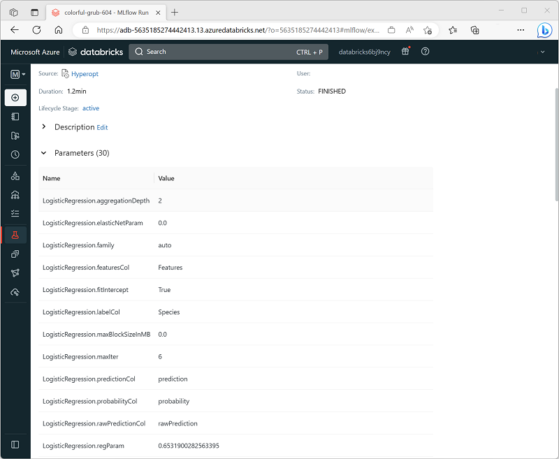

When you use Hyperopt to try multiple hyperparameter combinations, you may want to review the details of each trial. You can review these details in two ways:

- View the MLflow run for each trial.
- Use the **Trials** class to capture run details.

## View the MLflow run for each trial

In Azure Databricks, calls to the Hyperopt **fmin** function automatically generate MLflow experiment runs that you can view in the Azure Databricks portal; providing you with an easy way to view the full set of hyperparameters and metrics for each trial, as shown here:



## Use the *Trials* class

Hyperopt includes a **Trials** class that logs details for each trial that is run during an **fmin** function call. The following code example shows how to use the **Trials** class.

```python
from hyperopt import Trials

# Create a Trials object to track each run
trial_runs = Trials()

argmin = fmin(
  fn=objective,
  space=search_space,
  algo=algo,
  max_evals=100,
  trials=trial_runs)

print("Best param values: ", argmin)

# Get details from each trial run
print ("trials:")
for trial in trial_runs.trials:
    print ("\n", trial)
```

The full detail output for a collection of trials resembles this example:

```text
{'state': 2, 'tid': 0, 'spec': None, 'result': {'loss': -0.8571428571428571, 'status': 'ok'}, 'misc': {'tid': 0, 'cmd': ('domain_attachment', 'FMinIter_Domain'), 'workdir': None, 'idxs': {'Iterations': [0], 'Regularization': [0]}, 'vals': {'Iterations': [1], 'Regularization': [0.4965634473237057]}}, 'exp_key': None, 'owner': None, 'version': 0, 'book_time': datetime.datetime(2023, 3, 17, 22, 45, 24, 993000), 'refresh_time': datetime.datetime(2023, 3, 17, 22, 46, 30, 374000)}

 {'state': 2, 'tid': 1, 'spec': None, 'result': {'loss': -0.8857142857142857, 'status': 'ok'}, 'misc': {'tid': 1, 'cmd': ('domain_attachment', 'FMinIter_Domain'), 'workdir': None, 'idxs': {'Iterations': [1], 'Regularization': [1]}, 'vals': {'Iterations': [9], 'Regularization': [0.8446551490616772]}}, 'exp_key': None, 'owner': None, 'version': 0, 'book_time': datetime.datetime(2023, 3, 17, 22, 46, 30, 379000), 'refresh_time': datetime.datetime(2023, 3, 17, 22, 47, 34, 155000)}

 {'state': 2, 'tid': 2, 'spec': None, 'result': {'loss': -0.9523809523809523, 'status': 'ok'}, 'misc': {'tid': 2, 'cmd': ('domain_attachment', 'FMinIter_Domain'), 'workdir': None, 'idxs': {'Iterations': [2], 'Regularization': [2]}, 'vals': {'Iterations': [9], 'Regularization': [0.3931915704555482]}}, 'exp_key': None, 'owner': None, 'version': 0, 'book_time': datetime.datetime(2023, 3, 17, 22, 47, 34, 160000), 'refresh_time': datetime.datetime(2023, 3, 17, 22, 48, 45, 986000)}

 ...
```

> [!TIP]
> For more information about the details recorded by the **Trials** class, see the [Hyperopt documentation](http://hyperopt.github.io/hyperopt/getting-started/minimizing_functions?azure-portal=true#the-trials-object).
