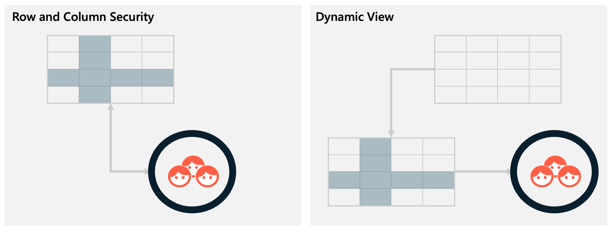
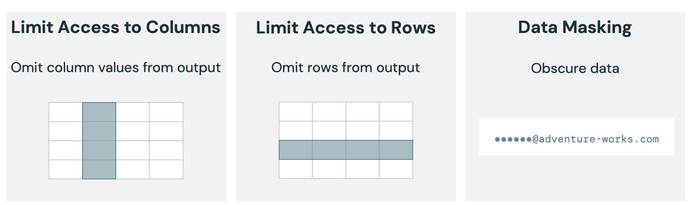

In the previous module, you looked at granting or denying access to entire tables. That works when every authorized user can see every row and column, but in real scenarios you often need to expose only part of a dataset. You might need to hide rows that a user isn't entitled to view, redact or mask specific columns that contain sensitive attributes, or partially transform values so that they remain useful without leaking full detail. Rather than duplicating tables or maintaining multiple extract copies, you can apply fine-grained access control. In Databricks Unity Catalog, you implement fine-grained control using one of two approaches: 

- **Row and Column Security**: the preferred, modern method, composed of column masking and row filtering.
- **Dynamic Views**: the earlier pattern that still has valid use cases. 

In this unit, you'll learn what each approach is, when to use it, and why one is generally favored today. You'll explore the specific SQL syntax in the next unit, so here we stay at the conceptual level.

## Why Fine-Grained Control Matters

You frequently have a single canonical table that must serve different audiences: application users, data analysts, compliance reviewers, or support staff. Creating separate physical tables for each audience leads to data duplication, stale copies, extra orchestration, and security drift. Views can help, but managing many views—each encoding slightly different masking or filtering—becomes difficult over time. Fine-grained access control lets you keep one authoritative table while tailoring what each principal actually sees at query time.

Typical objectives you'll address:

- **Column masking**: Show a column's presence but hide (or transform) its sensitive values for most users.
- **Row filtering**: Suppress entire records that a user or group shouldn't see.
- **Partial transformation**: Preserve analytical utility (for example, last two digits, domain of an email) without exposing full identifiers.

## Row and Column Security

Row and Column Security is implemented through two core concepts:

- **Column masking**: You associate a masking function with a specific column. When a user queries the table, Unity Catalog invokes that function to decide whether to return the real value, a redacted placeholder, or a transformed version. You typically define one function per masked column.

- **Row filtering**: You associate a filter function with the table. That function returns a boolean determining whether each row is visible to the querying principal. One function can govern all row-level rules for that table.

You create user-defined SQL functions that contain the decision logic (for example, checking the querying user's group membership). Because these functions are securable objects just like tables, you also decide where they live (schema/catalog) and who can alter or execute them. You then bind them directly to the table's metadata. At that point, anyone querying the table benefits from a single authoritative definition of masking and filtering—no extra layer required.

Key characteristics you should internalize:

- **Centralized logic**: Rules live alongside the table definition, reducing drift between data and policy.
- **Combinatorial flexibility**: A single set of masking and filtering functions handles all user combinations; you don't create separate artifacts per audience.
- **Performance alignment**: Operating at the table layer avoids the overhead of stacking multiple view abstractions.
- **Operational simplicity**: Fewer named objects to permission, audit, and lifecycle.

## Dynamic Views

Dynamic Views predate Row and Column Security. These have been with Databricks for some time, and though they're no longer the preferred method for controlling access to rows and columns, they still have their place. You define a view that selects from one or more underlying tables and encodes conditional logic: CASE expressions to mask sensitive columns, predicates to exclude rows, or transformations that partially obfuscate values. Any user with permission on the view can query it without having direct access to the underlying tables, assuming the view owner has that access. This separation lets you shield source objects while presenting a curated projection.

You might create multiple dynamic views over the same table to serve different user cohorts (for example, a support view with partially masked identifiers and an analyst view with additional fields). Each view becomes its own securable object with its own ownership and grants.

Characteristics to note:

- **Level of separation**: Users can be isolated from source tables entirely.
- **Multi-table composition**: You can assemble data from several tables and apply masking/filtering in one place.
- **Read-only exposure**: Views can't themselves be updated; any data modification still requires access to the base tables.
- **Object proliferation risk**: Each audience-specific variant typically requires a new view.

## Why Row and Column Security Is Preferred

You should default to Row and Column Security because:

- **Reduced object sprawl**: One table plus a small set of functions replaces a potentially expanding family of views.
- **Easier maintenance**: Policy changes occur where the data resides, lowering chances of unsynchronized logic across parallel views.
- **Performance advantages**: Enforcement happens at the source, avoiding extra resolution layers and enabling better optimization.
- **Clearer governance**: Auditing and lineage focus on the primary table rather than a web of derivative objects.
- **Flexible combinations**: You avoid creating a new physical or logical artifact for every unique mix of masking and filtering rules.

## When Dynamic Views Still Make Sense

You should consider dynamic views instead (or in addition) when:

- Source tables are intentionally treated as **read-only interfaces**; you want an explicit contract boundary between producers and consumers.
- You need to present a logical dataset assembled from **multiple tables** with consistent masking and filtering logic applied across joins.
- **Organizational policy** requires strict separation such that consumers shouldn't even know the exact structure or existence of underlying tables.
- **Existing legacy patterns** already use dynamic views and a phased migration strategy is necessary.

## Comparing Row and Column Security with Dynamic Views

Here's your comparison table with **Row and Column Security** vs **Dynamic Views** side by side, so you can see the trade-offs and decide which approach best fits your needs.

| **Dimension**            | **Row and Column Security**                                                               | **Dynamic Views**                                                                   |
| ------------------------ | --------------------------------------------------------------------------------------- | ----------------------------------------------------------------------------------- |
| **Maintainability**      | Minimizes moving parts by enforcing security at the table level.                        | More objects to manage if multiple views are created.                               |
| **Flexibility**          | Limited to what's stored in the table.                                                  | Can combine multiple tables directly for flexible compositions.                     |
| **Object governance**    | Fewer objects overall; simplifies grants and audits.                                    | More objects to govern; grants may need to be managed at both view and table level. |
| **Read/write patterns**  | Supports seamless querying and updating with masking or filtering applied at the table. | Typically read-only; write patterns require direct table access.                    |
| **Abstraction boundary** | Exposes storage design more directly.                                                   | Provides a presentation layer decoupled from underlying storage.                    |

## Typical Workflow

Follow these steps to design the right approach and keep your model both secure and maintainable:

1. Identify sensitive columns and row-level segmentation rules (for example, region-based, role-based).
2. Decide if you truly need multi-table assembly or strict abstraction. If not, prefer Row and Column Security.
3. For Row and Column Security: design minimal user-defined functions—one per masked column and optionally one row-filter function—that evaluate the querying principal.
4. Attach these functions to the table so that queries automatically enforce the logic.
5. For Dynamic Views (when justified): craft a single view that applies CASE expressions and WHERE predicates; create additional views only when audiences require materially different exposures.
6. Periodically review whether evolving requirements still justify each dynamic view or whether consolidation into Row and Column Security is now feasible.

## Common Pitfalls

A few common pitfalls can undermine the effectiveness of a security model. One of the most frequent mistakes is **duplicating tables** for each audience. This approach quickly creates synchronization challenges and complicates governance, as any schema or data change must be applied consistently across all copies. Another recurring issue is the creation of **multiple, nearly identical views** instead of implementing generalizable masking logic. This not only increases maintenance overhead but also makes the system harder to audit and reason about.
It's also important to be deliberate about where business logic resides. 

**Embedding complex transformations** inside masking functions can blur responsibilities; these rules typically belong in upstream transformation pipelines, not in security enforcement. Equally critical is ensuring that the **masking and filtering functions themselves are properly secured**. If they're altered or bypassed, the entire protection model can be weakened. Finally, organizations should be cautious of **over-masking**, which removes more information than necessary and can inadvertently block legitimate analytical tasks that depend on those fields.