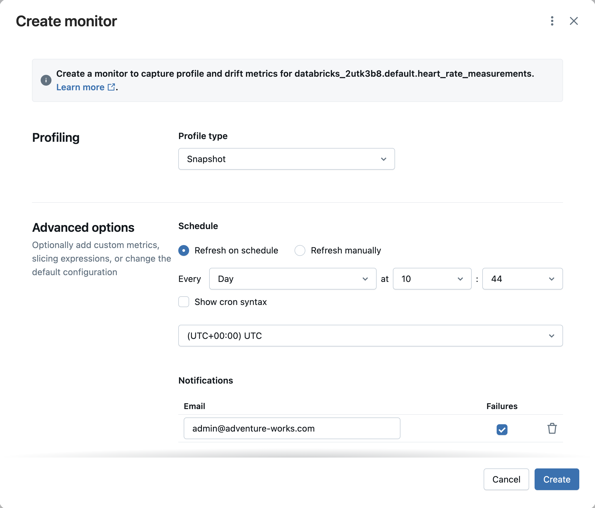
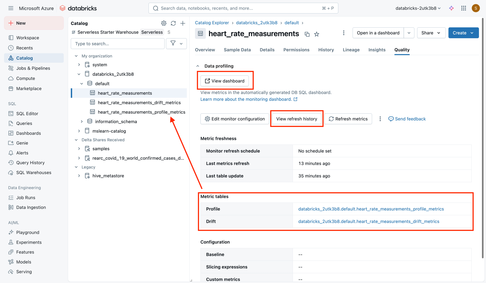
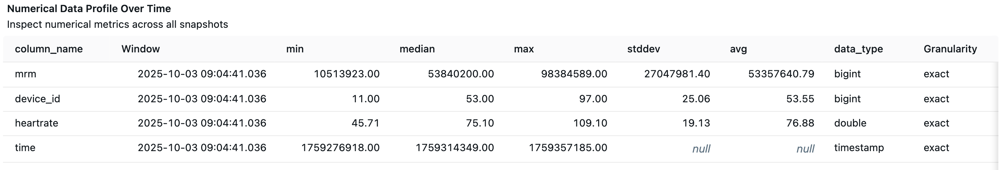
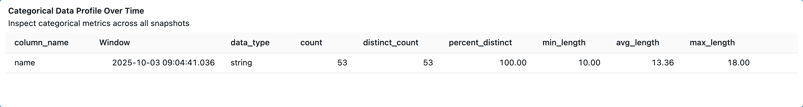

In this unit, we'll use a heart rate measurements table as our guiding example to learn about lakehouse monitoring. You'll explore how to set up a monitoring system, understand the types of metrics it can capture, and learn how to interpret those insights. Along the way, we'll highlight best practices for identifying issues such as missing values or unusual readings, ensuring your data remains accurate and reliable.

## Scenario: Heart Rate Measurements Table

Imagine we have a Delta table called **`heart_rate_measurements`** that stores readings from wearable devices. Each row contains:

- `device_id` (Integer) – an ID for the device that took the measurement
- `mrm` (Text) – a code (for example, medical record number or reading ID)
- `name` (Text) – the person's name (or could be blank if not provided)
- `time` (Timestamp) – when the measurement was taken
- `heartrate` (Decimal) – the heart rate value recorded

For example, a few rows might look like:

| device_id |   mrm    |      name       |           time            | heartrate |
|-----------|----------|-----------------|---------------------------|-----------|
|    23     | 40580129 | Nicholas Spears | 2025-10-01T00:01:58+00:00 |   54.0122 |
|    17     | 52804177 | Lynn Russell    | 2025-10-01T00:02:55+00:00 |   92.5136 |
|    37     | 65300842 | Samuel Hughes   | 2025-10-01T00:08:58+00:00 |   52.1354 |

As data engineers, we **want to ensure the quality of this data over time**. Important questions include: Are there any **missing names** (nulls)? Do we have heart rate readings that are **zero** (which might indicate sensor errors or placeholders)? What are the typical ranges of heart rates, and did we ever get an **outlier** reading that looks unreasonable? Manually checking these can be labor-intensive; instead, we can use Databricks Lakehouse Monitoring to automate these checks and provide a dashboard of data quality metrics.

## Setting Up a Data Monitor (Snapshot Profile)

To monitor a Delta table like `heart_rate_measurements`, you need to **create a monitor** and attach it to that table. Databricks makes this easy through the Unity Catalog Data Explorer UI: 

1. Open the Table in Data Explorer: Navigate to the table (for example, via the Catalog explorer). Go to the **Quality** tab for the table. If no monitor exists yet, you'll see an option to **"Get Started"** with Lakehouse Monitoring.

2. **Choose a Profile Type**: When creating a monitor, you select a profile type that determines how data is analyzed. There are three types: Snapshot, Time series, and Inference. For our scenario, we select **Snapshot** since we want to profile the entire `heart_rate_measurements` table state each time. 

3. **Configure Refresh Schedule**: Decide how the monitor should run:
    - You can have it **refresh on a schedule** (for example, every hour or every day) to continuously monitor new data, or
    - Set it to **refresh manually** on-demand. In a development or demo setting, manual refresh is fine (as in our original lab scenario). In production, you might schedule it to run after each ETL job or daily at a certain time.
  

4. **Create the Monitor**: After choosing the settings, select **Create**. Databricks will set up the necessary monitoring infrastructure. Under the hood, this creates two Delta tables (a **profile metrics** table and a **drift metrics** table in a specified monitoring schema) and a default dashboard for your monitor. The monitor will then perform its first data scan. (Note: The initial profiling may take a few minutes depending on table size, since it's computing a comprehensive set of statistics.)

**Monitor via API**: Alternatively, monitors can be created via the Databricks API/SDK. For example, you could use Python with the Databricks SDK to create monitors programmatically for many tables. In our context, we'll stick to the UI for clarity, but advanced workflows might automate monitor creation for all important tables in a schema.

**Unity Catalog Requirements**: Keep in mind that Lakehouse Monitoring works for tables in Unity Catalog (Delta tables). Ensure Unity Catalog is enabled and you have adequate permissions (like MANAGE SCHEMA on the schema containing the table) to create a monitor. 

## What Metrics Does the Monitor Capture?

Once the monitor is created and run, it computes a rich set of **profile metrics** that describe the data in `heart_rate_measurements`. These metrics are stored in the profile metrics table (accessible via Unity Catalog) and also visualized in the autogenerated dashboard. Here are some key types of metrics Lakehouse Monitoring provides out-of-the-box:

- **Record Count & Volume**: Total number of rows in the table, and potentially trends of row counts over time. For example, if yesterday there were 1,000 readings and today 1,200, that trend is captured. Sudden drops or spikes in row count can indicate pipeline issues (missing data or duplicates).

- **Missing Data Indicators**: The count and percentage of null values in each column. If our name column has some missing entries, the monitor would report something like "Name – 5 nulls (5%)" for that run. This lets us quickly spot if missing data is creeping in. Similarly, although zero is a valid numeric value, we might treat 0 in `heartrate` as a special case (for instance, a malfunctioning device might report 0). Lakehouse Monitoring tracks distribution of values, so an influx of zeros would show up in metrics like min value or in a distribution histogram, and we could also add a custom metric to specifically count zeros if needed.

- **Statistical Distribution (Numeric columns)**: Summary stats like min, max, mean, standard deviation, and percentiles (for example, 25th, 50th, 75th, 90th percentile) for numeric columns. For `heartrate`, the monitor computes the minimum and maximum heart rate observed, which immediately flags outliers:
  
  - Example: If normally heart rates range from 50 to 120, but one record has `heartrate = 1000052.13`, the max value metric will jump to ~1,000,052. This clearly signals an anomaly. Similarly, the mean might be skewed, and the distribution chart would show an outlier point.
  
  - The 90th percentile heart rate might be, say, 100 in normal operation; if it suddenly becomes much higher, that indicates a shift in the data distribution.

- **Categorical Distribution (Text columns)**: For string columns (like `mrm` or `name)`, the monitor can report distinct counts or top frequent values. For example, it might track how many distinct devices (`device_id`) are contributing data, or if a categorical column's value frequencies change significantly (which could indicate a new category appearing or an old one dropping off unexpectedly). This helps in detecting categorical anomalies. In our heart rate scenario, `name` might not be a strict category to monitor distribution of, but if we had a column like `device_type` or `sensor_location`, changes there would be notable.

- **Data Freshness**: Although not a "profile" metric in itself, monitors also note when the table was last updated and can flag if data hasn't arrived as expected (staleness). If our heart rate sensors are supposed to send data every hour and nothing came in a day, the monitor could mark the table as stale (freshness check failed).

- **Drift Metrics**: If you have a baseline dataset or simply as days progress, the monitor calculates drift statistics – essentially how today's metrics differ from yesterday's or from a reference dataset. For example, it might compute that the average heart rate today is +5 different from the average a week ago, or that the percentage of null names increased by 2% compared to the baseline. These drift metrics are stored in a separate drift metrics table. They highlight changes in data quality over time (for example, "null percentage increased by +5%" or "row count is 50% lower than expected").

All these metrics are recorded in Delta tables, meaning you can query them with SQL for custom analysis or join them with other operational data. Databricks also provides a default dashboard to visualize these metrics so you don't have to build charts from scratch.

To illustrate, here are some example metrics after an initial monitor run on our table (imagine the table initially had 53 records with no nulls or zeros):

