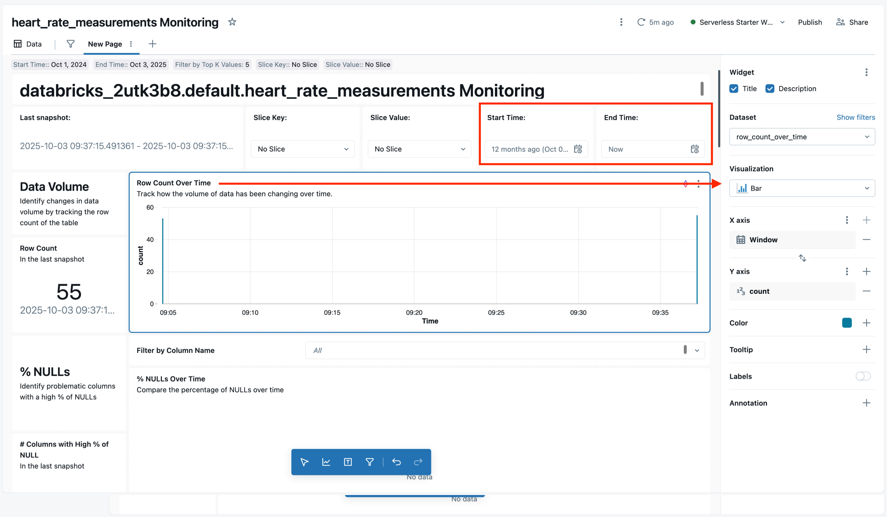
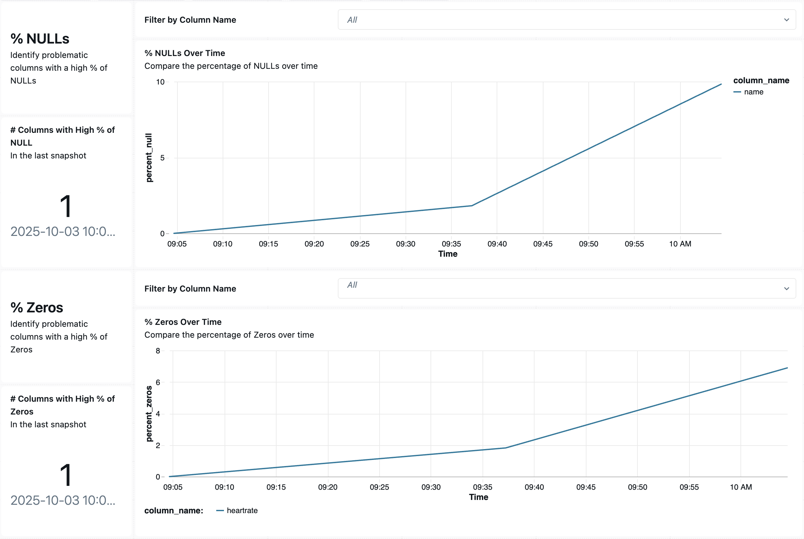

After the monitor runs, you can view the automatically generated dashboard for the monitor. This dashboard provides a visual overview of the metrics we discussed, making it easier to spot trends and outliers at a glance. To access it, you would typically select "**View dashboard**" from the table's Quality tab, or find it in the Databricks SQL workspace (it's saved under your user's dashboards).

The dashboard is interactive and has filters (widgets) at the top. For a Snapshot profile, you might see a time range selector (to choose the date range of monitor results to display, for example, last seven days, or custom start/end), as well as possible filters for specific slices or groupings if those were configured. In our example, because snapshot profiles recompute on the whole table, we might simply filter by date of monitor run (each run produces one set of metrics).

On the dashboard, you'll see a list of metrics and charts available. For instance, one chart might show **Row Count Over Time**, another might show % Nulls per Column, another might display a distribution histogram for heart rate values. You can select these to navigate the dashboard.



Each visualization is backed by a query on the metric tables. By default, the Snapshot dashboard might include:
  - A table or chart of **Summary Statistics** for each column (for example, count, mean, min, max, % null, distinct count).
  - A chart for **Numeric Distributions** (perhaps a histogram or boxplot of the heart rate values).
  - If there were any time-based grouping or slices, charts for those as well.

Since our monitor is snapshot (no time window grouping by default), the dashboard might show the latest profile metrics and possibly comparisons to the previous profile if you adjust filters.

You must attach a SQL warehouse (compute engine) to the dashboard to execute the queries when you view it. In practice, you'd ensure a SQL endpoint is selected (for example, a shared warehouse) when opening it so that all charts can load the latest data.

The dashboard is fully customizable. You can edit existing charts or add new ones just like any Databricks SQL dashboard. For instance, if you want a special chart to highlight the count of zero heart rates, you could create a new query against the profile metrics table (or define a custom metric) to surface that, and pin it to the dashboard. This flexibility means the monitoring dashboard can be tailored to the metrics that matter most for your data quality goals.

## Detecting Data Quality Issues (Nulls, Zeros, Outliers)

With the monitoring set up, how do we use it to catch problems in our heart rate data? Let's walk through an example scenario of new data arriving and see how Lakehouse Monitoring helps identify issues.

Initially, our data was clean. Now, suppose a new batch of data comes in from the devices – but unfortunately, this batch has some problems:

- Some records have the name missing (NULL) because the patient info wasn't synced.
- A number of heart rate readings came in as 0. Perhaps the devices use 0 to indicate no reading or an error.
- One device had a firmware bug and logged a ridiculously high heart rate value by mistake (for example, over a million).

We append these new records to the `heart_rate_measurements` table. In SQL, that might look like:

```sql
INSERT INTO heart_rate_measurements VALUES
  -- A record with a missing name and an erroneous 0 heart rate
  (17, '52804177', NULL, '2025-10-01T12:00:00+00:00', 0),
  -- A record with a valid name but an outlier high heart rate
  (37, '65300842', 'Samuel Hughes', '2025-10-01T12:05:00+00:00', 1000052.1354);
```

*(The above are just two sample rows to illustrate; in practice, imagine ~30 new rows were ingested, with several zeros and NULL names.)*

After this data load, the table now contains these anomalies. Without monitoring, we might not notice these issues until someone queries the data or a downstream process fails. But with Lakehouse Monitoring, we can **trigger a refresh** of the monitor to profile the updated table (or wait for the next scheduled run).

Once the monitor refreshes, it will update the metrics:

- **Total Records** will have increased (say from 50 to 80, if 30 new rows added).
- **% Null in Name** jumps from 0% to a higher value. For example, if 10 out of the 80 entries now have name = NULL, the monitor might show "Name – 12.5% null". This immediately alerts us that name data has started to go missing.
- **Min/Max Heartrate will update**. The minimum might now be 0 (if zero values were added), and the maximum will be 1,000,052 (the outlier). These metrics turning abnormal are a red flag. The average heart rate might also skew lower due to those zeros.
- The dashboard's distribution chart for heart rates would visibly change: perhaps a spike at 0 (many zero readings) and an outlier bar way off the chart to the far right for the 1,000,052 value.
- If the monitor calculates a **percent of zeros** (which might be part of drift metrics or a custom metric), it would show a nonzero percentage now. Even if not directly shown, the zero readings are effectively counted in the distribution and in metrics like "values below X." We could configure a custom metric to explicitly count how many heart rates are exactly 0 for easier tracking.

The following screenshot illustrates these metrics, but keep in mind this doesn't represent a real-world scenario:



## Best Practices for Data Quality Monitoring

The heart rate scenario illustrates general best practices in data quality monitoring:

- **Track Completeness**: Always monitor for missing or empty values in your critical fields. In Lakehouse Monitoring, the fraction of nulls per column is a key health metric. Even if a field isn't strictly required, a sudden rise in nulls often signals upstream issues. We saw this with name – monitoring let us catch that immediately.

- **Identify Invalid Placeholder Values**: Decide what constitutes an "invalid" value for your data and track it. In numeric fields, zeros or negatives might be placeholders or errors. While Lakehouse Monitoring doesn't inherently know that "0" is wrong for heart rates, you can address this by:

  - **Custom Metrics**: Define a custom metric to count how many rows have heart rate = 0. The platform allows adding custom SQL expressions as metrics during monitor setup. This way, you'd have a direct line item in your metrics for "ZeroHeartRateCount" if needed. 
  - **Expectations**: If using Delta Live Tables or certain streaming workloads, Databricks supports Data Expectations (data quality rules) to handle bad data (for example, drop records where `heart_rate = 0`). These can complement Lakehouse Monitoring by preventing bad data from ever landing in the table. In the future, Databricks plans to unify expectations with Lakehouse Monitoring for all tables.
  - Regardless, keep an eye on min/max metrics – a min of 0 in a field that shouldn't be zero is a straightforward alert.

- **Monitor Distribution and Range**: Know the expected range of your data and let the monitor tell you when you're outside of it. In our case, any heart rate above, say, 250 is likely impossible from a human. The automatic max metric caught the 1,000,052 value. Setting up an alert on the profile metrics (for example, trigger an alert if max `heart_rate > 300`) could notify the team as soon as such an anomaly is detected. With Lakehouse Monitoring, you can create SQL alerts on the underlying metric tables or directly on the dashboard charts to automate this.

- **Baseline Comparisons**: If you have a trusted baseline dataset (for example, last month's clean data or an expected distribution), use it. Lakehouse Monitoring allows specifying a baseline table for drift analysis. For instance, if we had a baseline of heart rates under normal conditions, the monitor could compare today's data against that baseline and immediately flag the large deviations in distribution or null percentages. Baselines help quantify drift in a meaningful way ("today vs. ideal dataset").

- **Regular Reviews and Updates**: Data quality metrics should be reviewed regularly by the team. Over time, you might adjust which metrics you care about. Maybe we discover that heart rates of 0 are frequent and we start filtering them out upstream – then the focus might shift to other metrics like variability of heart rates across devices. Customize your monitor as needed: add or remove metrics, change refresh schedules, or even disable monitors on tables that are no longer critical.

- **Cost and Performance**: A snapshot profile scans the whole table on each run, which could be costly for very large tables. For production, consider enabling Change Data Feed (CDF) on Delta tables and using a Time series profile if appropriate, so that monitoring only processes new data increments rather than full scans. This is more efficient at scale. In our example, if the table grows to millions of rows, switching to time-series with CDF might be wise so that each hour/day only new heart rates are processed. Snapshot is fine for smaller tables or for periodic full reprofiling.