Now that we have covered the definition of CI/CD, let's put those principles in practice by following the steps below.

## Requirements

The following services are needed

- Azure DevOps
  - [Databricks Script Deployment Task by Data Thirst](https://marketplace.visualstudio.com/items?itemName=DataThirstLtd.databricksDeployScriptsTasks&targetId=8854f3d2-59c5-4b14-b687-1071a9da8180) Azure DevOps marketplace extension
- Two Azure Databricks Workspaces: DEV and PROD

## End goal scenario

1. Develop a notebook in DEV workspace
1. Commit this to Azure DevOps (Master branch of the repo)
1. Once the commit is successful, this notebook will automatically be deployed into PROD workspace
> [!NOTE]
> Ideally, a user wants to create a feature branch first and work there. Once it's reviewed by peers using 'pull request', this feature branch can be committed to master branch. Then, it'll be automatically deployed into higher environment like Staging for production testing or PROD directly.

## Unit pre-requisites

In this unit, you need access to two Azure Databricks workspaces. One will act as your DEV (development) environment, and the other your PROD (production) environment. If you do not have two workspaces available, follow the instructions below. Otherwise, you can skip to the bottom of the page to [Clone the Databricks archive in the DEV workspace](#clone-the-databricks-archive-in-the-dev-workspace).

**Microsoft Azure Account**: You will need a valid and active Azure account for the Azure labs. If you do not have one, you can sign up for a [free trial](https://azure.microsoft.com/free/)

- If you are a Visual Studio Active Subscriber, you are entitled to Azure credits per month. You can refer to this [link](https://azure.microsoft.com/pricing/member-offers/msdn-benefits-details/) to find out more including how to activate and start using your monthly Azure credit.

- If you are not a Visual Studio Subscriber, you can sign up for the FREE [Visual Studio Dev Essentials](https://www.visualstudio.com/dev-essentials/) program to create Azure free account.

## Create the required resources

To complete this lab, you will need to deploy two Azure Databricks workspaces in your Azure subscription.

### Deploy a DEV Azure Databricks workspace

1. Click the following button to open the Azure Resource Manager template in the Azure portal.
   [Deploy Databricks from the Azure Resource Manager Template](https://portal.azure.com/#create/Microsoft.Template/uri/https%3A%2F%2Fraw.githubusercontent.com%2FAzure%2Fazure-quickstart-templates%2Fmaster%2F101-databricks-workspace%2Fazuredeploy.json)

1. Provide the required values to create your Azure Databricks workspace:

   - **Subscription**: Choose the Azure Subscription in which to deploy the workspace.
   - **Resource Group**: Leave at Create new and provide a name for the new resource group.
   - **Location**: Select a location near you for deployment. For the list of regions supported by Azure Databricks, see [Azure services available by region](https://azure.microsoft.com/regions/services/).
   - **Workspace Name**: Provide a name for your workspace that includes the word **DEV** in the name.
   - **Pricing Tier**: Ensure `premium` is selected.

1. Accept the terms and conditions.
1. Select Purchase.
1. The workspace creation takes a few minutes. During workspace creation, move on to the next step to deploy the PROD Azure Databricks workspace.

### Deploy a PROD Azure Databricks workspace

1. Click the following button to open the Azure Resource Manager template in the Azure portal.
   [Deploy Databricks from the Azure Resource Manager Template](https://portal.azure.com/#create/Microsoft.Template/uri/https%3A%2F%2Fraw.githubusercontent.com%2FAzure%2Fazure-quickstart-templates%2Fmaster%2F101-databricks-workspace%2Fazuredeploy.json)

1. Provide the required values to create your Azure Databricks workspace:

   - **Subscription**: Choose the Azure Subscription in which to deploy the workspace.
   - **Resource Group**: Leave at Create new and provide a name for the new resource group.
   - **Location**: Select a location near you for deployment. For the list of regions supported by Azure Databricks, see [Azure services available by region](https://azure.microsoft.com/regions/services/).
   - **Workspace Name**: Provide a name for your workspace that includes the word **PROD** in the name.
   - **Pricing Tier**: Ensure `premium` is selected.

1. Accept the terms and conditions.
1. Select Purchase.
1. The workspace creation takes a few minutes. During workspace creation, the portal displays the Submitting deployment for Azure Databricks tile on the right side. You may need to scroll right on your dashboard to see the tile. There is also a progress bar displayed near the top of the screen. You can watch either area for progress.

### Create a cluster

> **OPTIONAL**: Creating a cluster is optional for this module. It is only needed if you plan on running the sample notebook. The notebook is only used for demonstration purposes of the CI/CD process. There is no requirement to run its cells to complete this unit.

1. When your Azure Databricks workspace creation is complete, select the link to go to the resource.

1. Select **Launch Workspace** to open your Databricks workspace in a new tab.

1. In the left-hand menu of your Databricks workspace, select **Clusters**.

1. Select **Create Cluster** to add a new cluster.

    

1. Enter a name for your cluster. Use your name or initials to easily differentiate your cluster from your coworkers.

1. Select the **Cluster Mode**: **Single Node**.

1. Select the **Databricks RuntimeVersion**: **Runtime: 7.3 LTS (Scala 2.12, Spark 3.0.1)**.

1. Under **Autopilot Options**, leave the box **checked** and in the text box enter `45`.

1. Select the **Node Type**: **Standard_DS3_v2**.

1. Select **Create Cluster**.

**Repeat the above steps** for the PROD workspace.

## Clone the Databricks archive in the DEV workspace

1. If you do not currently have your Azure Databricks workspace open: in the Azure portal, navigate to your deployed Azure Databricks workspace and select **Launch Workspace**.
1. In the left pane, select **Workspace** > **Users**, and select your username (the entry with the house icon).
1. In the pane that appears, select the arrow next to your name, and select **Import**.

    

1. In the **Import Notebooks** dialog box, select the URL and paste in the following URL:

    ```
    https://github.com/solliancenet/microsoft-learning-paths-databricks-notebooks/blob/master/data-engineering/DBC/13-CI-CD-with-Azure-Devops.dbc?raw=true
    ```

5. Select **Import**.

## High Level Steps

At a high level, setting up CI/CD on Azure Databricks with Azure DevOps consists of 4 steps:

1. Setting up Azure DevOps Repo
1. Have your Azure Workspace and notebook configured to use Azure DevOps
1. Azure DevOps - Create a build pipeline (CI)
1. Azure DevOps - Create a release pipeline (CD)

### Step 1: Set up Azure DevOps Repo

1. Go to [https://aex.dev.azure.com](https://aex.dev.azure.com). Make sure that you are logged in under the correct account.
1. If your account has access to multiple Azure subscriptions, make sure that you're in the same directory as your Databricks workspaces.
1. Create a project.
1. Complete the new project form by providing a unique project name. Set visibility to **Private**, expand the Advanced section on the bottom, then select **Git** for version control. The work item process can remain at its default setting.

    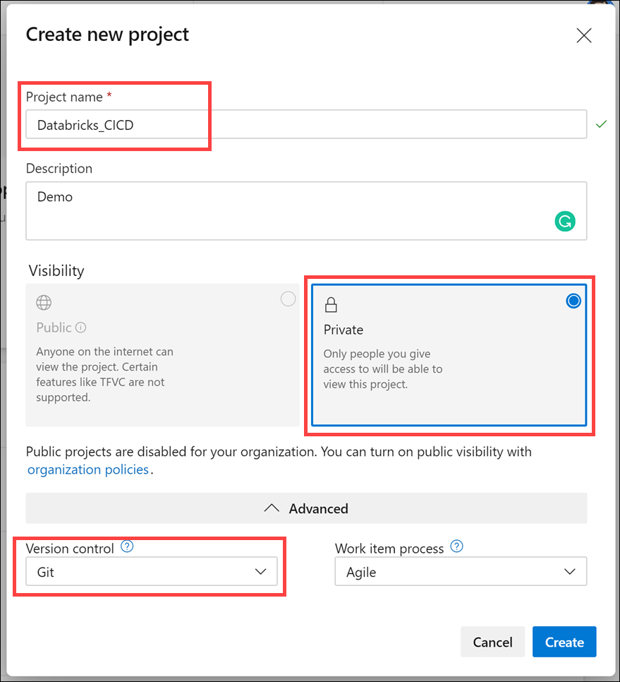

1. Once Project is created, go to **Repos**, then **Initialize** your repo.

    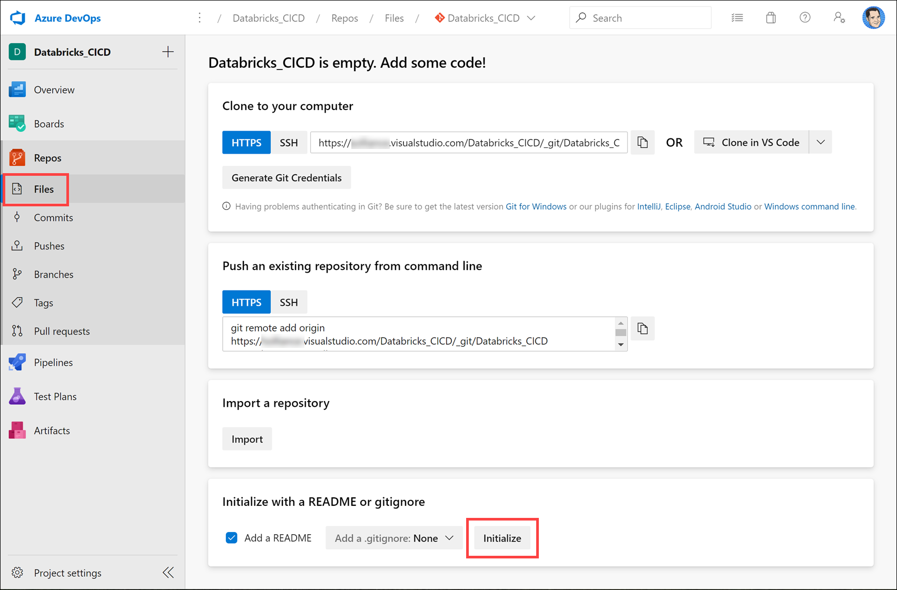

### Step 2: Set up Azure Databricks Workspace and your notebook

Go to DEV Azure Databricks workspace and setup your Git integration provider to Azure DevOps Services by following these steps:

1. Select the user icon on the top-right of the workspace, then select **User Settings**.

    

1. Select the **Git Integration** tab. Make certain the Git provider is set to **Azure DevOps Services**.

    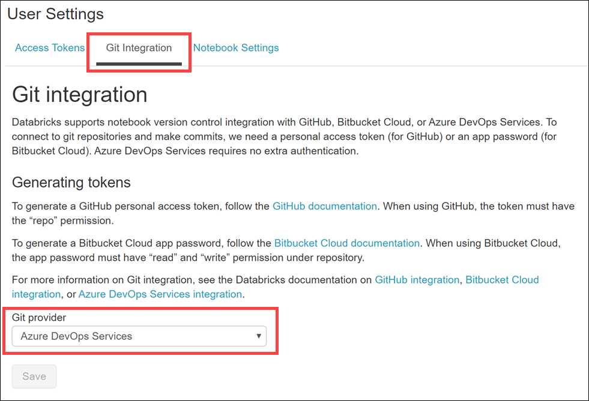

1. Navigate to the **13-CI-CD-with-Azure-Devops** folder in your Workspace. If you imported the Databricks notebook for this lab, this is the directory that was created during that process.

1. Open the **Distinct-Articles** notebook. Select **Revision history** on the right-hand side above the notebook.

    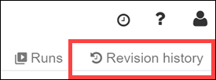

1. Select **Git: Not linked** at the top of the revision history. This opens a Git configuration dialog.

    

1. In Git Preferences, use the URL scheme `https://dev.azure.com/<myOrg>/<myProject>/_git/<myRepo>` in the **Link** field to link Azure DevOps and Azure Databricks to the same Azure AD tenant.

    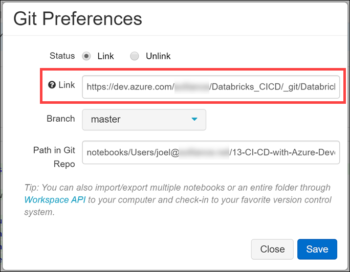

    If your Azure DevOps organization is `org.visualstudio.com`, open `dev.azure.com` in your browser and navigate to your repository. Copy the URL from the browser and paste that URL in the Link field.
    > [!NOTE]
    > format of URL is <br>`http://dev.azure.com/<myOrg>/<myProject>/_git/<myRepo>` <br>which differs from the URL of the repo displayed in Azure DevOps <br>`http://dev.azure.com/<myOrg>/_git/<myRepo>`

1. Select **Save** to finish linking your notebook. You should see that the Git repo is now synced.

    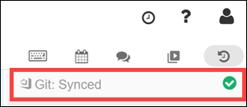

1. Close the Revision History sidebar, then scroll down to the bottom of the notebook. Uncomment cell #9 so it looks like the following:

    ```python
    display(df.select("article"))
    ```

1. Open the Revision History sidebar once again. When prompted to **Save Notebook Revision**, enter a revision description, then **Save**.

    

1. Go back to your repo in Azure DevOps and refresh the files list. You should see your notebook in the repo. If you look under Commits, you should see your commit message as well.

    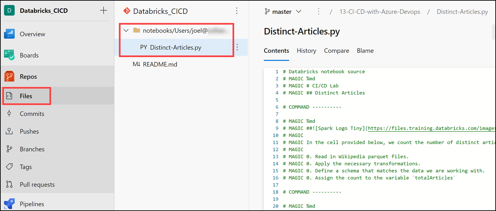

### Step 3: Retrieve Access Token from PROD workspace

Go to PROD Azure Databricks workspace and generate a user access token for the Azure DevOps release pipeline you will create later, by following these steps:

1. Navigate to your production (PROD) Azure Databricks workspace.

1. When you launch and sign in to the workspace, take note of the URL. It is in the form of `https://<location>.azuredatabricks.net`. Copy the `location` portion of the URL (for example, westus2) and save it to a text editor for later reference.

    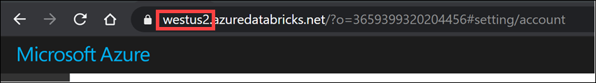

1. Select the user icon on the top-right of the workspace, then select **User Settings**.

    

1. Under the Access Tokens tab, select **Generate New Token**. In the Generate New Token dialog, add `Azure DevOps` for the Comment, then select **Generate**.

    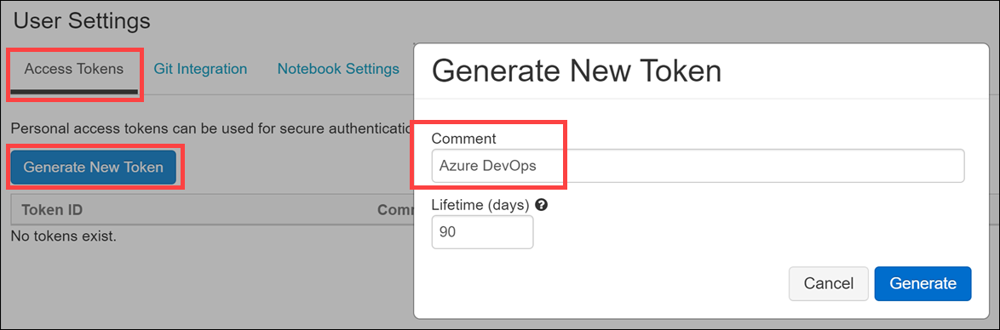

1. Copy the new token and save it to a text editor for later reference. This is only displayed once.

    

### Step 4: Azure DevOps - Create a build pipeline (CI)

A Build pipeline provides the **CI** portion of CI/CD.

1. Navigate back to Azure DevOps. Within your project, expand **Pipelines** in the left-hand menu, then select **Pipelines**. Select **Create Pipeline**.

    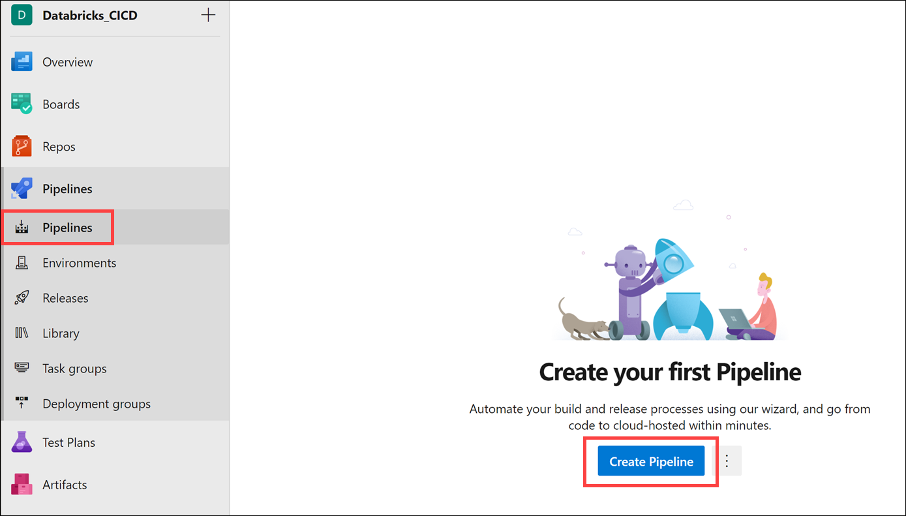

1. Select **Use the classic editor** link under "Where is your code?"

    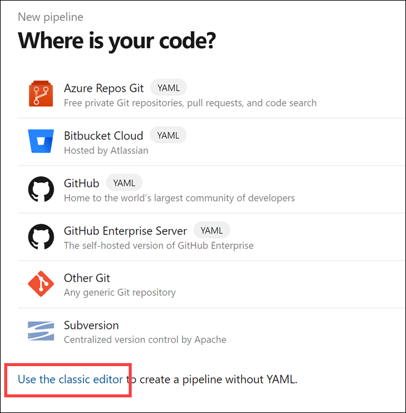

1. Select your project, repository, and the `master` branch for manual and scheduled builds, then select **Continue**.

    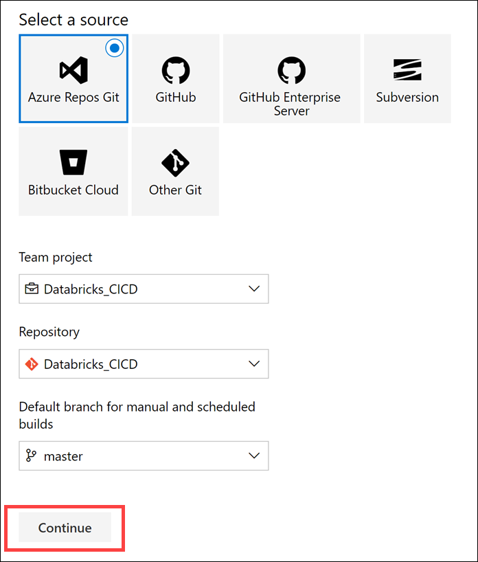

1. Under Select a template, select the start with an **Empty job** link.

    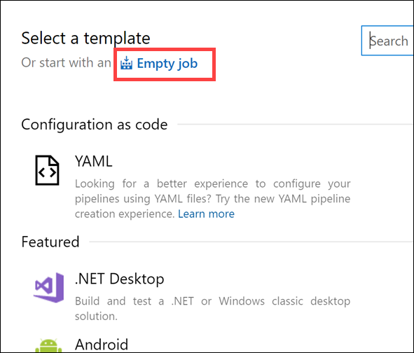

1. Select the **+** link on `Agent job 1` to add a task.

    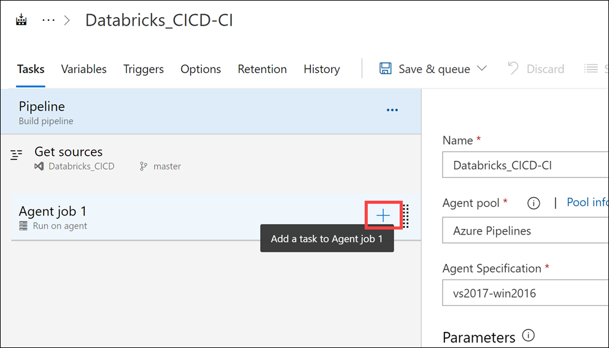

1. Search for the "**Publish Build Artifacts**" task and add it to a Agent job.

    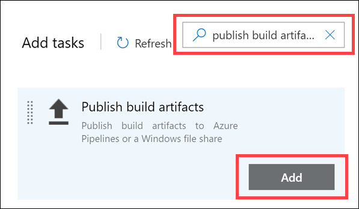

1. Select added task, enter `notebooks` for the **Path to publish** and enter `DEV build` for the **Artifact name**.

    

1. Select the **Triggers** tab and check **Enable continuous integration**. This will automatically trigger a build whenever you commit your code to the repo.

    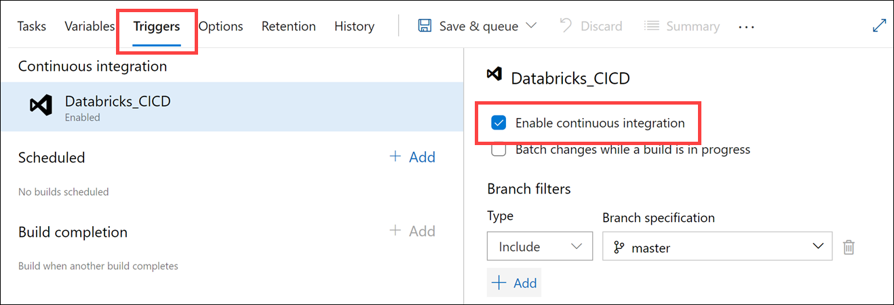

1. Select **Save & queue** to continue.

    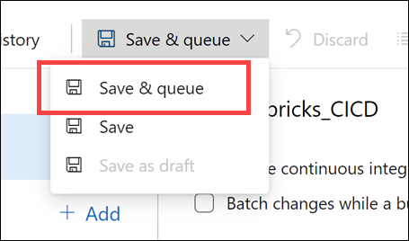

1. In the Run pipeline dialog that appears, enter a save comment, then select **Save and run**.

    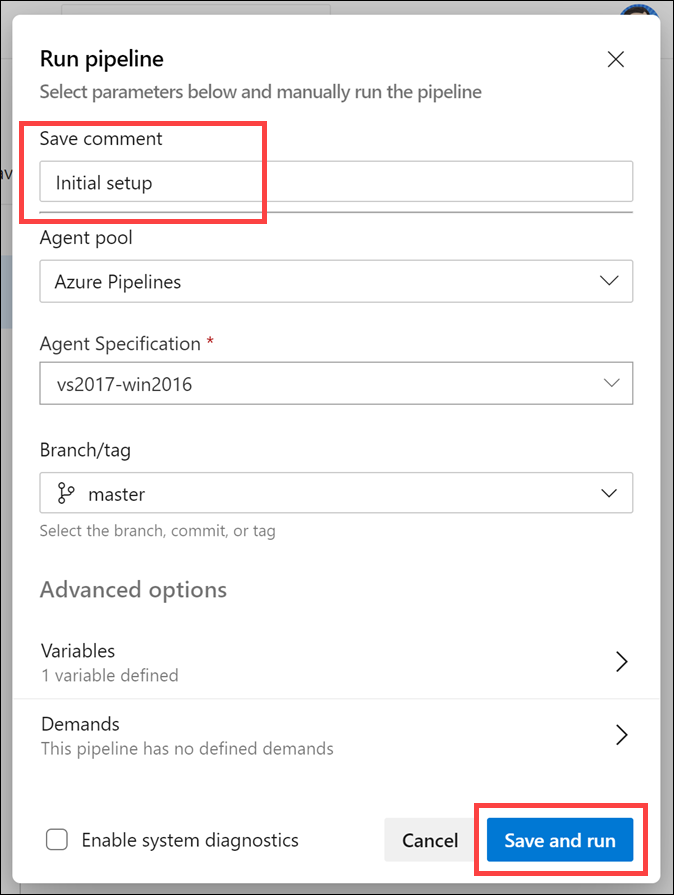

1. Verify that your build pipeline was created and successfully run.

    

### Step 5: Azure DevOps - Create a release pipeline (CD)

A release pipeline provides the **CD** portion of CI/CD.

1. Within your Azure DevOps project, expand **Pipelines** in the left-hand menu, then select **Releases**. Select **New pipeline**.

    

1. As you did when creating the previous pipeline, select the start with an **Empty job** link.

    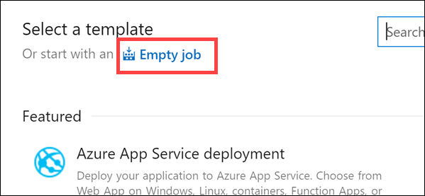

1. Select **Add an artifact**. Set the source type to **Build**, then select your build pipeline you created in the previous step as the **Source**. Select **Add** to apply your changes.

    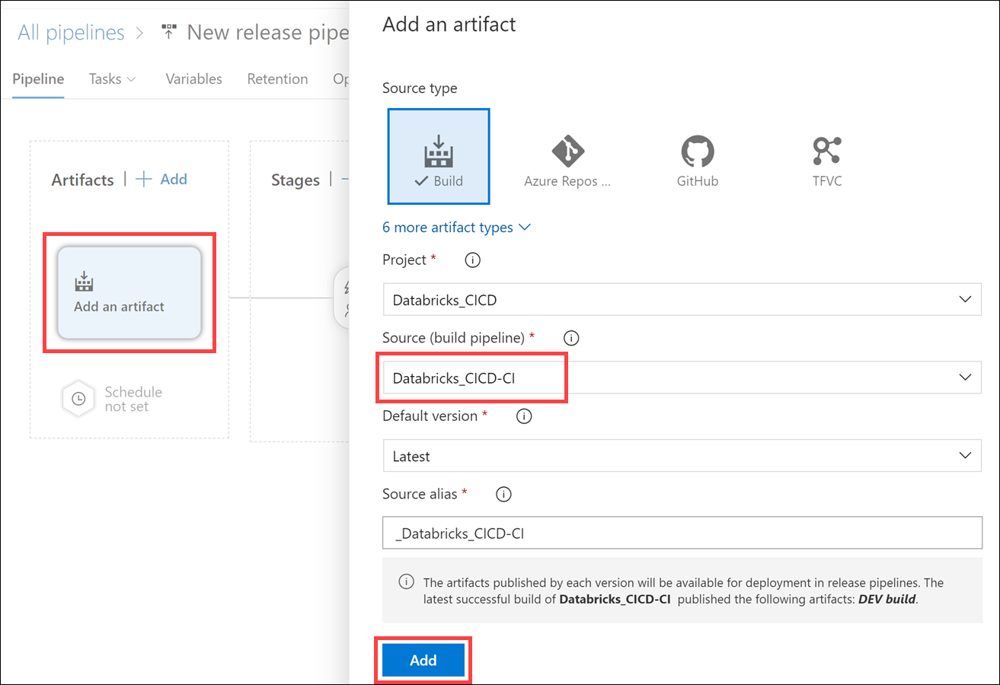

1. View the tasks for Stage 1 by selecting the `1 job, 0 task` link.

    

1. Select the **+** link on `Agent job` to add a task. Search "Databricks", then add **Databricks Deploy Notebooks**

    > [!NOTE]
    > If this is the first time adding this task, you first have to install "**Databricks Script Deployment Task by Data Thirst**", then the displayed Databricks tasks will become available. This package is provided by 3rd party.

    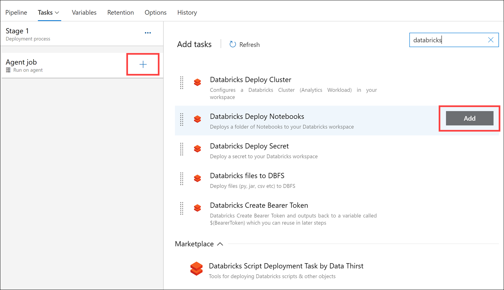

1. Once the task is added, select it and then fill the required parameters, then **Save**:
    
    - **Azure Region**: Enter the region of your production (PROD) Azure Databricks workspace that you obtained from the URL in a previous step.
    - **Source files path**: Browse to and select the **Users** subfolder.
    - **Target files path**: Enter `/Users`.
    - **Databricks bearer token**: Paste the Azure Databricks Access Key you copied in an earlier step. 
    > [!NOTE]
    >The Databricks bearer token has to be obtained from PROD workspace for access permission

    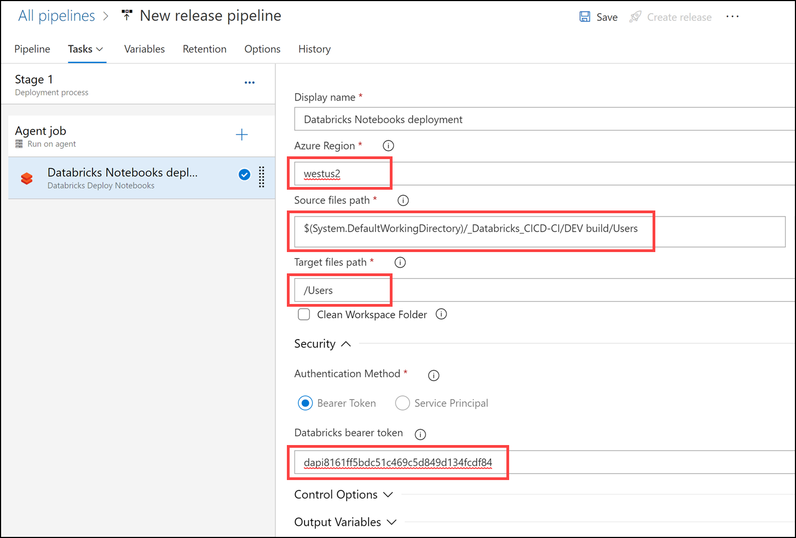

1. Select the **Pipeline** tab. Select the **Continuous deployment trigger** on the artifact, then **Enable** the continuous deployment trigger. This will create a release every time a new build is available.

    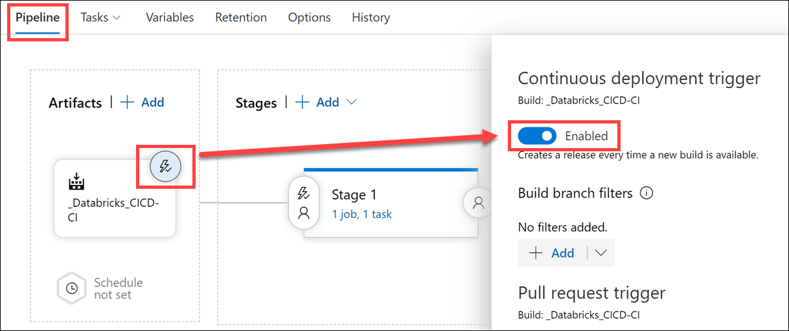

1. Select **Save** to save your pipeline changes.

1. Finally, create a release by selecting **Create release** at the top of the pipeline blade. When the `Create a new release` form displays, select **Create**.

    

1. Navigate back to **Releases** under the Pipelines section of the left-hand menu. Select the release you just created. When it opens, you should see that it is either in progress or completed.

    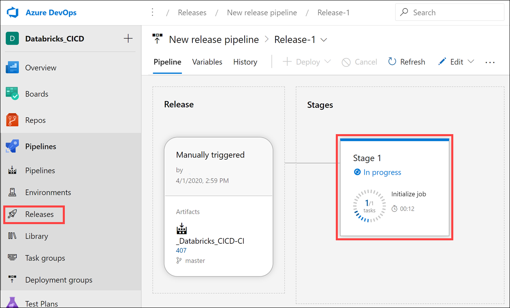

1. Navigate back to your production (PROD) Azure Databricks workspace. If it is already open, refresh the page. Navigate to your user folder under the workspace. You should see your notebook. This was saved to your workspace by your release pipeline.

    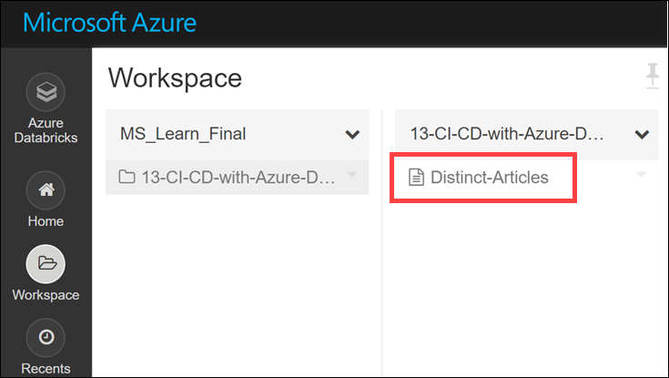

CI/CD setup is now completed. If you commit your code from the DEV workspace to the repo (master branch), the same notebook should be available in PROD.

Experiment with making changes to your notebook in DEV, then committing those changes. You will be able to see your build and release pipelines execute and the notebook in the PROD workspace automatically update to reflect those changes.
