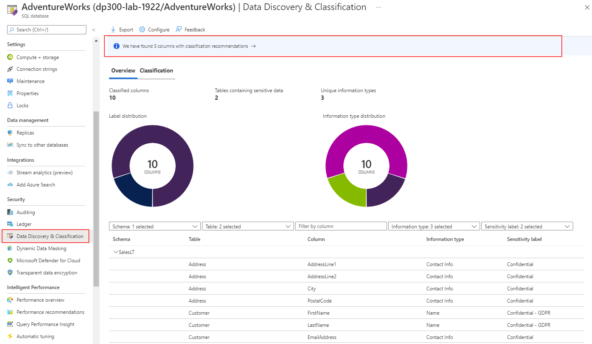

Confidential data stored within a Microsoft SQL Server or Azure SQL Database should be classified within the database. This classification allows the SQL Server users as well as other applications to know the sensitivity of the data that is being stored. Data classification with the database is done on a column by column basis. It is possible for a single table to have some columns be public, some columns be confidential, and some columns be highly confidential. Data classification was first introduced into SQL Server Management Studio and used extended properties of objects to store its data classification information. Starting with SQL Server 2019 (and in Azure SQL Database) this metadata is now stored in a catalog view called sys.sensitivity_classifcations.

The Azure portal provides a management pane for data classification of your Azure SQL Database as shown below. You can reach this screen by clicking Data Discovery and Classification in the Advanced Data Security screen, which is in the Security section of the main blade for your Azure SQL Database.

> [!div class="mx-imgBorder"]
> [](../media/module-33-security-final-16.png#lightbox)

In both the Azure portal and SQL Server Management Studio, you can configure data classification. The classification engine scans your database and locates columns with names that indicate that the column could have sensitive information. One example is that a column named email would be classified by default as containing sensitive personal information. Verify and validate this data, since it is based on column name, so a column named column1 that contained email addresses would not be classified as sensitive personal information.

Columns can be classified using the sensitivity wizard in SQL Server Management Studio, from the Advanced Data Security screen in the Azure portal for Azure SQL Database, or by using the ADD SENSITIVITY CLASSFICATION T-SQL command as shown below:

```sql
ADD SENSITIVITY CLASSIFICATION TO

[Application].[People].[EmailAddress]

WITH (LABEL='PII', INFORMATION_TYPE='Email')

GO
```

Classification of data allows you to easily identify the sensitivity of data within the database. Knowing what columns contain sensitive data allows for easier audits and allows you to more easily identity which columns are good choices for data encryption. Classification will allow other employees within the company to make better decisions on how to handle the data which is available within the database.
